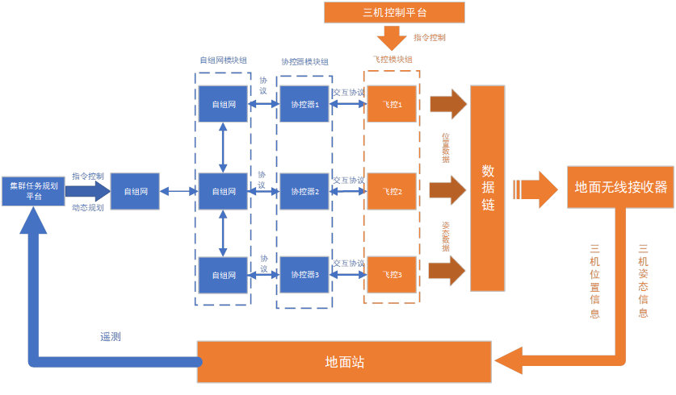

## 待实现环节

### 1. 准备阶段

- 遥控起飞

- 旋翼切固定翼
- 外控功能切换（三机控制平台发送控制指令，根据协控器更新的航路尽可能**同时**到达第一个航路点）
- 安全降落

### 2. 交互环节

- 协控器与飞控的数据交互（->更新航路50Hz，<-发布到达信息20Hz，protocol）

- 地面站实时显示航迹（要求**一站多机**）
- 地面站遥测回传（ETH发送6DOF到集群任务规划软件，protocol）

### 3. 动态规划

- 构建任务指令，实现在线3机在线动态规划和队形变换等功能
- 队形重构（飞机到达集结点有偏差时执行）
- 3机盘旋
- 队形变化

## 存在问题

1. 是否拥有一站多机地面站显示功能平台？
2. 无人机的最小转弯半径和最小直飞距离为多少？
3. 在线动态规划的流程描述不够清晰