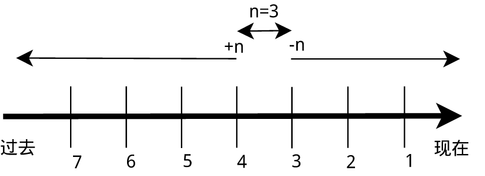
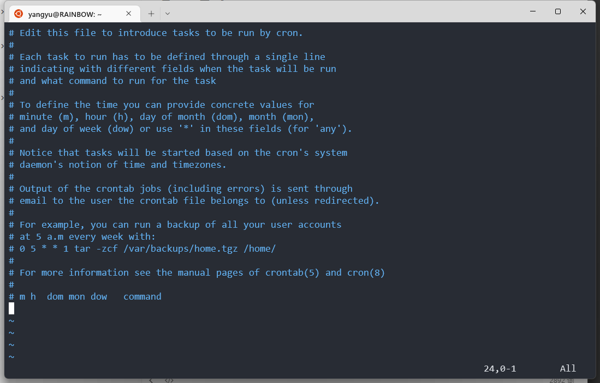

[TOC]

# Command

## File

```bash
#文件操作
file one.txt     #查看文件类型
touch empty.txt  #新建文件
mkdir (-p) new   #新建目录
rmdir new        #移除目录
cp -r doc1 doc2  #拷贝目录下所有文件
rm -r doc2       #移除目录下所有文件
mv xxx1 xxx2     #移动/重命名
cat one.txt      #输出整个文件
head -2 one.txt  #输出前2行
tail -3 one.txt  #输出后3行
sort -n -r		 #-n:对数字排序 -r:反转结果
more/less		 #对文件进行翻页显示，Space进行翻页，回车下一行，Ctrl+B上一行(less)

#文件搜索
whereis who	#whereis只能搜索二进制文件（-b），man 帮助文件（-m）和源代码文件（-s）
which who	#which	定位命令位置
find [path] -name "*.c" [-ls]
locate [name]	 #新文件需要先更新数据库 sudo updatedb

#压缩
tar -zcvf directory directory.gz
zip -r -q -o -l test.zip test01/ #linux下文本文件打包压缩到windows需要加上-l参数将LF转换为CR+LF
#解压缩
tar -zxvf directory directory.gz -C ~	#指定路径：-C 参数
unzip -q test.zip -d test01			#如果你不想解压只想查看压缩包的内容你可以使用 -l 参数：unzip -q -l test.zip -G GBK #指定编码类型

#软链接
ln -s source.txt direction.txt #--链接文件，相当于快捷方式

#重新定向
ls > output.log           ls >> output.log #如果已存在则附加在结尾
ls 1> output.log 2> error.log  #1:stdout 2:stderr
ls &> output_error.log #1+2
./test.sh >/dev/null 2>&1	#将输出到垃圾桶

grep -E "abc" < content.txt	# -E 正则模式匹配
#pipe
ls | grep txt | wc -l #word count:-l:行数 -w:单词数 -c:字节数 -m:字符数 -L:最长行字节数
cat 1.txt | sort | uniq > 2.txt #删除重复
cat /etc/passwd | sort -t ':' -k 3 -n #以':'为分隔符，对第3个字段进行排序
	#sort: -u:uniq

#权限
sudo chown (-R) pi:pi file.txt #(递归)改变文件的拥有者和拥有组
sudo chmod 755 file.txt   #改变文件的权限 4:r 2:w 1:x
sudo chmod a+r,u+w,g+o,o-o file.txt #修改对应组别的权限
**755:rwxr-xr-x**
444:r--r--r--
777:rwxrwxrwx
644:rw-r--r--

#文件系统 FAT:window ext4:raspberry NTFS:Network
sudo fdisk -l          #查看磁盘信息
sudo umount /dev/sda1  #卸载磁盘
sudo df -h             #查看磁盘的容量
du -h -d 0 ~		   #查看目录的容量 -d:depth -b:Bytes
free -h                #缓冲

#/bin:可执行文件
#/etc:配置文件 .conf *rc
#/proc:硬件信息 cat /proc/cpuinfo
```

### find

格式： **find [path] [option] [action]**

与时间相关的命令参数：

| 参数     | 说明                   |
| -------- | ---------------------- |
| `-atime` | 最后访问时间           |
| `-ctime` | 最后修改文件内容的时间 |
| `-mtime` | 最后修改文件属性的时间 |

下面以 `-mtime` 参数举例：

- `-mtime n`：n 为数字，表示为在 n 天之前的“一天之内”修改过的文件
- `-mtime +n`：列出在 n 天之前（不包含 n 天本身）被修改过的文件
- `-mtime -n`：列出在 n 天之内（包含 n 天本身）被修改过的文件
- `-newer file`：file 为一个已存在的文件，列出比 file 还要新的文件名




## Shell

`cat /etc/shells` 	查看当前系统已安装的 Shell

### 变量

| 命 令    | 说 明                                                        |
| -------- | ------------------------------------------------------------ |
| `set`    | 显示当前 Shell 所有变量，包括其内建环境变量（与 Shell 外观等相关），用户自定义变量及导出的环境变量。 |
| `env`    | 显示与当前用户相关的环境变量，还可以让命令在指定环境中运行。 |
| `export` | 显示从 Shell 中导出成环境变量的变量，也能通过它将自定义变量导出为环境变量。 |

#### 变量修改

变量的修改有以下几种方式：

| 变量设置方式                   | 说明                                         |
| ------------------------------ | -------------------------------------------- |
| `${变量名#匹配字串}`           | 从头向后开始匹配，删除符合匹配字串的最短数据 |
| `${变量名##匹配字串}`          | 从头向后开始匹配，删除符合匹配字串的最长数据 |
| `${变量名%匹配字串}`           | 从尾向前开始匹配，删除符合匹配字串的最短数据 |
| `${变量名%%匹配字串}`          | 从尾向前开始匹配，删除符合匹配字串的最长数据 |
| `${变量名/旧的字串/新的字串}`  | 将符合旧字串的第一个字串替换为新的字串       |
| `${变量名//旧的字串/新的字串}` | 将符合旧字串的全部字串替换为新的字串         |

```bash
#变量
var=abc    # ' $var'==>纯文本  " $var"==>可以加入变量
echo $var  #or ${var}
now=`date "+%Y-%m-%d %H:%M:%S"` #将date的输出存入now <==> now=$(date)
read name  #将键盘输入存入name
unset var  #删除环境变量
source ~/.bashrc #使环境变量生效 source <==> .

#返回代码
echo $?      #正常运行则返回0
date && date #前一个成功后才运行
date || date #前一个失败后才运行
echo $1      #获得第1个参数
exit 1       #中途退出脚本，并返回1

#Signal信号
fg                    #回到上一个暂停进程
ps aux | grep " "     #获取进程信息，如PID <==> pgrep
kill (-s SIGINT) -9 xpid #结束进程 <==> Ctrl+C
kill -9 `ps -ef|grep frpc.ini| grep -v grep| awk '{print $1}'`
#SIGINT:中断 SIGTSTP:暂停 SIGQUIT:退出
trap "echo 'interrupted';" SIGINT #捕获信号(异步)

#数值运算 $(())
echo $((2+5*2**(3-1)/2)) #priority:() -> ** -> */% -> +-

#定义函数
myInfo(){
	lscpu > $1
  lsmod >>$1
}
myInfo log      #调用该函数,log为参数

#结构
if [ -e $1 ]          case $var in         while []    
then                 root)                do          
	..                   ..                   ..          
else                 ;;                   done        
	..                 *)                   for x in xxx
fi                     ..                 do
                     ;;                     ..
                     esac                 done

```

### Disk

1. 挂载磁盘

```bash
#查看磁盘情况
sudo fdisk -l 
#显示磁盘空间占用
df -h
#挂载到指定路径
sudo mkdir /mnt/usb_flash
sudo mount -t vfat -o uid=pi,gid=pi,iocharset=utf8 --rw /dev/sda1 /mnt/usb_flash
#设置默认挂载
sudo nano /etc/fstab

#if exFAT
sudo apt install exfat-fuse
/dev/sda1 /mnt/usbdisk vfat rw,defaults 0 0
#if FAT32
/dev/sda1 /mnt/myusbdrive auto defaults,noatime,umask=0000 0 0
#if NTFS
sudo apt install fuse-utils ntfs-3g 
modprobe fuse  #加载内核模块
/dev/sda1 /mnt/myusbdrive ntfs-3g defaults,noexec,umask=0000 0 0

#取消挂载
sudo umount /dev/sda1
```

1. 格式化磁盘（需要先umount）

```bash
#FAT32
sudo mkfs.vfat -F 32 /dev/sdb1

#NTFS
sudo apt install ntfsprogs
sudo mkfs.ntfs /dev/sda1

#EXT
sudo mkfs.ext4 /dev/sda1
sudo mkfs.ext3 /dev/sda1
```

### dd

​	`dd` 可以用在备份硬件的引导扇区、获取一定数量的随机数据（`/dev/random`）或者空数据（`/dev/zero`）等任务中。`dd` 程序也可以在复制时处理数据，例如转换字节序、或在 ASCII 与 EBCDIC 编码间互换。

```bash
#从标准输入读入用户的输入到一个文件
dd of=test bs=10 count=1 # 或者 dd if=/dev/stdin of=test bs=10 count=1
#从标准输入读入用户的输入到标准输出
dd if=/dev/stdin of=/dev/stdout bs=10 count=1

#dd 实现数据转换，将输出的英文字符转换为大写再写入文件
dd of=test bs=10 count=1 conv=ucase

#dd 创建虚拟镜像文件
dd if=/dev/zero of=virtual.img bs=1M count=256
sudo mkfs.ext4 virtual.img
#查看Linux支持哪些文件系统 (wsl不支持)
ls -l /lib/modules/$(uname -r)/kernel/fs
mount -t ext4 -o loop --rw virtual.img /mnt  #读写方式挂载
```

> /dev/loop（或称 vnd （vnode disk）、lofi（循环文件接口））是一种伪设备，这种设备使得文件可以如同块设备一般被访问。
>
> 在使用之前，循环设备必须与现存文件系统上的文件相关联。这种关联将提供给用户一个应用程序接口，接口将允许文件视为块特殊文件（参见设备文件系统）使用。因此，如果文件中包含一个完整的文件系统，那么这个文件就能如同磁盘设备一般被挂载。
>
> 这种设备文件经常被用于光盘或是磁盘镜像。通过循环挂载来挂载包含文件系统的文件，便使处在这个文件系统中的文件得以被访问。这些文件将出现在挂载点目录。如果挂载目录中本身有文件，这些文件在挂载后将被禁止使用

## String

```bash
string="hello world"
#cut
echo $string |cut -d" " -f 1 #hello 1表示输出分割后的第一个字段 1-表示输出字段1以及后边的所有字段
echo $string |cut -c 1-4    #hell

#字符串截取
string="hello,shell,haha"
array=${string//,/ }    #按'，'分隔
for var in ${array[@]}    
do
echo $var
done

echo ${#string}  # 11  获得字符串长度
string="http://www.test.com"
echo ${string#*//} # www.test.com '#'号截取，删除左边字符，保留右边字符

string='hello world'
echo ${string:0:7}		#hello w	从左开始第0个字节后截取7个字节
echo ${string:0-5:3}	#wor		从右开始第5个字节后截取3个字节
#more:https://blog.csdn.net/Jayccccc_chao/article/details/85281529

#tr: 删除/替换/转换文本
echo 'hello shiyanlou' | tr -d 'olh' #删除 "hello shiyanlou" 中所有的'o'，'l'，'h'	
echo 'hello' | tr -s 'l'		 # 将"hello" 中的ll，去重为一个l
echo 'hello' | tr '[a-z]' '[A-Z]'# 将输入文本，全部转换为大写或小写输出
echo 'hello' | tr 'hello' 'HELLO'# 替换文本，注意为逐个字符替换 h->H,e->E..

#col: 过滤控制字符
cat /etc/protocols | col -x | cat -A	# 将Tab转换为空格

#join: 两个文件中指定栏位内容相同的行连接起来
sudo join -t ':' -1 4 /etc/passwd -2 3 /etc/group	#-t: 指定分隔符 -1:指明第一个文件对比字段 -2:...

#paste: 将多个文件按行队列合并
paste -d ':' file1 file2 file3	#-d:指定合并的换行符  -s:每个文件各成一行
```

## **WHO**

```bash
who am i #find myself
who      #find all users
echo hh | write pi  #send msg to pi
groups , id
/etc/passwd #存储用户信息  nologin/false 伪用户
```

### 创建用户及用户组

```bash
#常用command
sudo useradd -G sudo -m yangyu			#创建sudoer用户		-m:创建home-directory
sudo usermod -s /bin/bash yangyu		#设置默认shell
sudo passwd yangyu						#设置密码

# 创建一个用户
sudo useradd www
# 创建一个用户组
sudo groupadd www
# www用户归属于www用户组
sudo usermod -a -G www www
```

## **Exe**

```bash
type exit		#内建命令实际上是 shell 程序的一部分,其执行速度比外部命令快
type vim		#外部命令是 Linux 系统中的实用程序部分,是在 Bash 之外额外安装的，通常放在/bin，/usr/bin，/sbin，/usr/sbin 等等
which date          #定位可执行文件
alias xxx="free -h" #起别名，类似于宏定义define
man ls              #返回帮助文档
```

## CronTab

1. 安装日志 `rsyslog`

```bash
sudo apt-get install -y rsyslog
sudo service rsyslog start
```

2. 启动 `cron`

```bash
sudo cron －f &
crontab -e			#-l:列出任务  -r:删除任务
```



```bash
* * * * * touch /home/yangyu/$(date "+\%Y-\%m-\%d")
```

> “ % ” 在 crontab 文件中，有结束命令行、换行、重定向的作用，前面加 ” \ ” 符号转义，否则，“ % ” 符号将执行其结束命令行或者换行的作用，并且其后的内容会被做为标准输入发送给前面的命令。

## 网络协议

### 协议分层

1. 物理层(Physical Layer):光纤等真实存在的物理媒介，传输二进制序列
2. 连接层(Link Layer):将二进制序列分割成帧，常用的连接层协议为 Ethernet and Wi-Fi
3. 网络层(Network Layer):“中间人”设备，如路由器
4. 传输层(Transport Layer):通过端口号将信息传送给指定进程
5. 应用层(Application Layer): 某个类型应用间的某个协议，如用于web的HTTP协议，域名解析的DNS协议

```bash
#查询整个局域网内所有ip&MAC
sudo apt install arp-scan -y
sudo arp-scan -l

#修改ip
#wlan:
sudo dhclient -v -r  #更新DHCP租约，设备将释放ip地址
sudo ifconfig wlan0 192.168.x.x up
#eth: 编辑/etc/dhcpcd.conf,在末尾加入
interface eth0
static ip_address=192.168.x.x

#域名解析
host www.baidu.com
```

## Scp

```bash
scp ~/local root@192.168.xx.xx:~/remote
```

```bash
scp root@192.168.xx.xx:~/remote ~/local
```

## NTP 服务

```bash
sudo apt install ntp
sudo ntpq -pn #查看当前服务器
```

```bash
sudo service ntp stop
sudo ntpd -gq
sudo service ntp start
```

```bash
sudo cp /usr/share/zoneinfo/Asia/Shanghai /etc/localtime
```

## GPIO

```bash
echo 21 > /sys/class/gpio/export
echo out > /sys/class/gpio/gpio21/direction
echo 1 > /sys/class/gpio/gpio21/value
#echo 21 > /sys/class/gpio/unexport #使用完删除端口
```

## device tree overlay  —配置设备树以开启某些功能

/dev/config.txt

## UART

```bash
stty -F /dev/tty* 115200
echo "hello" > /dev/tty*
cat /dev/tty*
```

## Bluetooth

```bash
#显示全部蓝牙设备信息
hciconfig -a 
#开启/关闭/复位 hci0 蓝牙设备
sudo hciconfig hci0 up(/down/reset)
#查看蓝牙模块信息
hcitool dev
#查询周围蓝牙设备
hcitool scan
#配置蓝牙可发现
sudo hciconfig hci0 piscan
#配置蓝牙名称(重启 BLE 后可见)
sudo hciconfig hci0 name "MyBLE"

#bluetoothctl
discoverable yes #设置蓝牙可见
```

## Pybluez 开发

[https://github.com/pybluez/pybluez](https://github.com/pybluez/pybluez)

1. 搭建环境

```bash
sudo apt install python3-dev libbluetooth-dev bluetooth bluez
pip install pybluez
```

编辑 /etc/bluetooth/main.conf 加入一行：

```bash
disableplugins=pnat
```

1. 生成 UUID

```bash
>>> import uuid
>>> uuid.uuid1()
UUID('83009328-84a3-11ec-975a-e45f0162d0a2')
```

1. 编写代码

<aside>
💡  [Errno 2] No such file or directory 解决办法：修改 Bluetooth 服务文件，以 -C 兼容模式启动，最后重启一下服务即可

</aside>

```python
### Blue_Server.py
import bluetooth

server_sock = bluetooth.BluetoothSocket(bluetooth.RFCOMM)
server_sock.bind(("", bluetooth.PORT_ANY))
server_sock.listen(1)

port = server_sock.getsockname()[1]

uuid = "94f39d29-7d6d-437d-973b-fba39e49d4ee"

bluetooth.advertise_service(server_sock,
                            "MyBLE",
                            service_id=uuid,
                            service_classes=[uuid, bluetooth.SERIAL_PORT_CLASS],
                            profiles=[bluetooth.SERIAL_PORT_PROFILE],
                            # protocols=[bluetooth.OBEX_UUID]
                            )

print("Waiting for connection on RFCOMM channel", port)

client_sock, client_info = server_sock.accept()
print("Accepted connection from", client_info)

try:
    while True:
        data = client_sock.recv(1024)
        if not data:
            break
        print("Received", data)
except OSError:
    pass

print("Disconnected.")

client_sock.close()
server_sock.close()
print("All done.")
```

```python
### Blue_Client.py
import sys
import bluetooth

addr = None
if len(sys.argv) < 2:
    print("No device specified. Searching all nearby bluetooth devices for "
          "the Server service...")
else:
    addr = sys.argv[1]
    print("Searching for Server on {}...".format(addr))

# search for the SampleServer service
uuid = "94f39d29-7d6d-437d-973b-fba39e49d4ee"
service_matches = bluetooth.find_service(uuid=uuid, address=addr)

if len(service_matches) == 0:
    print("Couldn't find the Server service.")
    sys.exit(0)

first_match = service_matches[0]
port = first_match["port"]
name = first_match["name"]
host = first_match["host"]

print("Connecting to \"{}\" on {}".format(name, host))

# Create the client socket
sock = bluetooth.BluetoothSocket(bluetooth.RFCOMM)
sock.connect((host, port))

print("Connected. Type something...")
while True:
    data = input()
    if not data:
        break
    sock.send(data)

sock.close()
```

## Camera

- Motion 动作捕捉
  
    ```bash
    sudo apt install motion -y
    #/etc/default/motion
    start_motion_daemon=yes
    #/etc/motion/motion.conf
    daemon on
    stream_localhost off
    framerate 30
    sudo service motion start
    ```
