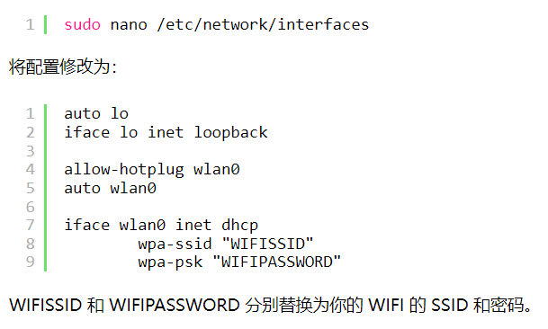
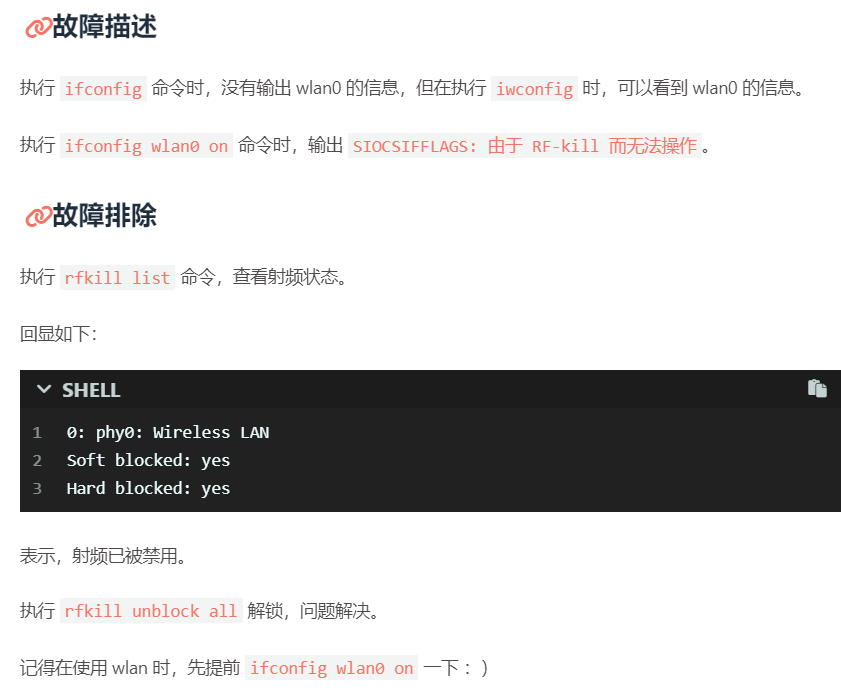
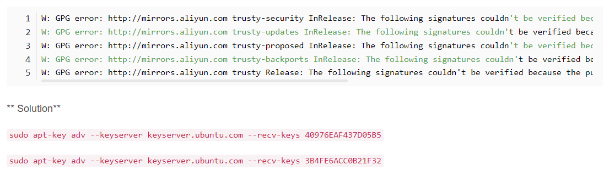

# Get Started !

## Set Proxy

### 1.Terminal

```bash
export http_proxy=http://127.0.0.1:7898
export https_proxy=http://127.0.0.1:7898
```

### 2.Git-Bash

```bash
#设置全局代理
git config --global http.proxy socks5://127.0.0.1:1080
git config --global https.proxy socks5://127.0.0.1:1080

#取消全局代理
git config --global --unset http.proxy
git config --global --unset https.proxy
```

## ssh SerectKey

​	主机端创建密钥并将公钥发送至 username@ip

```bash
ssh-keygen -t rsa
ssh-copy-id -i ~/.ssh/id_rsa.pub username@ip
```

## **上网**

### 0.ifconfig

```bash
#ifconfig配置ip，网关，dns
ifconfig eth0 192.168.0.50 netmask 255.255.255.0
route add default gw 192.168.0.1 eth0
echo "nameserver 8.8.8.8" | tee /etc/resolv.conf > /dev/null
```

### 1.nmcli

```bash
#安装nmcli
sudo apt install network-manager
#打开wifi
sudo nmcli r wifi on
#列出wifi
sudo nmcli dev wifi list
#连接指定wifi
sudo nmcli dev wifi connect "SSID" password "PASSWORD" ifname wlan0
#重启网卡设备
sudo ifconfig wlan0 down
sudo ifconfig wlan0 up
```

```bash
#断开连接
nmcli dev dis wlan0
#完全删除
nmcli c
nmcli c del __UUID__
```

---



### 2.wpa_supplicant



## OpenSSH

```bash
sudo apt install openssh-server
```

```bash
sudo systemctl start ssh
sudo ps -ef|grep ssh
```

```bash
sudo systemctl enable ssh
```

## 系统更新

```bash
sudo apt update
sudo apt full-upgrade
```

## APT

```bash
#安装包 yes
sudo apt install tree -y 
#卸载包
sudo apt remove tree
#完全卸载(+配置文件)
sudo apt purge tree
#修复尚未完成的安装包
sudo dpkg --configure -a
```

## APT换源

```bash
echo "deb http://mirrors.tuna.tsinghua.edu.cn/raspbian/raspbian/ bullseye main non-free contrib rpi
# deb-src http://mirrors.tuna.tsinghua.edu.cn/raspbian/raspbian/ bullseye main non-free contrib rpi
" > ~/sources.list && sudo mv ~/sources.list /etc/apt/
echo "deb http://mirrors.tuna.tsinghua.edu.cn/raspberrypi/ bullseye main" > ~/raspi.list && sudo mv ~/raspi.list /etc/apt/sources.list.d/
```

> 编辑 `/etc/apt/sources.list.d/raspi.list` 文件，删除原文件所有内容，用以下内容取代：
>
> deb http://mirrors.tuna.tsinghua.edu.cn/raspberrypi/ bullseye main

- Ubuntu换源后，更新提示GPG error缺少公钥

  

## PIP换源

```bash
pip install -i https://pypi.tuna.tsinghua.edu.cn/simple pip -U
```

```bash
pip config set global.index-url https://pypi.tuna.tsinghua.edu.cn/simple
```

## Python 创建虚拟环境

```bash
python3 -m venv mp_env && source mp_env/bin/activate
```

### 网络测速

```bash
sudo apt install speedtest-cli
```

```bash
speedtest-cli
```


