# uboot & linux & rootfs

## Part 1: u-boot

### 1.安装编译工具链

```bash
sudo apt install build-essential bison flex libncurses-dev libssl-dev gcc-powerpc-linux-gnu binutils-powerpc-linux-gnu
```

```bash
#echo 'export ARCH=powerpc;export CROSS_COMPILE=powerpc-linux-gnu-;' >> ~/.bashrc
#source ~/.bashrc
```

### 2.下载源码并编译

```bash
git clone https://github.com/u-boot/u-boot.git
cd u-boot/
# Patch
patch -p1 < ../uboot.patch

sudo make distclean
sudo make ARCH=powerpc CROSS_COMPILE=powerpc-linux-gnu- MPC837XERDB_defconfig
sudo make ARCH=powerpc CROSS_COMPILE=powerpc-linux-gnu- -j8

# sudo make ARCH=powerpc CROSS_COMPILE=powerpc-linux-gnu- menuconfig
```

### Optional

配置uboot启动命令：

```bash
setenv bootcmd 'bootm 0xc0000000 0xC0400000 0xffec0000'
setenv bootargs 'console=ttyS0,115200 rootfstype=ramfs init=/linuxrc rw'

# boot from nfs
nfsboot="setenv bootargs console=ttyS0,115200 root=/dev/nfs nfsroot=$serverip:/nfsroot/vmc1,nfsvers=3 init=/linuxrc rw ip=$ipaddr:$serverip::255.255.255.0::eth0:off;bootm 0xc0000000 - 0xffec0000"
```

## Part 2: linux

```bash
sudo ln -s /home/yangyu/u-boot/tools/mkimage /usr/bin/mkimage
# make patch
git diff > ~/kernel.patch
# add new files to tar.gz
tar zcvf ~/src.tar.gz ` git status --short | sed 's/^ *[^ ]* \(.*\)/\1/g' `
```

https://git.kernel.org/pub/scm/linux/kernel/git/rt/linux-stable-rt.git

```bash
wget https://git.kernel.org/pub/scm/linux/kernel/git/rt/linux-stable-rt.git/snapshot/linux-stable-rt-5.10.162-rt78.tar.gz
# Patch
cd linux-
patch -p1 < ../kernel.patch
tar zxvf ~/src.tar.gz -C .

sudo make mrproper
sudo make ARCH=powerpc 83xx/mpc837x_rdb_defconfig
sudo make ARCH=powerpc CROSS_COMPILE=powerpc-linux-gnu- -j8

# sudo make ARCH=powerpc CROSS_COMPILE=powerpc-linux-gnu- menuconfig //set tick hz to 1000,enable Preemptible Kernel
# turn on CONFIG_VMC_DRIVER
```

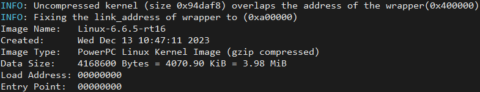

## Part 3: dts

空间分配：

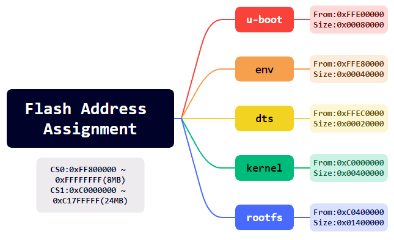

```bash
cd linux/ 
sudo make ARCH=powerpc CROSS_COMPILE=powerpc-linux-gnu- mpc8378_rdb.dtb
```

## Part 4: rootfs

进入配置页面

`vi configs/mpc8378e_defconfig`

```bash
# Architecture
BR2_powerpc=y
BR2_generic_powerpc=y

# Toolchain
BR2_KERNEL_HEADERS_CUSTOM_TARBALL=y
BR2_KERNEL_HEADERS_CUSTOM_TARBALL_LOCATION="https://git.kernel.org/pub/scm/linux/kernel/git/rt/linux-stable-rt.git/snapshot/linux-stable-rt-5.10.162-rt78.tar.gz"
BR2_TOOLCHAIN_BUILDROOT_CXX=y
BR2_PACKAGE_HOST_GDB=y
BR2_PACKAGE_GDB=y
BR2_PACKAGE_GDB_SERVER=y

# System
BR2_TARGET_GENERIC_HOSTNAME="vmc"
BR2_ROOTFS_DEVICE_CREATION_DYNAMIC_MDEV=y

# Target packages
BR2_PACKAGE_BUSYBOX_SHOW_OTHERS=y
BR2_PACKAGE_OPENSSH=y
BR2_PACKAGE_OPENSSH_CLIENT=n
BR2_PACKAGE_OPENSSH_SERVER=y
BR2_PACKAGE_OPENSSH_KEY_UTILS=y
# BR2_PACKAGE_NFS_UTILS=y
# BR2_PACKAGE_NFS_UTILS_NFSV4=y

# Filesystem
BR2_TARGET_ROOTFS_CPIO=y
BR2_TARGET_ROOTFS_CPIO_GZIP=y
BR2_TARGET_ROOTFS_CPIO_UIMAGE=y
BR2_TARGET_ROOTFS_TAR=y

```

```bash
cd buildroot/
sudo make mpc8378e_defconfig
sudo make -j8

cd ../linux-
sudo make ARCH=powerpc CROSS_COMPILE=powerpc-linux-gnu- modules
sudo make ARCH=powerpc modules_install INSTALL_MOD_PATH=/home/yangyu/buildroot-2023.02.9/output/target

cd ../buildroot

sudo vi output/target/etc/profile
export PS1='\u@\h:\w$:'
#if [ "$PS1" ]; then
#       if [ "`id -u`" -eq 0 ]; then
#               export PS1='# '
#       else
#               export PS1='$ '
#       fi
#fi


# ssh
sudo vi output/target/etc/ssh/sshd_config
PermitRootLogin yes
PasswordAuthentication yes
PermitEmptyPasswords yes
sudo cp ../key/ssh_host* output/target/etc/ssh/
sudo chmod 400 output/target/etc/ssh/ssh_host*

# nfs
sudo mkdir output/target/mnt/nfs
sudo vi output/target/etc/fstab # 最后一行添加
192.168.8.20:/home/yangyu/nfs   /mnt/nfs       nfs     defaults        0       0

# Deprecated
sudo vi output/target/etc/network/interfaces
auto eth0
iface eth0 inet static
address 192.168.8.25
netmask 255.255.255.0
gateway 192.168.8.1

# Deprecated
sudo vi output/target/etc/init.d/S80mod
#! /bin/sh
DESC="modprobe"
case "$1" in
  start)
        printf "Starting $DESC: "
        modprobe m1394
        modprobe uart
        modprobe gaio
        modprobe gdio
        modprobe engineio
        echo "OK"
        ;;
  stop)
        printf "Stopping $DESC: "
        echo "OK"
        ;;
  restart|force-reload)
        echo "Restarting $DESC: "
        $0 stop
        sleep 1
        $0 start
        echo ""
        ;;
  *)
        echo "Usage: $0 {start|stop|restart|force-reload}" >&2
        exit 1
        ;;
esac
exit 0
sudo chmod 755 output/target/etc/init.d/S80mod
```

### 1.Target

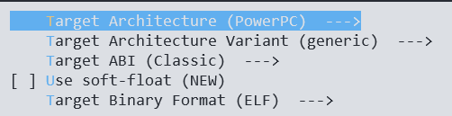

### 2.Toolchain

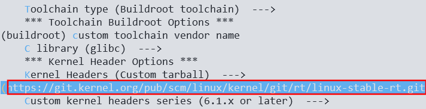

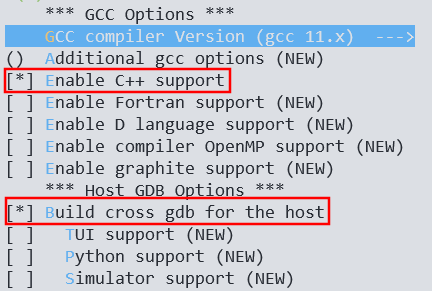

### 3.System Configuration

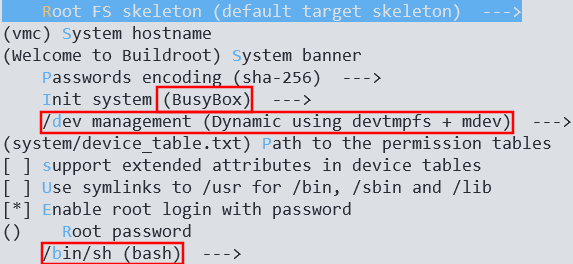

### 4.Target packages


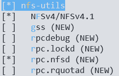

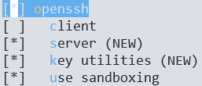

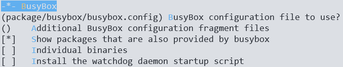

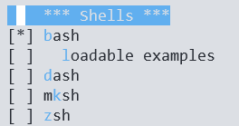

### 5.Filesystem Images

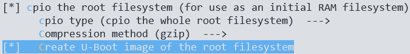

### Optional

```bash
sudo mkimage -A powerpc -O linux -T ramdisk -C gzip -d output/images/rootfs.ext2.gz output/images/rootfs.ext2.gz.uboot

cd ./rootfs
find . | cpio -H newc -ov --owner root:root > ../initramfs.cpio && cd ..
gzip initramfs.cpio
mkimage -A ppc -O linux -T ramdisk -C gzip -d initramfs.cpio.gz initramfs.cpio.gz.uboot
```

