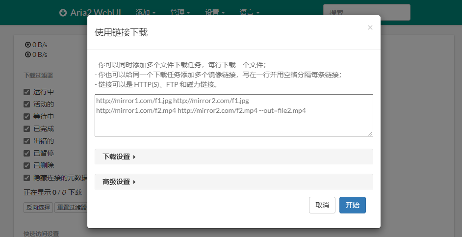

# 离线下载 Aria2 + Screen

## 一键配置 Aria2

```bash
unzip AutoInstallAria2.zip
cd AutoInstallAria2
bash AutoInstallAria2ForLinux.sh
```

## WebUI

1. 安装依赖

```bash
sudo apt install -y aria2 screen nodejs
```

1. 后台运行

```bash
screen                  #新建一个会话
ariac2 https://xxx.zip  #执行指令,此时可使用 Ctrl+A+D 退出
aria2c --enable-rpc --rpc-listen-all
screen -ls              #查看后台会话
screen -r               #重新安装之前会话
```

1. 运行 Web UI 服务器

```bash
git clone git@github.com:ziahamza/webui-aria2.git
cd webui-aria2/
node node.js
```

1. 打开网站 [http://192.168.10.109:8888](http://192.168.10.109:8888) ,输入链接下载即可



dir: 下载路径

conf-path: 配置文件路径

### Screen 后台执行文件：

```bash
screen -dmS stream /home/pi/stream-rtsp.sh
```