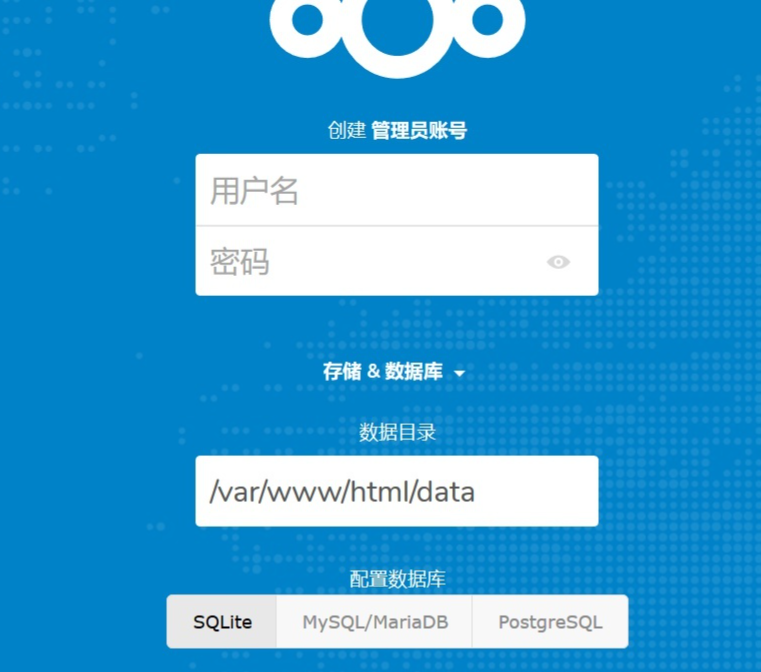

# NextCloud (Nginx+PHP)

[Installation on Linux - Nextcloud latest Administration Manual latest documentation](https://docs.nextcloud.com/server/latest/admin_manual/installation/source_installation.html#apache-configuration-label)

## 一.准备磁盘

格式化磁盘文件系统为 ext4

a.查看磁盘`sudo fdisk -l`

b.编辑磁盘分区

```bash
sudo fdisk /dev/sda

#<...>
d #删除分区
o #创建新的 DOS 分区表
n #新建分区
p #查看分区
w #保存退出

sudo mkfs.ext4 /dev/sda1
```

c.安装 autofs 并创建挂载点：

```bash
sudo apt install autofs
sudo mkdir /nas
```

d.在`/etc/auto.master` 添加下面这行：

```bash
/nas    /etc/auto.usb     
```

e.新建`/etc/auto.usb` 加入下面内容：

```bash
data -fstype=ext4,rw :/dev/sdb1     #存储数据
backup -fstype=ext4,rw :/dev/sda1   #用于备份
```

f.重启一下autofs

```bash
sudo systemctl restart autofs.service
```

g.测试是否可以访问`/nas/data`以及`/nas/backup`

```bash
cd /nas/data
cd /nas/backup
mount
```

## 2.数据备份

### ****利用 rsync 进行数据备份****

1. 完整备份 `rsync -a /nas/data/ /nas/backup/2022-02-01`
2. 增量备份`rsync -a --link-dest /nas/backup/2022-02-01/ /nas/data/ /nas/backup/2022-02-02`

### 自动化备份

- 每周 7 个日备份
- 每月 4 个周备份
- 每年 12 个月备份
- 每五年 5 个年备份
1. script 

```bash
#!/bin/bash

TODAY=$(date +%Y-%m-%d)
DATADIR=/nas/data/
BACKUPDIR=/nas/backup/
SCRIPTDIR=/nas/data/backup_scripts
LASTDAYPATH=${BACKUPDIR}/$(ls ${BACKUPDIR} | tail -n 1)
TODAYPATH=${BACKUPDIR}/${TODAY}
if [[ ! -e ${TODAYPATH} ]]; then
        mkdir -p ${TODAYPATH}
fi

rsync -a --link-dest ${LASTDAYPATH} ${DATADIR} ${TODAYPATH} $@

${SCRIPTDIR}/deleteOldBackups.sh
```

```bash
#!/bin/bash
BACKUPDIR=/nas/backup/

function listYearlyBackups() {
        for i in 0 1 2 3 4 5
                do ls ${BACKUPDIR} | egrep "$(date +%Y -d "${i} year ago")-[0-9]{2}-[0-9]{2}" | sort -u | head -n 1
        done
}

function listMonthlyBackups() {
        for i in 0 1 2 3 4 5 6 7 8 9 10 11 12
                do ls ${BACKUPDIR} | egrep "$(date +%Y-%m -d "${i} month ago")-[0-9]{2}" | sort -u | head -n 1
        done
}

function listWeeklyBackups() {
        for i in 0 1 2 3 4
                do ls ${BACKUPDIR} | grep "$(date +%Y-%m-%d -d "last monday -${i} weeks")"
        done
}

function listDailyBackups() {
        for i in 0 1 2 3 4 5 6
                do ls ${BACKUPDIR} | grep "$(date +%Y-%m-%d -d "-${i} day")"
        done
}

function getAllBackups() {
        listYearlyBackups
        listMonthlyBackups
        listWeeklyBackups
        listDailyBackups
}

function listUniqueBackups() {
        getAllBackups | sort -u
}

function listBackupsToDelete() {
        ls ${BACKUPDIR} | grep -v -e "$(echo -n $(listUniqueBackups) |sed "s/ /\\\|/g")"
}

cd ${BACKUPDIR}
listBackupsToDelete | while read file_to_delete; do
        rm -rf ${file_to_delete}
done
```

1. crontab 创建定时备份：

```bash
0 2 * * * /nas/data/backup_scripts/daily.sh
```

## 二.安装环境

### Docker 安装 Nextcloud （可选）

一步安装 Docker ：

```bash
sudo apt install nginx docker.io
#sudo curl -sSL get.docker.com | sh
```

安装 Nextcloud：

```bash
sudo docker run -d --name nextcloud -p 8000:80 -v /nas/data/nextcloud:/var/www/html nextcloud
```

运行 Nextcloud :

```bash
sudo docker run -d -p 8000:80 -v /nas/data/nextcloud:/var/www/html nextcloud
```

成功后，输入网址 [http://192.168.10.103:8000/](http://192.168.10.103:8000/) 进入到配置页面



1. APT安装 nginx mysql php

```bash
sudo apt update
```

```bash
sudo apt install -y nginx
sudo apt install -y mariadb-server
sudo apt install -y php7.4-fpm php7.4-gd php7.4-mysql php7.4-curl php7.4-mbstring php7.4-intl
sudo apt install -y php7.4-gmp php7.4-bcmath php7.4-imagick php7.4-xml php7.4-zip
```

1. 配置数据库

```bash
sudo mysql
```

创建用户和数据库：(pi—>username)

```bash
CREATE USER 'pi'@'localhost' IDENTIFIED BY '12134';
CREATE DATABASE IF NOT EXISTS nextcloud CHARACTER SET utf8mb4 COLLATE utf8mb4_general_ci;
GRANT ALL PRIVILEGES ON nextcloud.* TO 'pi'@'localhost';
FLUSH PRIVILEGES;
exit;
```

3.下载 nextcloud

- The HTTP user and group in Debian/Ubuntu is www-data.
- The HTTP user and group in Fedora/CentOS is apache.
- The HTTP user and group in Arch Linux is http.
- The HTTP user in openSUSE is wwwrun, and the HTTP group is www

```bash
mkdir /nas && mkdir /nas/date
cd /nas/data
wget https://download.nextcloud.com/server/releases/nextcloud-23.0.2.zip
unzip nextcloud-23.0.2.zip
```

```bash
sudo ln -s /nas/data/nextcloud /var/www/nextcloud
sudo chown -R www-data:www-data /nas/data/nextcloud
```

## 三.配置服务器

1. 创建配置文件

For Debian, Ubuntu, and their derivatives:

==>/etc/nginx/sites-available/nextcloud.conf

For Fedora, CentOS, RHEL, and similar systems: 

==>/etc/httpd/conf.d/nextcloud.conf

```bash
sudo vi /etc/nginx/sites-available/nextcloud.conf
```

```bash
server {
    listen 80;
    listen [::]:80;

    server_name mycloud.server.com;

    root /var/www/nextcloud;

		index index.php index.html /index.php$request_uri;
		
		client_max_body_size 5120M;
    client_body_timeout 3000s;
    fastcgi_buffers 64 40K;

    # Rule borrowed from `.htaccess` to handle Microsoft DAV clients
    location = / {
        if ( $http_user_agent ~ ^DavClnt ) {
            return 302 /remote.php/webdav/$is_args$args;
        }
    }

    location = /robots.txt {
        allow all;
        log_not_found off;
        access_log off;
    }

    # Make a regex exception for `/.well-known` so that clients can still
    # access it despite the existence of the regex rule
    # `location ~ /(\.|autotest|...)` which would otherwise handle requests
    # for `/.well-known`.
    location ^~ /.well-known {
        # The rules in this block are an adaptation of the rules
        # in `.htaccess` that concern `/.well-known`.

        location = /.well-known/carddav { return 301 /remote.php/dav/; }
        location = /.well-known/caldav  { return 301 /remote.php/dav/; }

        location /.well-known/acme-challenge    { try_files $uri $uri/ =404; }
        location /.well-known/pki-validation    { try_files $uri $uri/ =404; }

        # Let Nextcloud's API for `/.well-known` URIs handle all other
        # requests by passing them to the front-end controller.
        return 301 /index.php$request_uri;
    }

    # Rules borrowed from `.htaccess` to hide certain paths from clients
    location ~ ^/(?:build|tests|config|lib|3rdparty|templates|data)(?:$|/)  { return 404; }
    location ~ ^/(?:\.|autotest|occ|issue|indie|db_|console)                { return 404; }

    # Ensure this block, which passes PHP files to the PHP process, is above the blocks
    # which handle static assets (as seen below). If this block is not declared first,
    # then Nginx will encounter an infinite rewriting loop when it prepends `/index.php`
    # to the URI, resulting in a HTTP 500 error response.
    location ~ \.php(?:$|/) {
        # Required for legacy support
        rewrite ^/(?!index|remote|public|cron|core\/ajax\/update|status|ocs\/v[12]|updater\/.+|oc[ms]-provider\/.+|.+\/richdocumentscode\/proxy) /index.php$request_uri;

        fastcgi_split_path_info ^(.+?\.php)(/.*)$;
        set $path_info $fastcgi_path_info;

        try_files $fastcgi_script_name =404;

        include fastcgi_params;
        fastcgi_param SCRIPT_FILENAME $document_root$fastcgi_script_name;
        fastcgi_param PATH_INFO $path_info;
        fastcgi_param HTTPS off;

        fastcgi_param modHeadersAvailable true;         # Avoid sending the security headers twice
        fastcgi_param front_controller_active true;     # Enable pretty urls
        fastcgi_pass 127.0.0.1:9000;

        fastcgi_intercept_errors on;
        fastcgi_request_buffering off;

        fastcgi_max_temp_file_size 0;
    }

    location ~ \.(?:css|js|svg|gif|png|jpg|ico|wasm|tflite|map)$ {
        try_files $uri /index.php$request_uri;
        add_header Cache-Control "public, max-age=15778463, immutable";
        access_log off;     # Optional: Don't log access to assets

        location ~ \.wasm$ {
            default_type application/wasm;
        }
    }

    location ~ \.woff2?$ {
        try_files $uri /index.php$request_uri;
        expires 7d;         # Cache-Control policy borrowed from `.htaccess`
        access_log off;     # Optional: Don't log access to assets
    }

    # Rule borrowed from `.htaccess`
    location /remote {
        return 301 /remote.php$request_uri;
    }

    location / {
        try_files $uri $uri/ /index.php$request_uri;
    }
}
```

```bash
sudo vi /etc/php/7.4/fpm/pool.d/www.conf
```

> 修改 listen 后面内容为 `9000`
> 

修改监听端口：/etc/apache2/ports.conf

```bash
listen 80
```

最后使能一下：

```bash
sudo ln -s /etc/nginx/sites-available/nextcloud /etc/nginx/sites-enabled/nextcloud
sudo rm /etc/nginx/sites-enabled/default
sudo systemctl restart nginx
```

接着就可以配置你的 [Nextcloud](http://192.168.10.107/) 啦


1. 额外配置

- **去除无效登陆**

  > 修改config/config.php  'auth.bruteforce.protection.enabled' => false,

- **Pretty URLs**
  
    ```bash
    sudo nano /var/www/nextcloud/config/config.php
    ```
    
    自习修改一下内容：
    
    ```bash
    'overwrite.cli.url' => 'https://example.org/',
    'htaccess.RewriteBase' => '/',
    'check_data_directory_permissions' => false,
    'trusted_domains' =>
      array (
        0 => '192.168.10.107',
        1 => 'rainbowseeker.picp.vip',
      ),
    ```
    
    更新一下配置文件
    
    ```bash
    sudo -u www-data php /var/www/nextcloud/occ maintenance:update:htaccess
    ```
    
- **ocDownloads** 
  
    将 github 上下载的ocDownloads 包解压放至 /nextcloud/apps ,并在应用界面启用
    
    
    
    安装aria2
    
    ```bash
    sudo apt install aria2 curl php7.4-curl -y
    ```
    
    配置成系统服务
    
    ```bash
    sudo nano /etc/systemd/system/aria2.service
    ```
    
    输入下面配置文件：
    
    ```bash
    [Unit]
    Description=Aria2
    After=network.target
    
    [Service]
    User=www-data
    Type=simple
    ExecStart=/usr/bin/aria2c --enable-rpc --rpc-listen-all
    
    [Install]
    WantedBy=multi-user.target
    ```
    
    ```bash
    sudo systemctl daemon-reload
    sudo systemctl restart aria2.service
    sudo systemctl enable aria2.service
    sudo lsof -i:6800
    ```
    
- **Externel Storage**
  
    a.开启外部存储功能：
    
    
    
    b.配置路径
    
    
    

