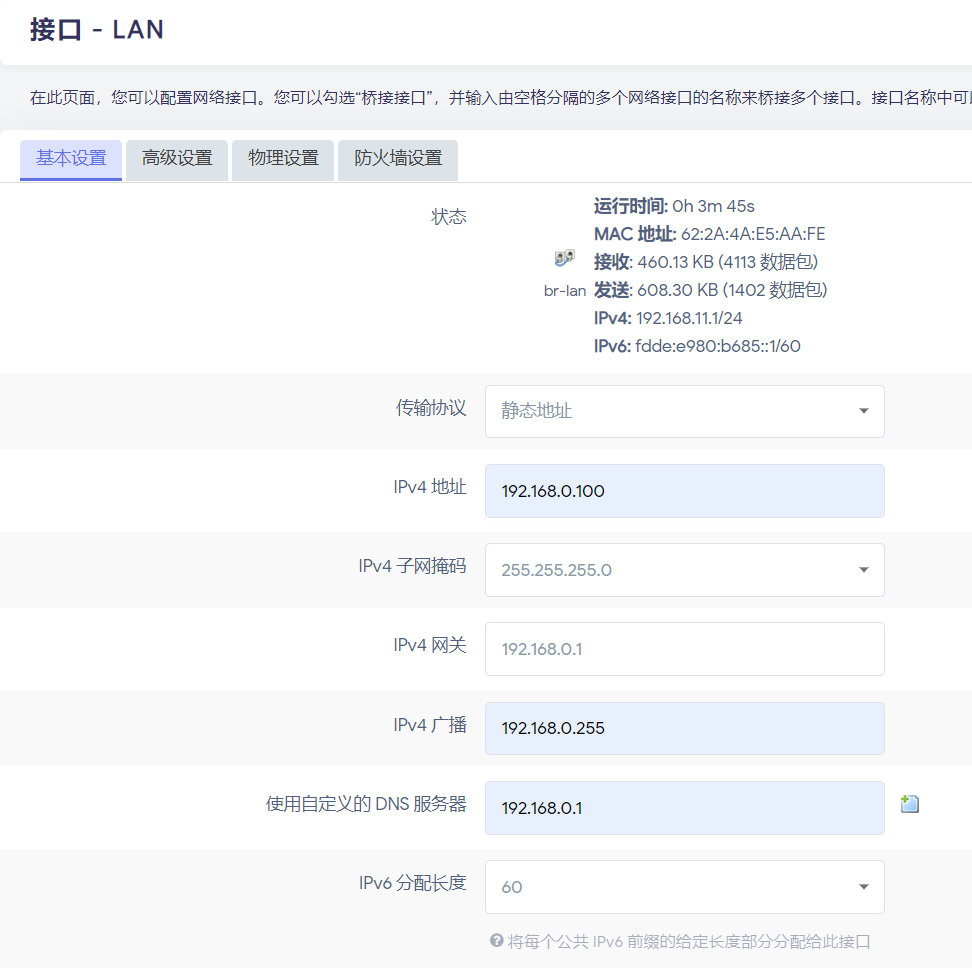

# R2S旁路由实用配置

## Openclash 科学上网

1. 配置软路由 lan 口（将**软路由的LAN**连接到**电脑的网口**）

<aside>
💡 **ip 地址需和主路由ip在同一网段！！！**

</aside>

---

<aside>
💡 **关闭软路由的 DHCP 和 ipv6 ！！！**

</aside>

这时只需要将软路由的**LAN**连上主路由的**LAN**，就可以通过之前填写**ip地址**访问 openwrt 啦！

1. 配置 openclash

最后点击**更新配置**即可

## AdGuard Home 广告拦截

