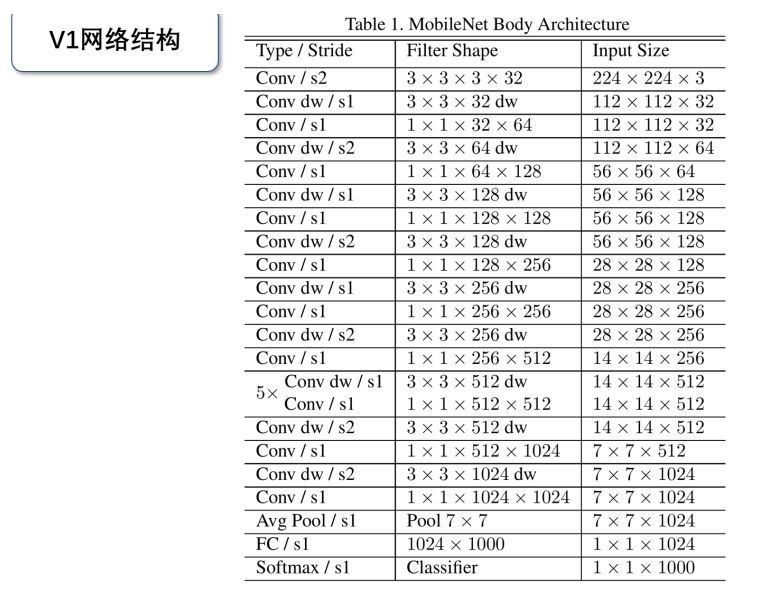
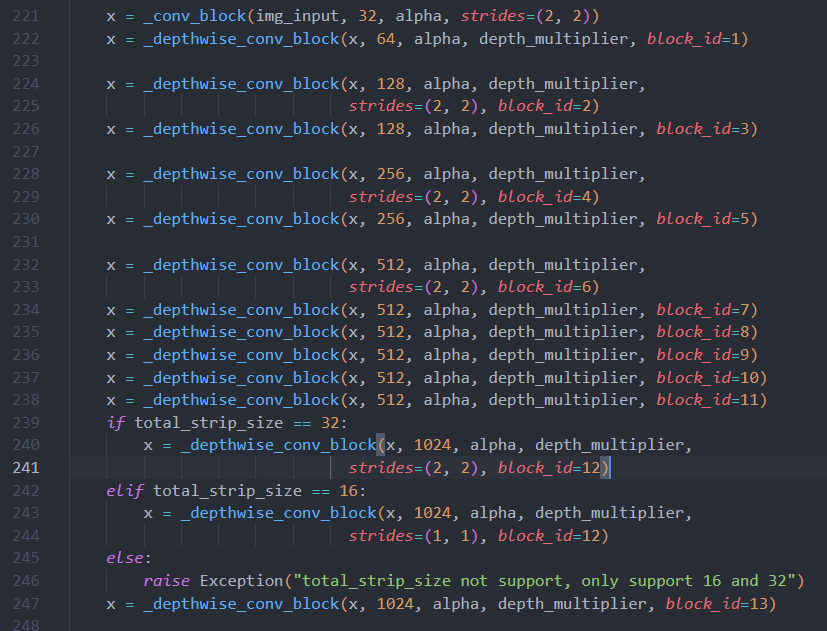
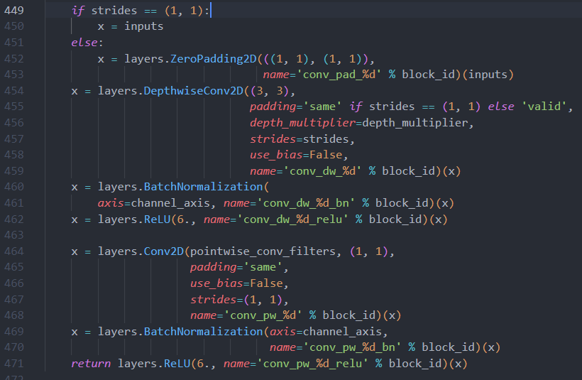
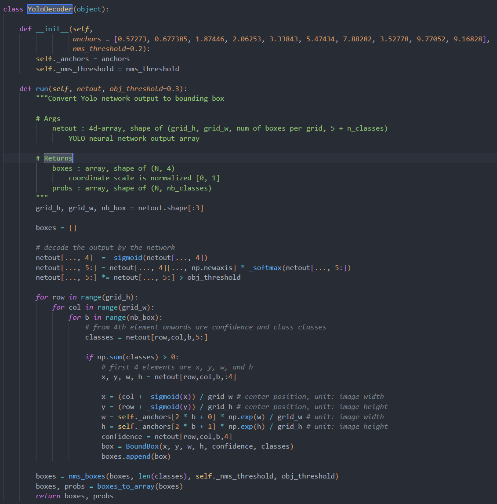
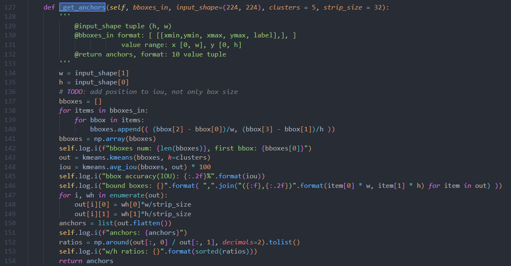
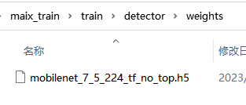

# Maix YOLO 

## 1. YOLO 结构

​	K210 使用的 YOLO 版本为 YOLO v2，相较于 YOLO v1 在保留了高检测速度的同时，大幅度提高了定位精度。

> 具体描述可看这篇[文章](https://zhuanlan.zhihu.com/p/35325884)。

​	在基础模型（特征提取器）上，maix 采用 MobileNet V1这一轻量化网络来实现对图片信息的快速提取（通过牺牲一点准确率换取较小模型参数量，这实际上恰好适应嵌入式设备资源，算力有限的情形，与之类似网络的还有Tiny YOLO ，VGG16，ResNet18等）。

​	在maix_train\train\detector\yolo\backend\utils\mobilenet_sipeed\mobilenet.py 文件里，可以看到对应层次结构的实现（网络截止到`Avg Pool`，输出特征图为7 X 7 X 1024）：

​	_depthwise_conv_block 实现先 dw卷积再普通卷积：

在`maix_train\train\detector\yolo\backend\network.py`里可以看到整个骨干网络的构建（feature_extractor + output_tensor）：

output_tensor 实际上就是在特征图上卷积做预测，输出通道数取决于 anchor boxes 数量以及检测的物品类别数。

​	在定位上，YOLOv2借鉴了RPN网络使用anchor boxes来预测边界框相对先验框的offsets。
$$
\\b_x = (\sigma (t_x)+c_x)/W

\\ b_y = (\sigma (t_y) + c_y)/H

\\b_w = p_we^{t_w}/W

\\b_h = p_he^{t_h}/H
$$

​	这部分对模型输出数据的解码可以参看maix_train\train\detector\yolo\backend\decoder.py：（其中也包含非极大值抑制NMS，即去除相关联框）

​	而在anchor boxes 值的选取上，YOLOv2并没有使用预设的纵横比和尺度的组合（Faster R-CNN 定义三组纵横比`ratio = [0.5,1,2]`和三种尺度`scale = [8,16,32]`，可以组合出9种不同的形状和大小的边框），而是使用`k-means`聚类的方法，从训练集中学习得到不同的Anchor。

在`maix_train\train\detector\__init__.py`里有计算anchors的具体实现 ：

## 2. Train

​	为了加快训练速率，提高模型的泛化性，maix 的训练方式为迁移学习，在 maix_train\train\detector\weights 文件夹下，已提供了特征提取器mobilenet 的预训练参数文件。

因此实际训练时只需微调（FineTune）网络，即根据检测物品类别修改输出层（这一点在网络最后output_tensor 上有体现）等。