# 本地训练 for windows


​	本教程将在windows上平台使用CPU/GPU进行训练，若你的电脑非windows系统或者为办公用笔记本，那么本教程可能不太适用于你。

## Prerequisite

### 1.install driver

- 安装 [ch340 ch341 driver](https://gitee.com/rainbowseeker9/maix_train/releases/download/installer/CH341SER.EXE )
- 安装 [maixpy ide](https://gitee.com/rainbowseeker9/maix_train/releases/download/installer/maixpy-ide-windows-0.2.5.exe)
- 下载 [kflash_gui](https://gitee.com/rainbowseeker9/maix_train/releases/download/installer/kflash_gui.exe)， 直接打开无需安装

> 下载[k210固件](https://gitee.com/rainbowseeker9/maix_train/releases/download/installer/maixpy_v0.6.2_84_g8fcd84a58.bin)，在`kflash_gui`里打开你下载完成的k210固件。
>
> 使用数据线连接上k210，此时端口选项里会新增COMx，选择新增的COMx，下载即可（下载进度条未动则说明可能连接错误的COMx，下拉选择框选择其余的试一试）。
>
> 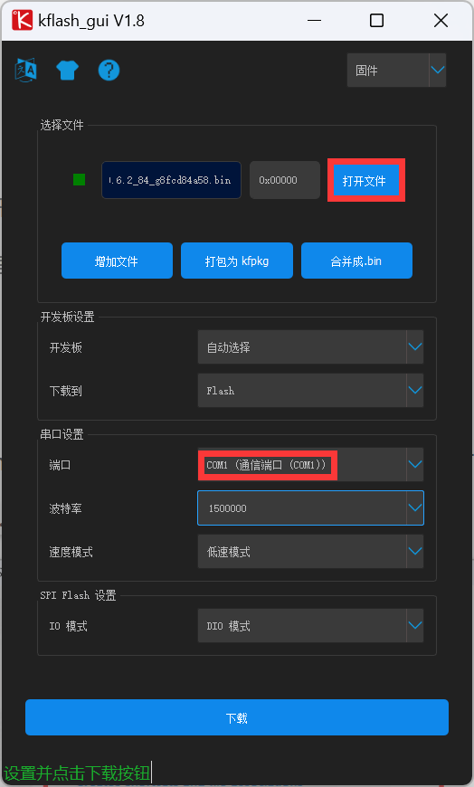

### 2. install python

有一定深度学习经验的读者可以自行使用 Anaconda 管理你的 python 环境。对于小白，则可以直接安装该[文件](https://www.python.org/ftp/python/3.8.10/python-3.8.10-amd64.exe)。

注意安装时先勾选下面的 `Add Python 3.8 to PATH` 。

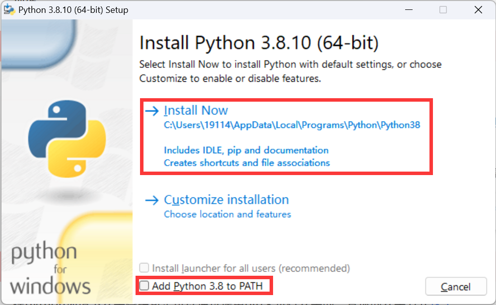

安装之后的python，按win+r，输入cmd打开命令行，然后输入`python -V`，出现下图则表示python安装成功。

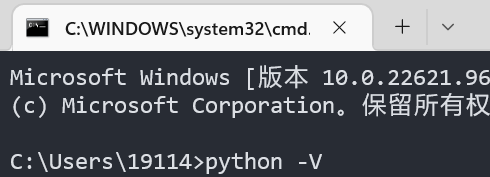

### 3. install CUDA & CUDNN （Optional）

> 对于模型的训练，可以使用CPU或者是GPU。如果你的电脑**安装有10系或者20系的 NVIDIA 显卡**（**不清楚品牌的同学可以用CPU**），那么恭喜你，你可以使用GPU加速模型的训练；如果没有，那么你可以点击[这里](##Install Packages)***跳过教程的本部，直接使用CPU进行训练***。
>
> 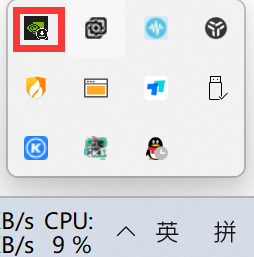
>
> ​	不同版本的CUDA有所对应不同的显卡驱动版本要求，这里推荐使用CUDA10.1版本。

#### 安装显卡驱动

点击[这里](https://www.nvidia.cn/Download/index.aspx?lang=cn),选择你对应的显卡型号，下载对应的显卡驱动，然后打开文件夹，进行显卡驱动的安装。

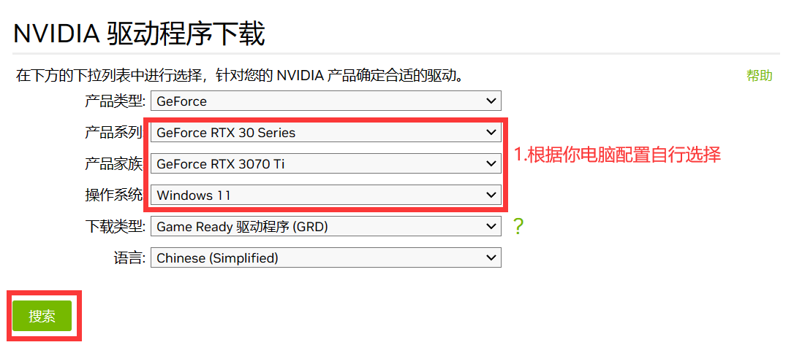

#### 安装CUDA

打开cuda10.1下载的[链接](https://developer.nvidia.com/cuda-10.1-download-archive-base)，选择对应的系统版本和下载方式（win11 和win10 都选择Version 10）。
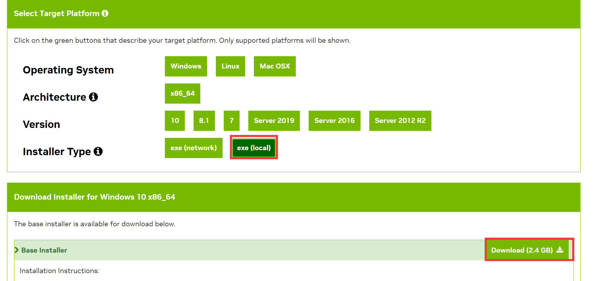

点击Download进行下载，这个网页可能打开的比较慢。下载好的安装包，直接打开，然后一直点下一步就好了。

#### 安装CUDNN

对于CUDNN下载，由于这个网页没有科学上网的情况下打开是比较慢的。

点击[这里](https://developer.nvidia.com/rdp/cudnn-archive#a-collapse765-101)，下载 cuDNN v7.6.5 (November 5th, 2019), for CUDA 10.1
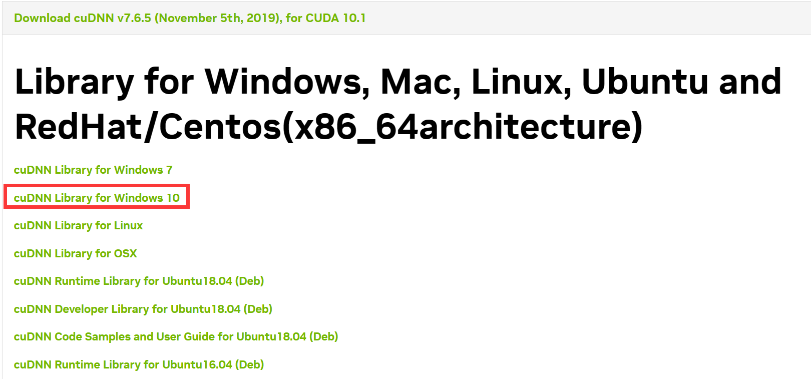

下载之后会得到一个cudnn-10.1-windows10-x64-v7.6.5.32.zip的压缩包，将其解压。

将解压的得到的文件三个文件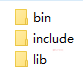，都复制到 **C:\Program Files\NVIDIA GPU Computing Toolkit\CUDA\v10.1**文件下面。这时CUDA的环境已经配置好了

## Install Packages

### 1. tensorflow

在cmd命令行中输入

```
pip install tensorflow-gpu==2.3.0 -i https://pypi.mirrors.ustc.edu.cn/simple
```

然后等待安装成功即可。

### 2. clone project

[下载本地训练代码](https://gitee.com/rainbowseeker9/maix_train.git)，进入连接之后，可以点击Download ZIP进行下载压缩包。

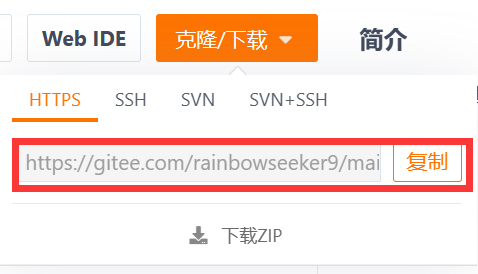

将压缩包解压，任何位置都都可以，只要你记得解压到哪里了。

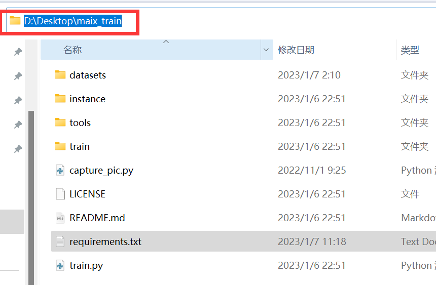

将cmd切换到你文件保存的路径下:

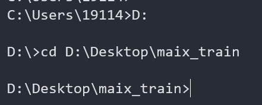

输入 

    pip install -r requirements.txt -i https://mirrors.aliyun.com/pypi/simple/

等待全部包的安装结束就可以了。

## Labelimg

### 1. Capture picture

打开`MaixPy IDE`，点击左侧蓝色文件夹，打开maix_train文件夹中的`capture_pic.py`文件。

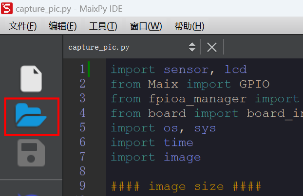

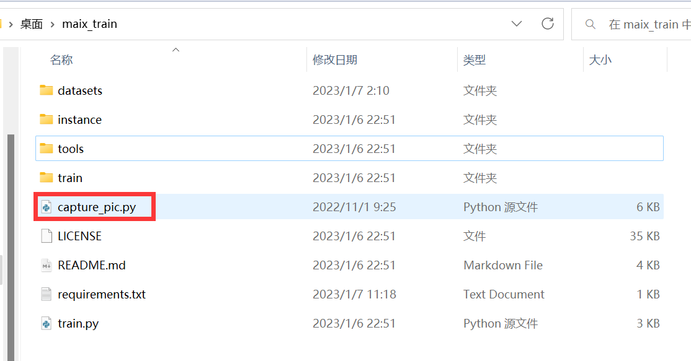

插入sd卡，将k210通过数据线连接到电脑，然后点击左下角连接。

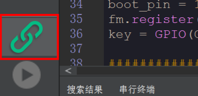

连接成功后，在`MaixPy IDE`的最上面一行`工具`里选择`将打开的脚本保存到开发板的 boot.py`，等待完成后为k210重新上电（无需再点击`MaixPy IDE`左下角连接）。

对需要识别的物品拍照，按一下k210左侧按键，照片便会自动保存至sd卡中，效果如下图所示。

> 你可以一次性拍入多个数字，也可以为每个数字单独拍照。但是需注意每个数字需要不同角度拍到，且被拍到的次数必须大于100，否则训练出的模型可能过拟合，识别效果不好。


在拍摄完近千张照片后，便可以正式的标注过程。

### 2. install labelimg

在cmd命令行输入

```
pip install labelimg
```

然后启动labelimg

```
labelimg
```

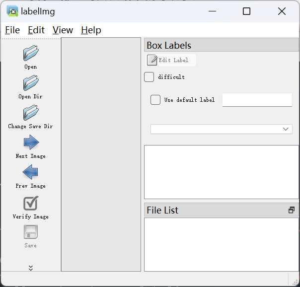

在datasets文件夹下新建一个文件夹用于保存你的数据集，这里我的数据集名称叫做`number1_8`，

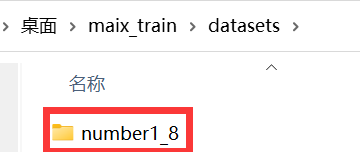

在`number1_8`文件夹下再新建三个文件夹，其中`images`放入你刚才拍摄完成的照片，`xml`文件夹现在为空，`labels.txt`中写入你检测的物品名称，由于这里检测的是数字1-8，因此在`labels.txt`写入1-8（每个种类为一行），如下图所示。

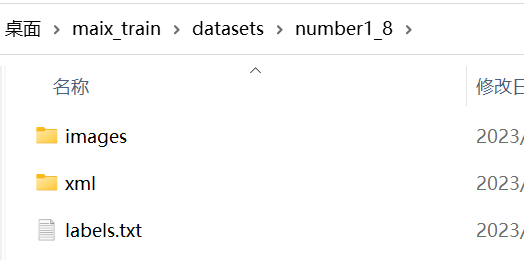

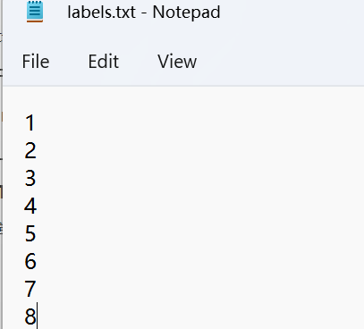

### 3. labelimg

在labelimg里首先选择` Open Dir`，打开上一步的`images`文件夹；然后选择`Change Save Dir`，这里打开刚刚空的文件夹`xml`，用于保存标注后的框。

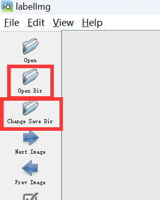

在View里选择 `Auto Save mode`

> 一定要确保 `Auto Save mode`功能打开

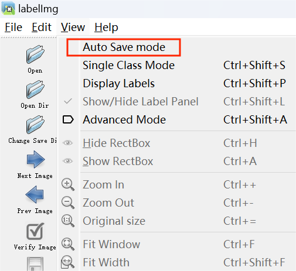

打开后的界面：

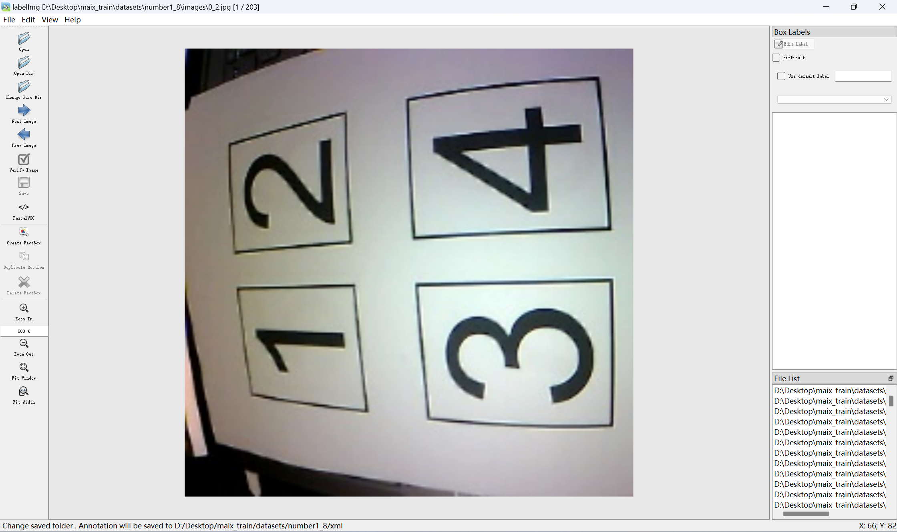

英文输入法下按`w`，依次点击数字的左上角和右上角，在弹出的小框中输入类别名称，我这里标注的是2，因此输入2，点击`OK`后依次标注完剩余数字。

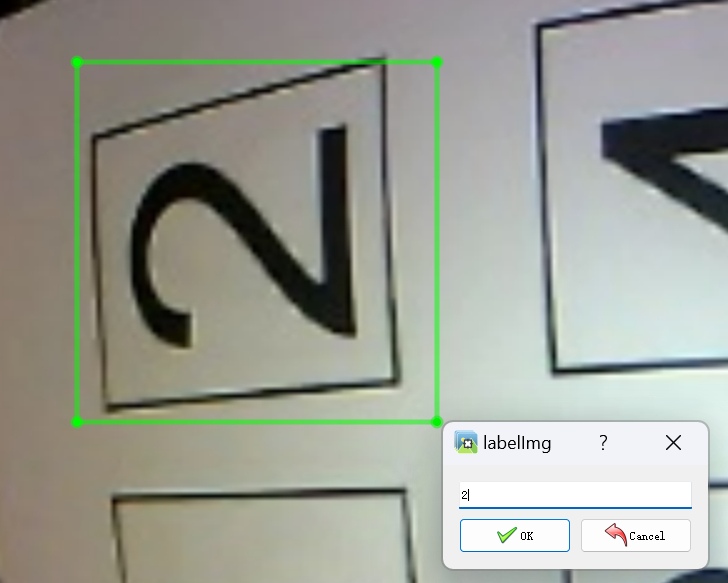

这是标注完一副图片后的效果，注意标注框的数字一定要和真实数字一致，是数字1就弹出的小框里填入1。

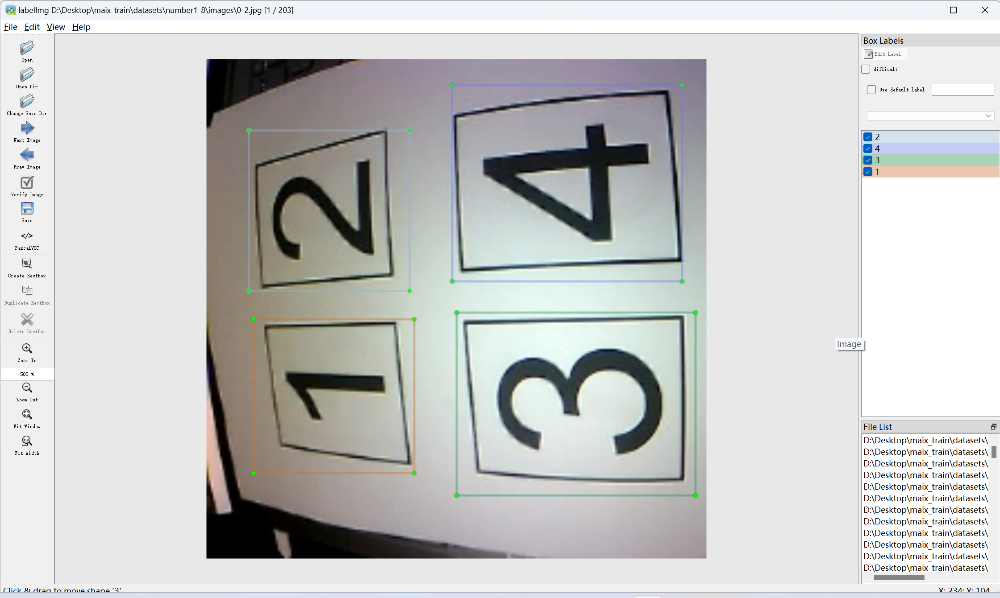

你可以用`D`键切换到下一副图片，用`A`键切换到上一副图片，直到所有图片标注完成。

> 标注（labelimg）是一个非常耗时的过程，但标注的图片数量又很大程度影响了你最终模型识别数字的准确率，因此务必耐心标注完。

## Train

先进行初始化

    python train.py init

开始训练之前，我们需要将自己本地训练的参数进行修改，在instance/config.py中进行修改对应的参数，否则就会出现错误，再进行训练。如果不清楚下面参数的意义，就可以默认使用下面这套。

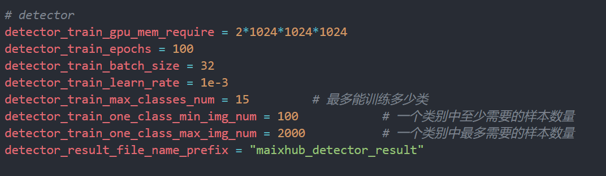

将数据集放到本地训练源码中的datasets文件夹中，然后在有train.py文件层级上启动命令行界面，和安装依赖的时的启动方法一样。

> 这里输入的命令中，在datasets/后面加的是你自己的所制作的数据集名字，比如我的数据集名称是number1_8，不要上来就直接将复制命令运行。

命令行输入

    python train.py -t detector -d datasets/[your_dataset_name] train

训练完之后就会得到一个out的文件夹，里面的文件就是训练之后得到的模型。

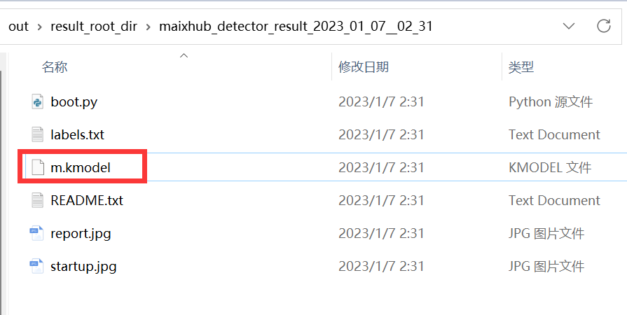

使用`kflash_gui`将模型烧录至 0x300000，如下图所示，确认无误后点击下载。

> 注意一定要修改地址为0x300000，否则k210成砖了！

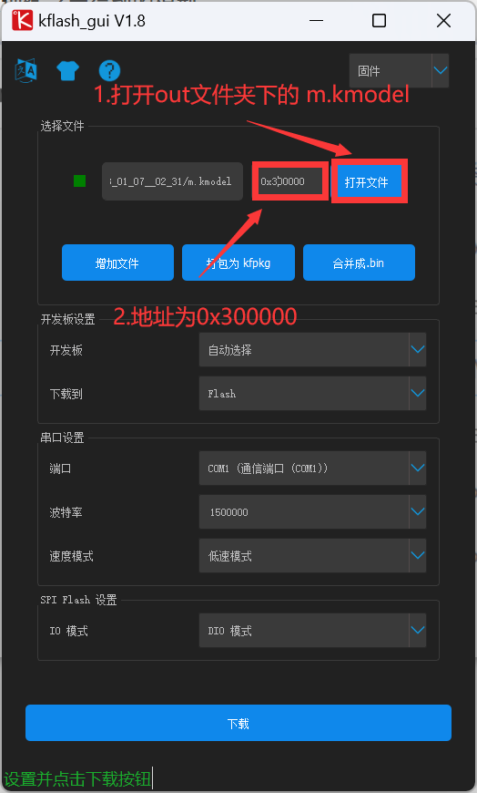

## Run

这里提供了一份[测试代码](https://gitee.com/rainbowseeker9/maix_train/releases/download/installer/pycode.zip)， 使用时请先解压，然后将`motor.py`， `pid.py`拷贝到sd卡中，最后在`Maixpy IDE`中打开`main.py`，如下图所示。

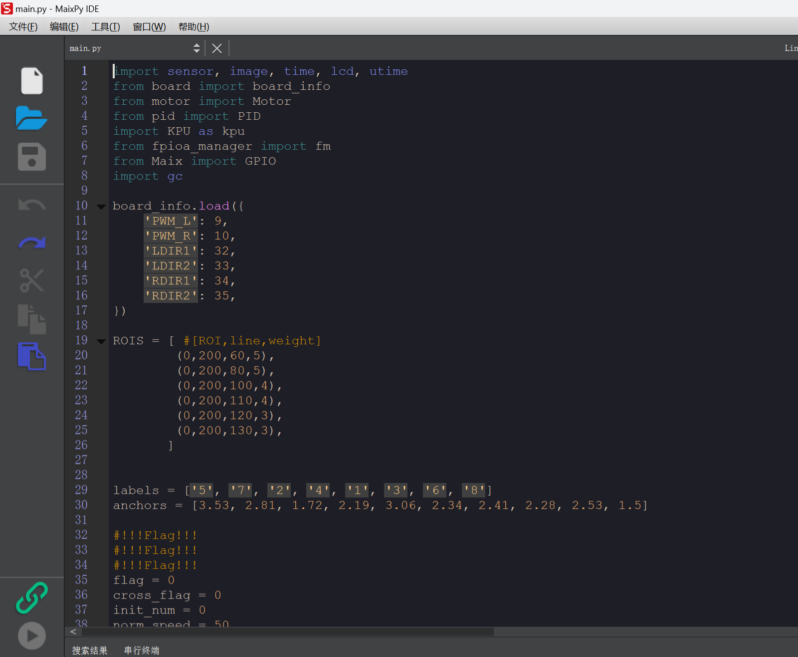

> 注意：第29，30行的参数来源于你的模型，在你out文件夹下（与`m.kmodel`同一目录）有一个`boot.py`文件，打开后有类似的`labels anchors`，请自行复制。
>
> 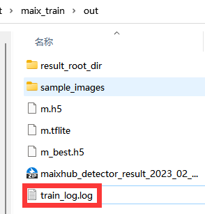
>
> 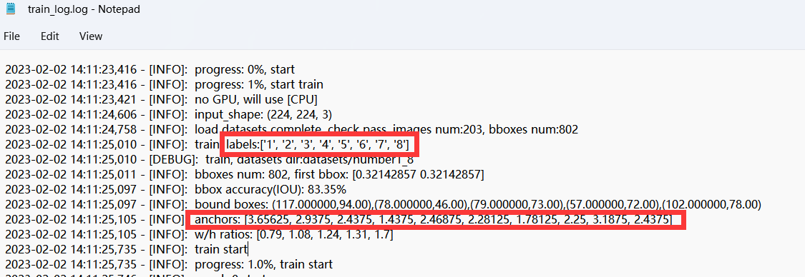


插入sd卡，将k210通过数据线连接到电脑，然后点击左下角连接。


连接成功后，在`MaixPy IDE`的最上面一行`工具`里选择`将打开的脚本保存到开发板的 boot.py`，等待完成后为k210重新上电（无需再点击`MaixPy IDE`左下角连接）。此时k210将会运行`main.py`中的内容，等待几秒若屏幕显示图像，则运行正常。

> 此后，若修改了main.py里的代码，要使其生效，只需重复上面一行话的操作即可。

## 常见问题

### 出现failed: TrainFailReason.ERROR_PARAM, datasets not valid: datasets format error: datasets error, not support format, please check

这种就是没有严格的安装数据集要求来进行制作，检查你的文件夹名字，就可以解决的了，特别是images这个文件夹，容易少了个s

