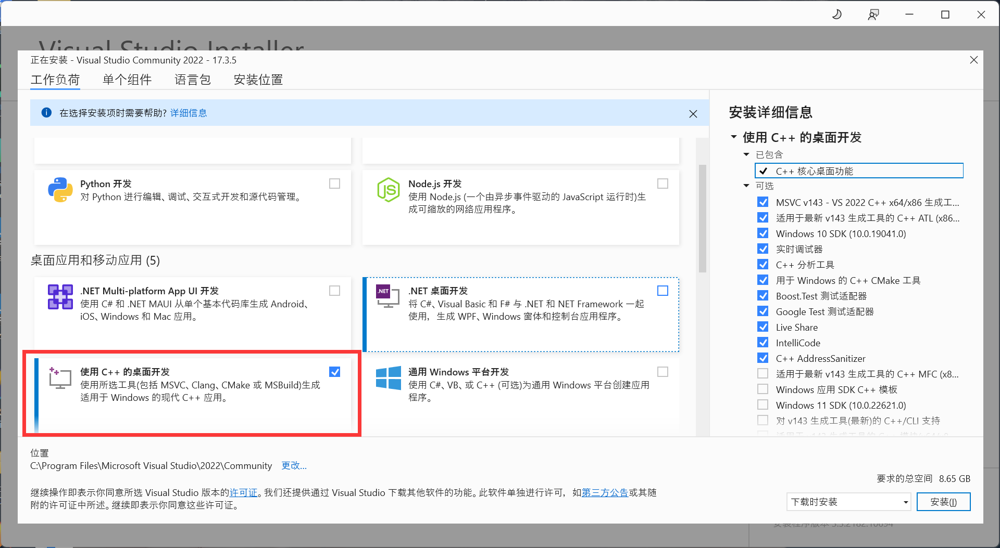
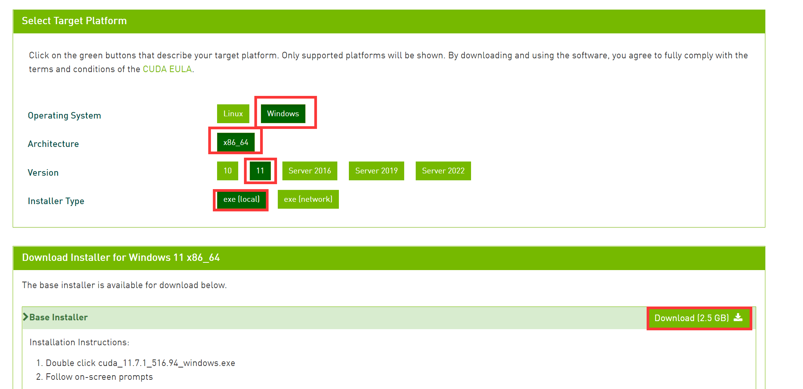
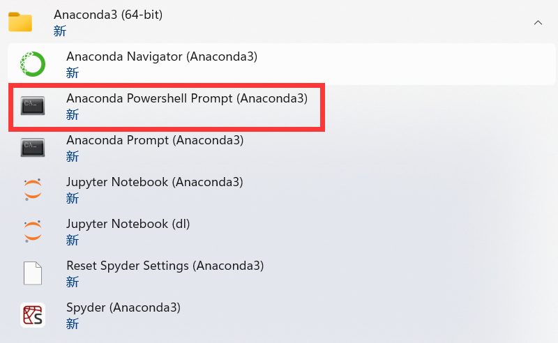
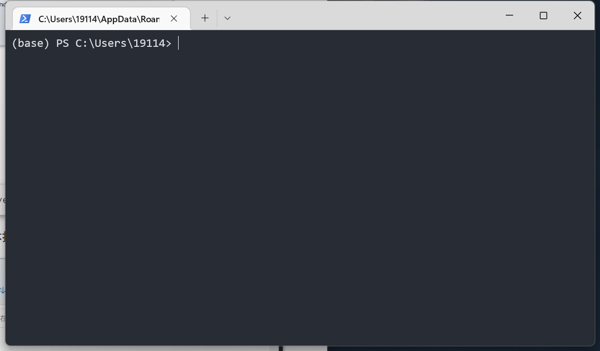
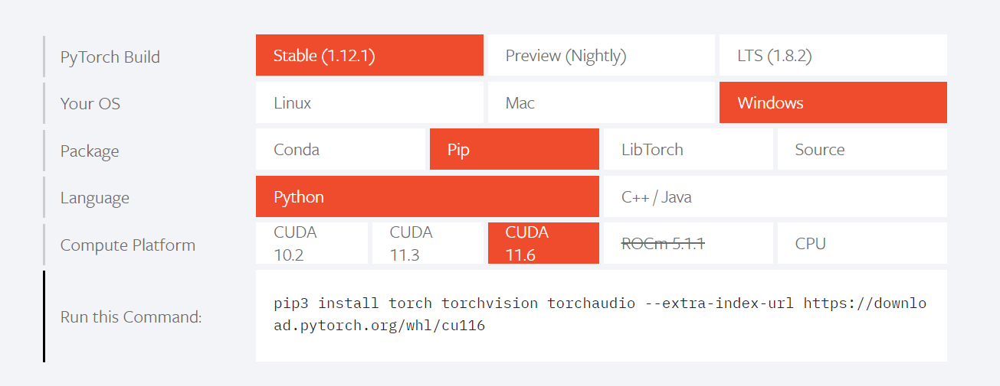
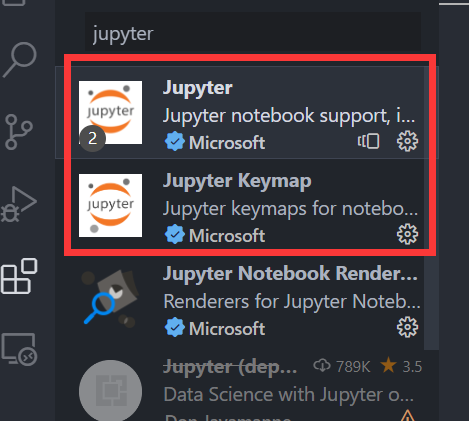
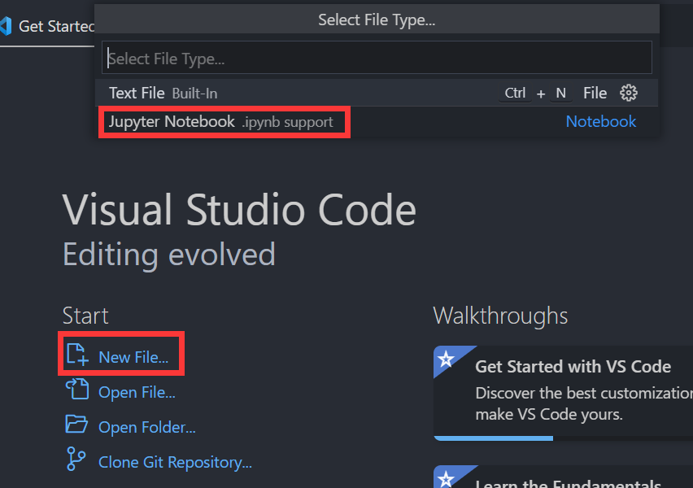
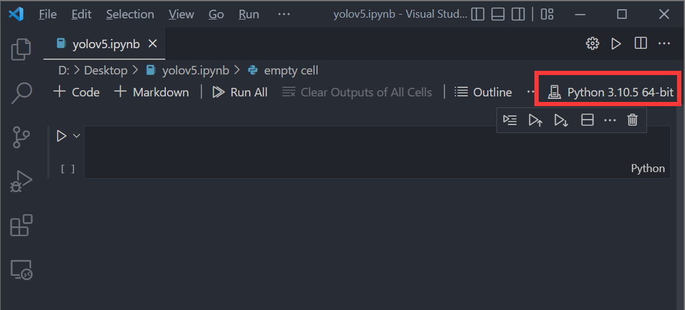
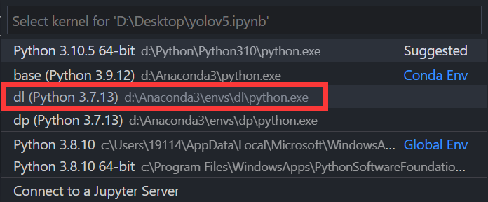

# Dive Into YOLOv5

​																						---windows 版本，Author: rainbowseeker9  from DHU

## 一.前言

​	Windows 操作系统通常是大家最为熟悉的操作系统，但是在做深度学习时并不建议大使用选择windows系统，你有可能因此出现的诸多问题，如深度学习框架的官方支持不够及时，复现他人模型时需修改源码才能直接运行（这往往是很困难的）等等。因此**为了能够使用大多数深度学习工程师开源的代码，我们建议使用 Ubuntu 作为运行代码的机器，参考方案见[linux版本](./动手做目标检测-linux)及[云端版本](./动手做目标检测-cloud)。**

### 配置环境

​	本教程编写于 2022.10，使用的环境：

- Pytorch: 1.12.0
- Python: 3.7
- CUDA: 11.7

### 前置软件

​	直接点击下方链接下载即可，安装时除安装位置可自行调整外其余默认。

- [Anaconda](https://repo.anaconda.com/archive/Anaconda3-2022.05-Windows-x86_64.exe): 一个辅助进行包管理和环境管理的软件，在功能上Conda可以看作是**pip** 和 **vitualenv** 的组合；
- [Git](https://github.com/git-for-windows/git/releases/download/v2.37.3.windows.1/Git-2.37.3-64-bit.exe): 用于获取托管在 github 上的工程源码；

> ​	对于带 **Nvidia** 显卡的电脑用户，还可使用 `gpu` 加速训练过程，链接如下，按各自电脑系统版本进行下载安装（**！！！不使用`gpu`训练的同学无须下载！！！**）。
>
> - [Visual Studio](https://visualstudio.microsoft.com/zh-hans/thank-you-downloading-visual-studio/?sku=Community&channel=Release&version=VS2022&source=VSLandingPage&cid=2030&passive=false): 勾选 C++ 安装即可；
>
>   
>
> - CUDA Toolkit 11.3： https://developer.nvidia.com/cuda-downloads
>
>   

## 二.环境创建

### 1.打开`Anaconda`控制台



打开之后如图：



#### 1.1 换源

在命令行中输入以下内容：

```
conda config --set show_channel_urls yes
```

接着进入 `C:\Users\{your_name}`，记事本打开 `.condarc`文件


修改内容为

```
channels:
  - defaults
show_channel_urls: true
default_channels:
  - https://mirrors.tuna.tsinghua.edu.cn/anaconda/pkgs/main
  - https://mirrors.tuna.tsinghua.edu.cn/anaconda/pkgs/r
  - https://mirrors.tuna.tsinghua.edu.cn/anaconda/pkgs/msys2
custom_channels:
  conda-forge: https://mirrors.tuna.tsinghua.edu.cn/anaconda/cloud
  msys2: https://mirrors.tuna.tsinghua.edu.cn/anaconda/cloud
  bioconda: https://mirrors.tuna.tsinghua.edu.cn/anaconda/cloud
  menpo: https://mirrors.tuna.tsinghua.edu.cn/anaconda/cloud
  pytorch: https://mirrors.tuna.tsinghua.edu.cn/anaconda/cloud
  pytorch-lts: https://mirrors.tuna.tsinghua.edu.cn/anaconda/cloud
  simpleitk: https://mirrors.tuna.tsinghua.edu.cn/anaconda/cloud
```

在命令行中输入以下内容，遇到 `Proceed ([y]/n)?`  直接回车确认：

```
conda clean -i
```

### 2.开始安装

在命令行中依次输入以下内容：

```bash
#更新 conda
conda update -n base -c defaults conda
#创建名为 dl 的 python 环境
conda create -n dl python=3.7 		
#激活环境
conda activate dl
#安装完可以使用下面命令检查 python 版本是否为3.7
python -V
#安装 jupyter
conda install nb_conda jupyter		
```

> 框架的选择：为什么选用 `PyTorch`？：学术界普遍使用 ，开发新模型简单，基于tensor的GPU加速非常给力，以及动态图框架等等。
>
> 目前使用的版本为 pytorch=1.12.1 , torchvision=0.13.1
>
> 

```bash
#安装 pytorch 建议使用 pip ,简单快速
pip3 install torch torchvision torchaudio --extra-index-url https://download.pytorch.org/whl/cu116
```

至此，框架和环境都已安装完成，接下来就可以打开 jupyter  进行代码的编辑和运行。

## 三. VSCode 编辑 运行

### 0. 前置条件

插件市场搜索安装 `jupyter`



### 1. 新建`notebook`





切记选择正确的环境， 这里使用我们之前创建的 `dl`。



后面步骤详见 yolov5.ipynb


