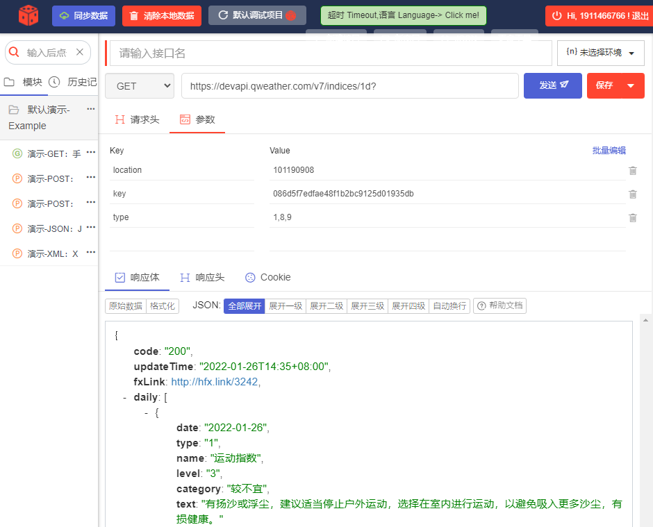

# 天气助手

---

1. 安装依赖

```bash
sudo apt install jq sendemail -y
```

1. 获取天气 API

[https://dev.qweather.com/docs/api/indices/](https://dev.qweather.com/docs/api/indices/)

<aside>
💡 可以使用 edge 插件进行 API 的 GET 接口调试，key需要自行注册账号，创建应用获取。

</aside>



1. 创建bash文件，键入以下内容

```bash
#!/bin/bash

CITY=101190908   #huai'an
TOKEN=086d5f7edfae48f1b2bc9125d01935db
TYPE=1,8,9

WEATHER=$(curl "https://devapi.qweather.com/v7/indices/1d?location=${CITY}&key=${TOKEN}&type=${TYPE}" | gunzip)

SUGGESTIONS=$(echo ${WEATHER} | jq -r '.daily | values[].text')

#echo ${SUGGESTIONS}

#send msg
SERVER="smtp.qq.com:587"
FROM="1911466766@qq.com"
TO="1911466766@qq.com"
SUBJECT="Weather $(date)"
MESSAGE="${SUGGESTIONS}"
CHARSET="utf-8"
USERNAME="1911466766@qq.com"
PASSWORD="nnsopweppzchbbai"

sendemail \
   -f ${FROM} \
   -t ${TO} \
   -u ${SUBJECT} \
   -s ${SERVER} \
   -m ${MESSAGE} \
   -xu ${USERNAME} \
   -xp ${PASSWORD} \
   -v -o message-charset=${CHARSET}
```

<aside>
💡 注意，密码需开启邮箱的smtp服务获取,见下面链接

</aside>

[如何打开POP3/SMTP/IMAP功能？_QQ邮箱帮助中心](https://service.mail.qq.com/cgi-bin/help?subtype=1&&no=166&&id=28)

1. 通过cron配置每日定时发送 

```bash
crontab -e
```

进入编辑页面，加入


那么每日7：30便会收到天气信息啦！

<aside>
💡 #在 crontab -e 最后一行输入命令即可实现简易开机执行
@reboot xxx

</aside>