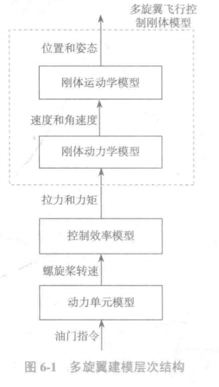

# Model

------

## 一、多旋翼控制模型

### 1.总体描述

（1）刚体运动学模型：运动学与质量和受力无关，只研究位置、

速度、姿态和角速度等变量。多旋翼运动学模型的输入为速度和角速度，输出为位置和姿态。 

（2）刚体动力学模型：动力学既涉及运动又涉及受力情况，与物体的质量和转动惯量有关。多旋翼动力学模型的输入为拉力和力矩（俯仰力矩、滚转力矩和偏航力矩），输出为速度和角速度。

（3）控制效率模型：输入是螺旋桨转速，输出是拉力和力矩。无论四旋翼还是六旋翼，其拉力和力矩都是由螺旋桨产生的。当已知螺旋桨转速时，可以通过控制效率模型计算出拉力和力矩。控制效率模型的逆过程称为`控制分配模型`，即当通过控制器设计得到期望的拉力和力矩时，可以通过控制分配模型解出所需的螺旋桨转速。

（4）动力单元模型：动力单元是以无刷直流电机、电调和螺旋桨为一组的整个动力机构。它的输入是0~1之间的油门指令，输出是螺旋桨转速。实际中，也可以建立输入是油门指令，输出是螺旋桨拉力的模型。

### 2.控制刚体模型

