# Data Fusion

## 1. Introduction

有关数据融合比较详细的讲解：

https://www.youtube.com/watch?v=6qV3YjFppuc&amp;list=PLn8PRpmsu08rneZErjW_NIBs0Rl_vcgSw&amp;ab_channel=MATLAB

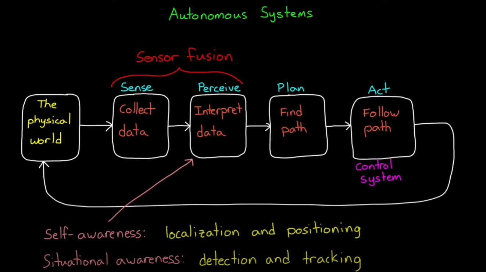

- func 1: Increasing data quality

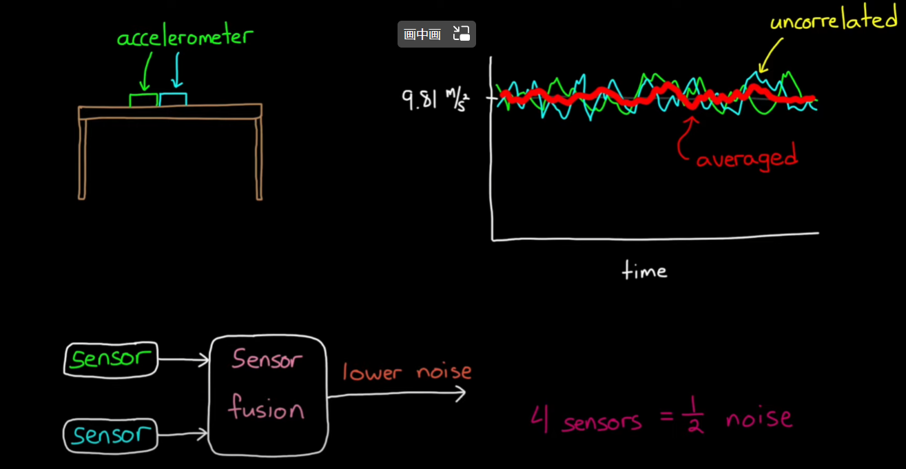

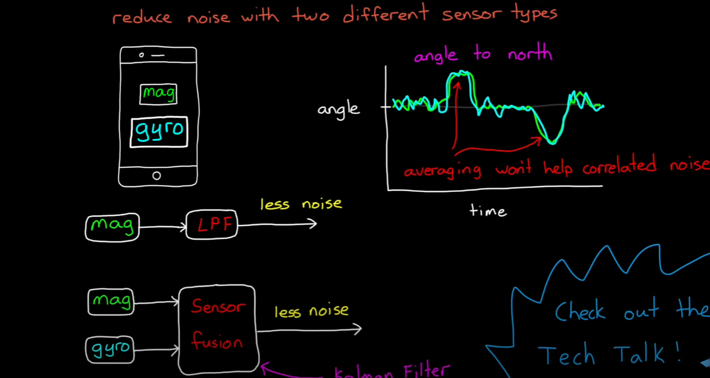

- func 2: Increasing reliability

  当某一个（甚至某种类型）传感器故障时，数据融合算法仍然有效（虽然质量下降），而且可以剔除掉异常数据。

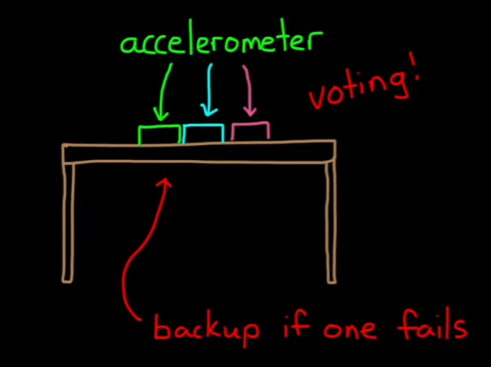

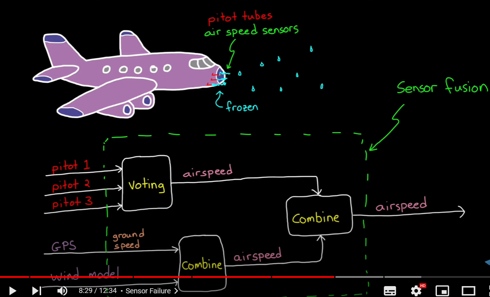

- func 3: Estimate unmeasured states

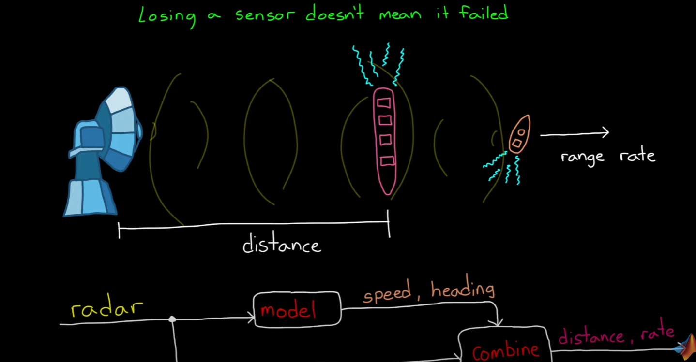

- func 4: Increasing coverage

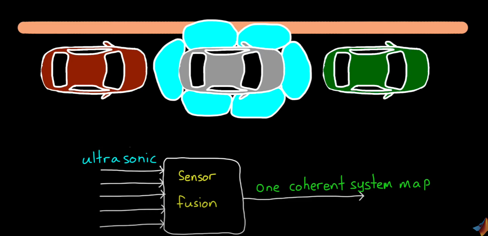

## 2. AHRS

attitude and heading reference system --> AHRS 	航姿系统

结合陀螺，加速度计以及磁力计数据进行数据融合。

通过磁力计以及加速度计获取姿态。

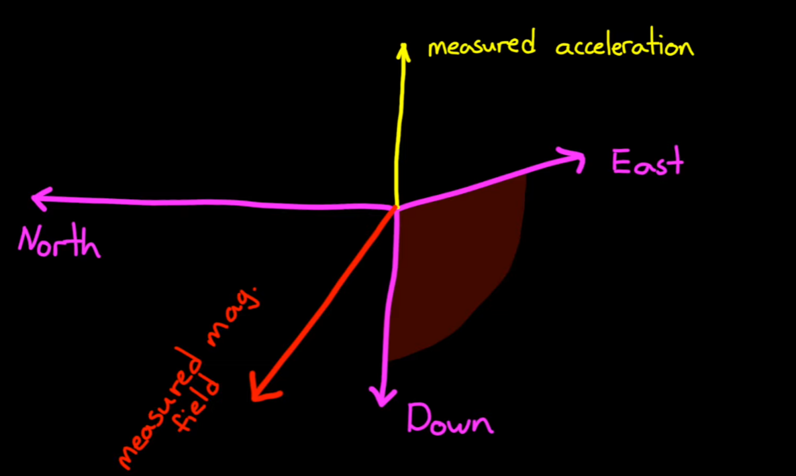

- 误差消除1： 磁力计校准

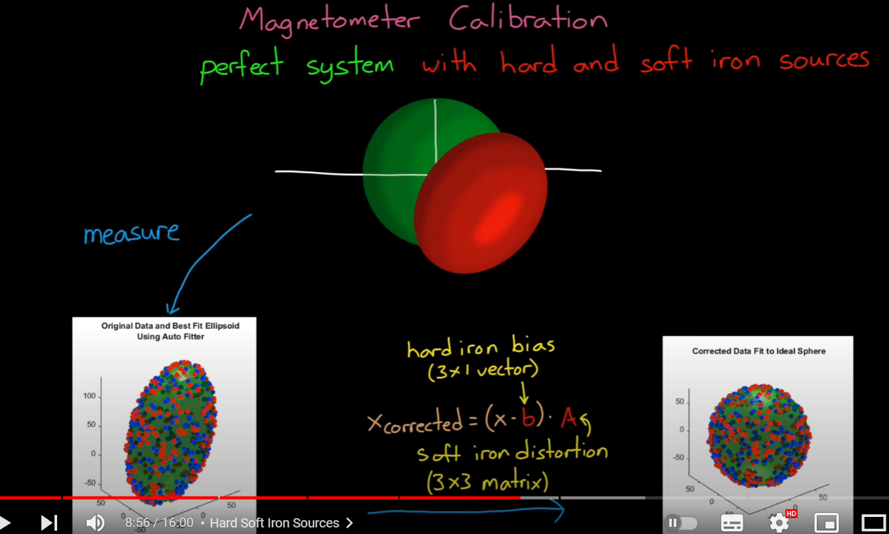

加速度 陀螺数据融合算法：

- 互补滤波
- 卡尔曼滤波
- Madgwick or Mahony

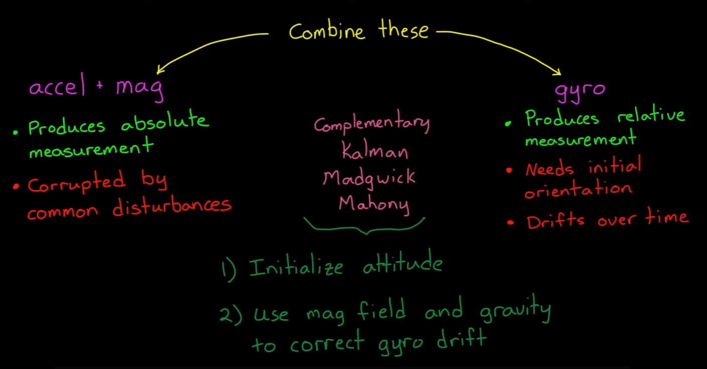

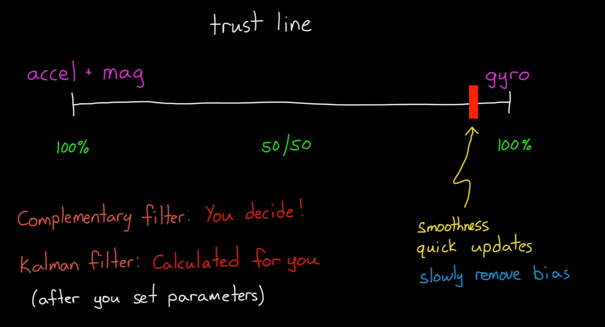