# Inertial Navigation System

------

## 一、惯性导航系统原理

### 1.惯性导航基础

> 导航状态：位置、速度和姿态（PVA）
>
> 导航原理：航位推算 (DR) vs 直接定位（Direct Fixing）
>
> 惯性导航系统分为：平台式 vs 捷联式

1. 惯性导航建立在牛顿经典力学定律的基础上，需要测量载体相

对惯性空间的加速度和角速度。

 2. 加速度计 

    测量相对于***惯性参考系***的加速度（称之为比力）

$$
f = a – g	（惯导比力方程）
$$

- **f** = 加速度计输出（比力，Specific Force）

-  **a** = 相对于惯性空间的运动加速度

-  **g** = 万有引力加速度

> ​		MEMS加速度计原理：变距离式电容传感器

 3. 陀螺仪

    测量相对于***惯性参考系***的角速率
    

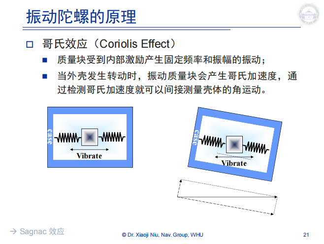

> MEMS陀螺都是基于振动陀螺（哥氏效应）的原理制造的

4. 惯导系统特性

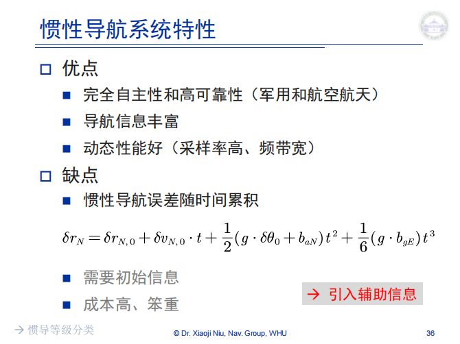

5. ins的精度等级

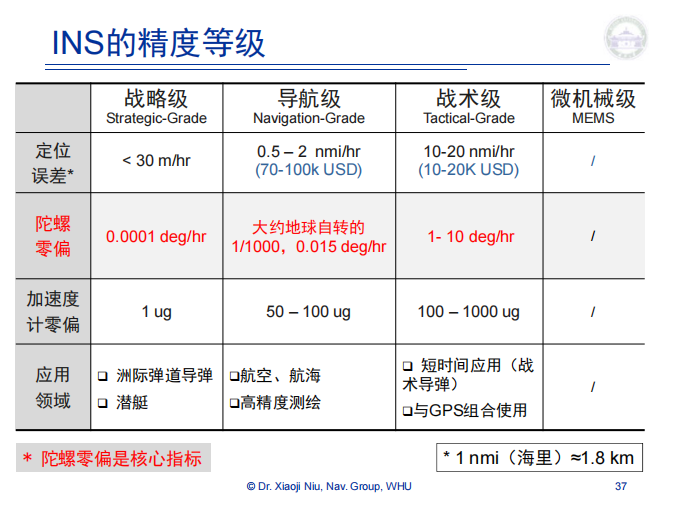

### 2.惯性器件的误差

1. 运动载体上的陀螺输出

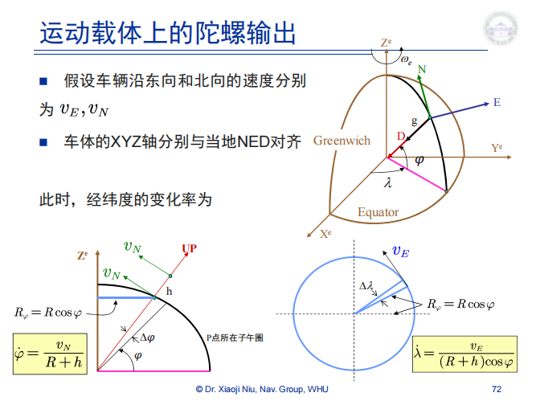

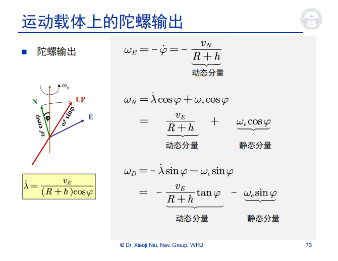

2. 常用坐标系

- 实用惯性坐标系(*i*-frame)
- 地心地固坐标系 (ECEF, e-frame)
- 导航坐标系(n-frame)，又称当地水平坐标系、地理坐标系
- IMU坐标系(b-frame)

3. 传感器误差的成分

- 常值误差（Constant error）

- 重复性（Repeatability）-- multiple runs

- 稳定性（Stability）-- within one run

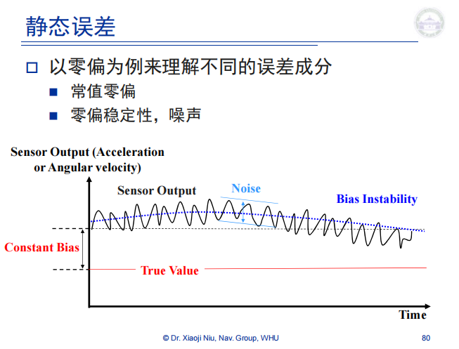

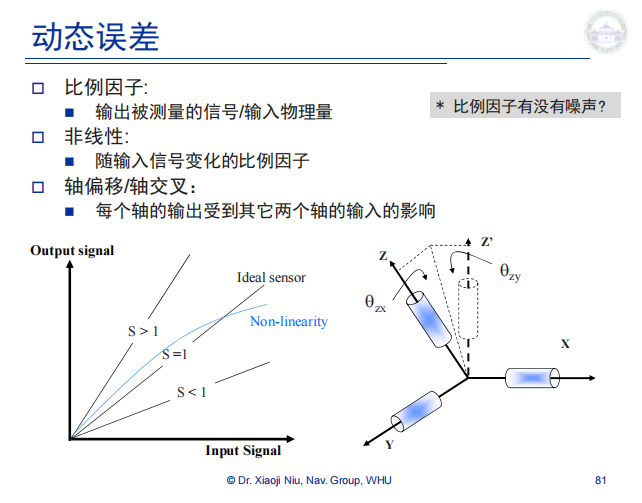

- 噪声（Noise）

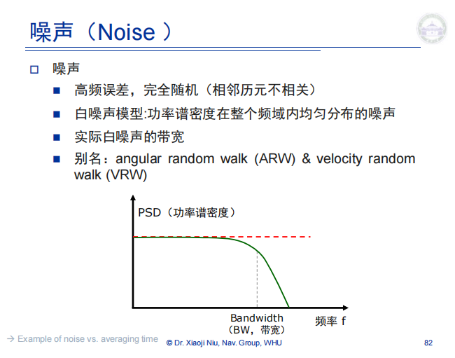

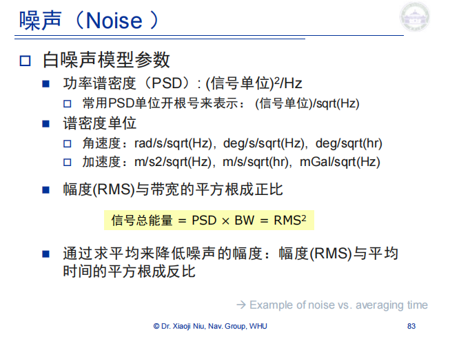

- 热敏感度（Thermal sensitivity，温漂）

4. 陀螺测量模型

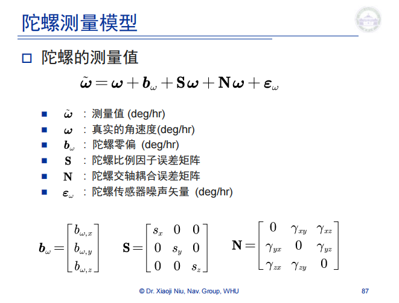

5. 加速度计测量模型

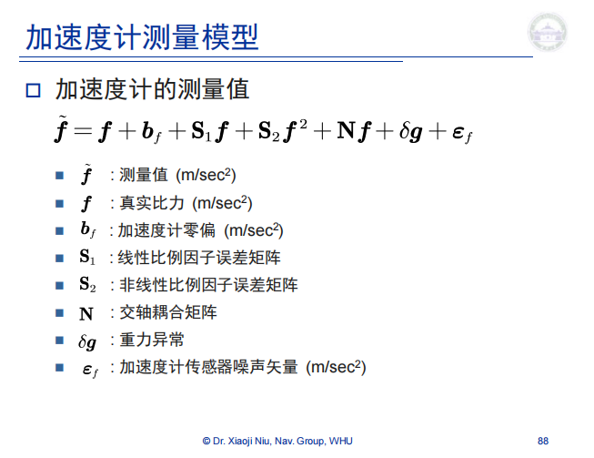

6. 误差模型

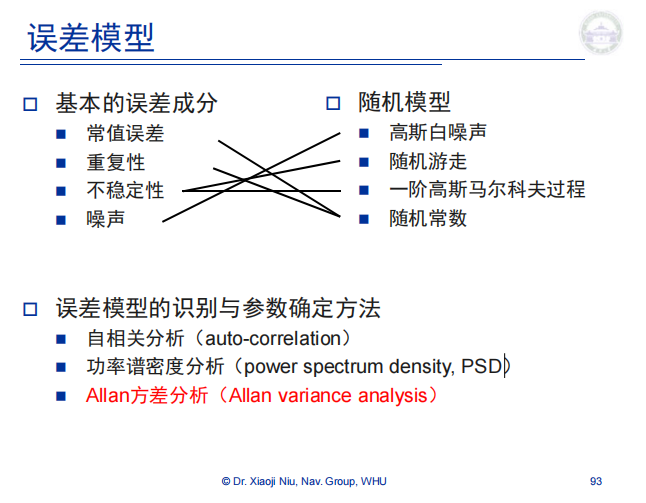

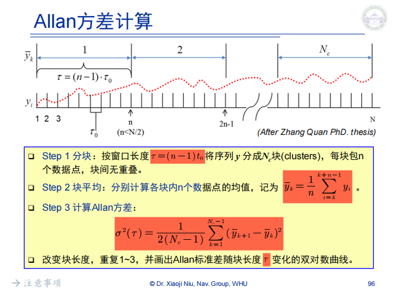

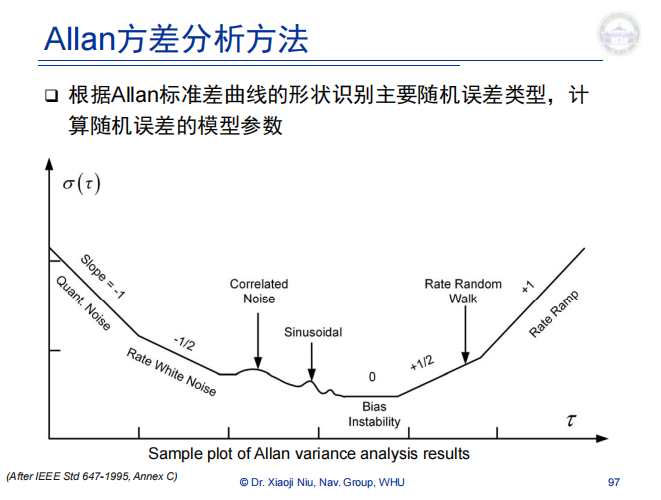

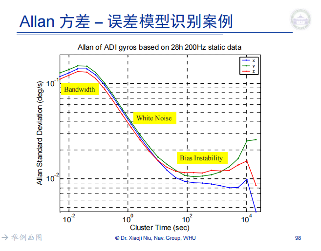

### 3.惯性器件的标定

> 标定的重要性：去除系统误差（陀螺零偏）

1. 加速度计标定

- 参考源：地球重力
- 方法：两位置，六位置法静态测试

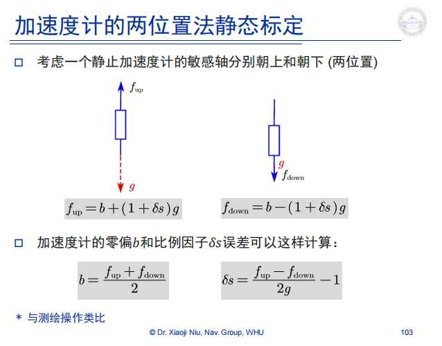

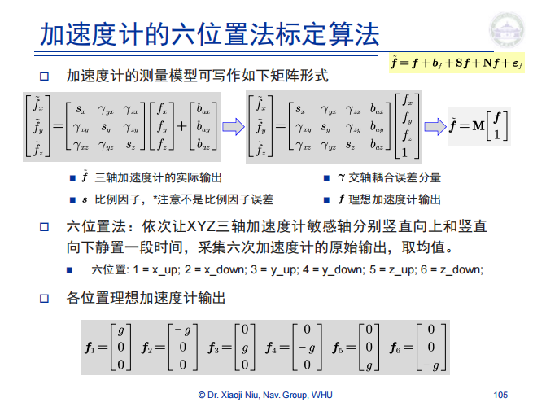

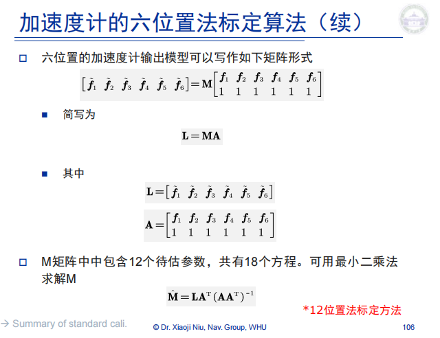

2. 陀螺的标定

- 参考源：地球自转或转台旋转
- 方法：角速率测试

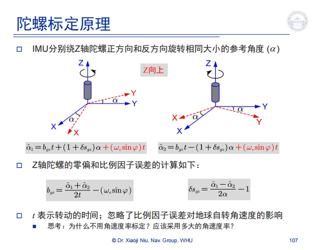

3. 标定总结

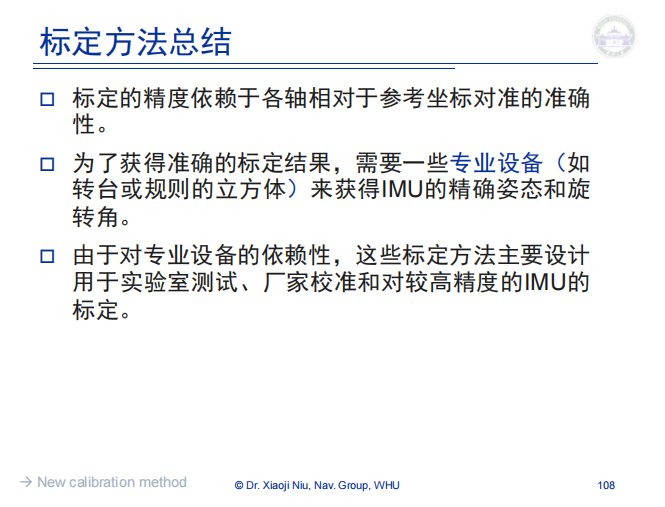

### 4.INS的初始对准

1. INS的初始化

- 初始位置：给定/从GPS

- 初始速度：零/给定

- 初始姿态：***初始对准***（静态粗对准， 非常重要）

2. 静态粗对准原理

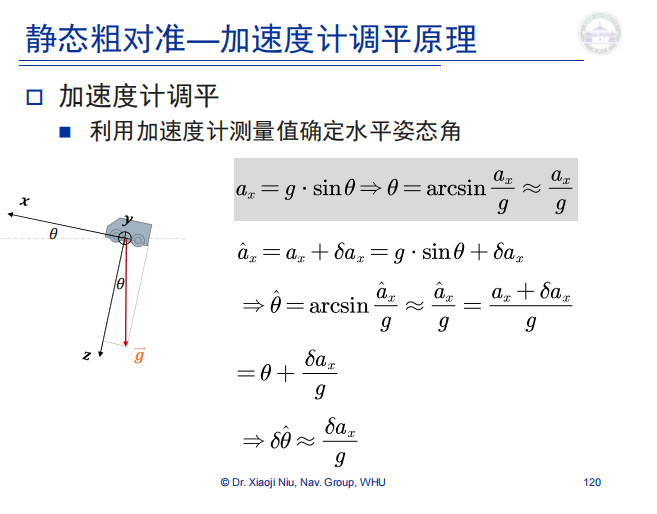

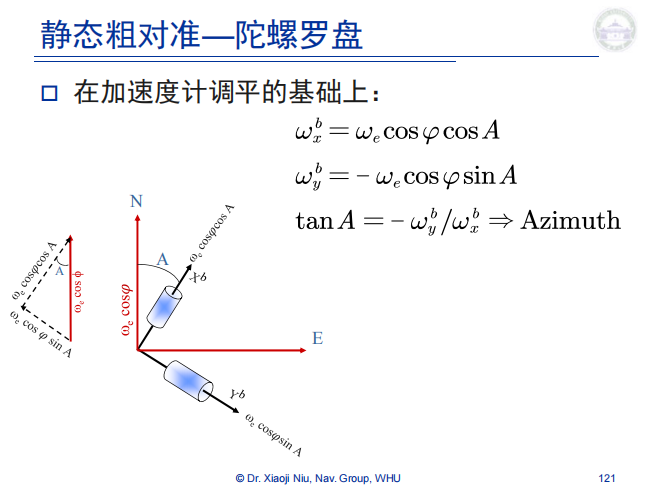

3. 静态解析粗对准—双矢量定姿

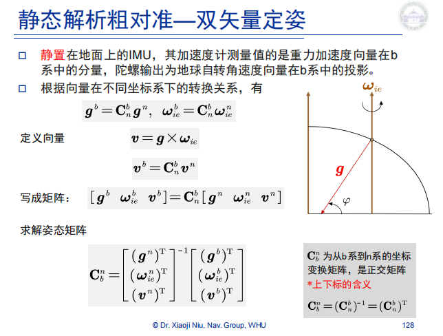

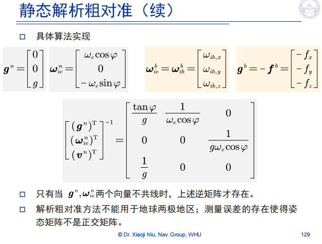

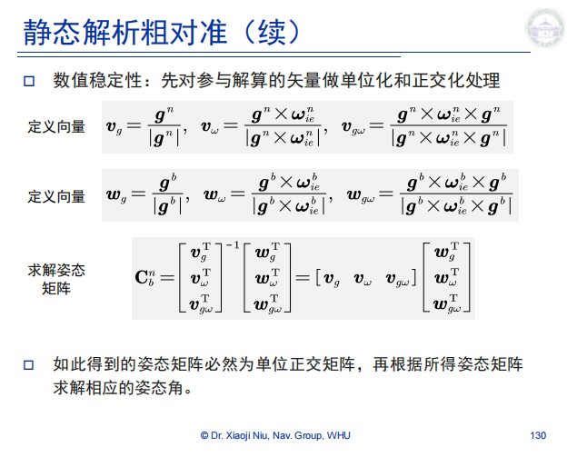

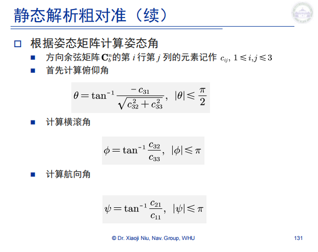

4. 其他初始对准方法

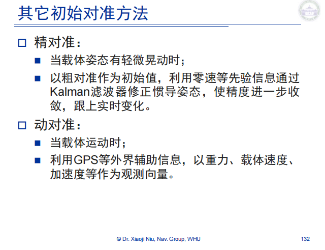

### 5.惯导设备的使用

1. INS 算法

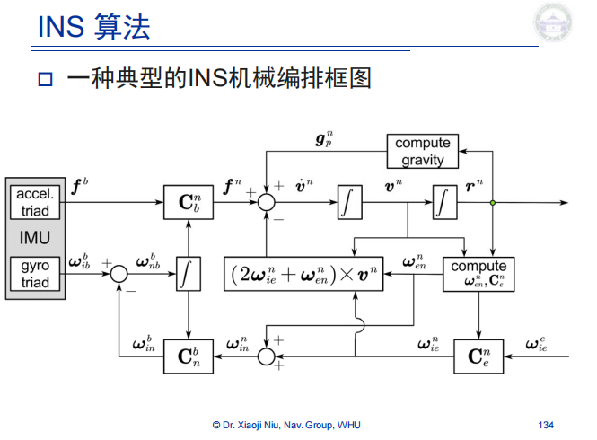

2. INS 测量

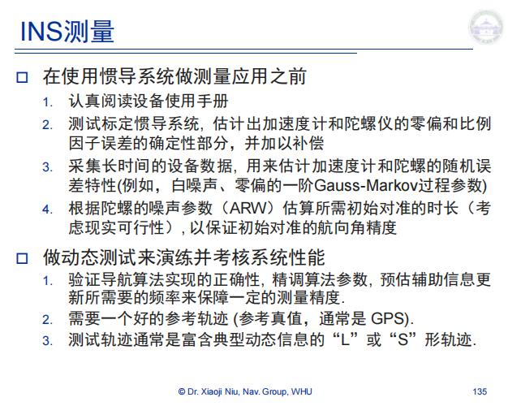

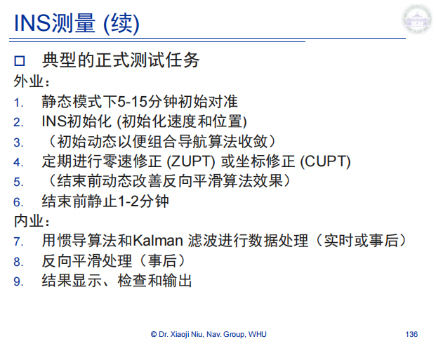
