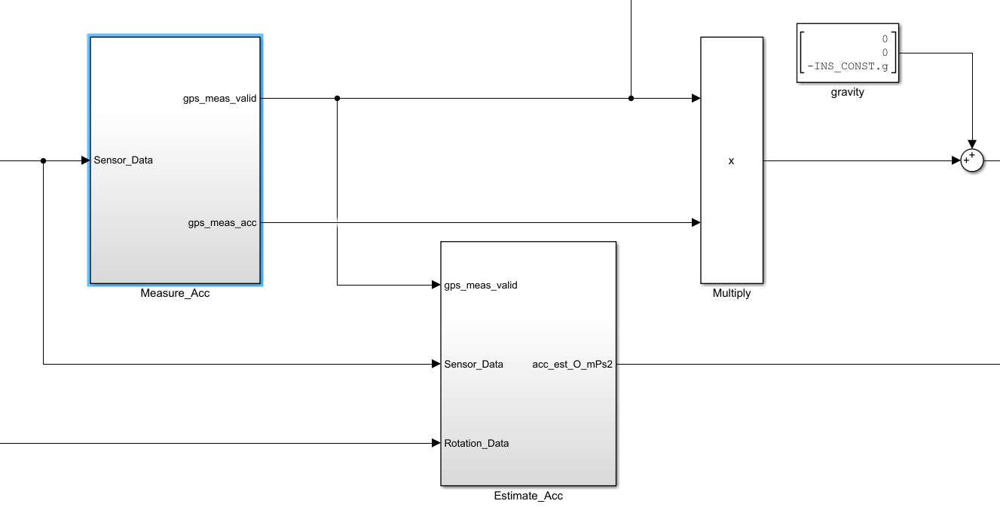

> n-frame : 北东地 		b-frame : 前右下

## INS

### 1.Sensor_PreProcess

1. IMU_PreProcess

当时间戳未更新时，对处理周期进行积分，在< timeout 时，数据有效。

其中的积分模块

`Ever_Vaild` 只要数据更新过，就为`True`。

2. MAG_PreProcess

> `M_OB` 表示 `DCM from body frame to earth frame`

通过GPS得到的当地经纬度数据，在全球地磁模型查找表（`WMM_LUT`）里查找出对应位置的磁场数据。

将弧度数据转换成 LUT 的 index， 这里除以 `resolution`因为 LUT 的分度值并未 1° （大约 10°）。

> 最终输出为当地的  磁场强度`magnitude_uT`， 磁偏角`declination_deg`， 磁倾角 `inclination_deg`

- WMM_Compensation

先将磁场数据除以当地磁场强度， 再将其从 b-frame 转到 e-frame （由于磁偏角的存在，经过DCM后 z-axis 还需转动 `-declination_rad`）。

只有在 GPS 数据有效的时候，才选用上一步处理完的数据，否则取磁力计规范化后的数据。

经过`DCM_BO`后，得到 b-frame 下的规范化的磁场数据。

- Mag_Quality_Estimate

对磁密度以及磁倾角的质量进行测算， 输出经过二阶`LPF`。

3. GPS_PreProcess

- quality

求取三项指标的质量。

- gps_status

判断 hAcc， fixtype 等是否符合要求，其中Ready模块作用为 当valid 累计达到 1000次true时，GPS 变为就绪状态。

- WGS84_Model

使用纬度求取地球扁平率。

> 对于WGS84模型，在单个经纬度带近似的条件下，可以使用中央子午线曲率半径和底部子午线弧长计算所需的经、纬度微分。
>
> 具体来说，假设当前点的经度为λ，纬度为φ，其中λ和φ均以弧度表示。则中央子午线曲率半径Rn和底部子午线弧长Rm的计算公式如下：
> $$
> R_{n}=\frac{a}{\sqrt{1-e^{2} \sin ^{2}φ}}
> $$
>
> $$
> R_{m}=\frac{a\left(1-e^{2}\right)}{\left(1-e^{2} \sin ^{2} φ\right)^{\frac{3}{2}}}
> $$
>
> 其中a是地球的赤道半径，e是第一偏心率。
>
> 然后，可以使用以下公式计算经度和纬度方向上的微分：
> $$
> \frac{dφ}{dx}=atan(1/R_{m})\\
> \frac{dλ}{dy}=atan(1/(R_{n}cosλ))
> $$
> 其中dx和dy是在经度和纬度方向上的位移量。
>
> 需要注意的是，这种计算方法仅适用于在一个经纬度带内进行较小范围内的位置计算。若所需计算的范围比较大，则需要使用更精确的算法。

4. Baro_PreProcess

- Pressure_Height

通过压力计算**绝对高度**。

- Relative_Height

其中`Sampling` 将启动前200次采样，采样完成则初始化成功。

其中`Reference_Height` 将保存初始化后的高度均值。

### 2.Data_Fusion

数据融合包括两部分： 旋转滤波 + 转义滤波

#### 1.RF_Data_PreProcess

##### Standstill 模块

取 x, y 轴角速度，经过 fc = 0.25 Hz 的 HPF 

再经过两次 LPF 后对信号进行判断。

##### Attitude_Reset

`att_reset` 信号在`sample_valid` 信号上升沿（第一次变为有效）或`GPS valid` 时有效。

`sample_valid` 表示当 `valid` 次数到达50次时， 输出信号为 true。

##### Initial_Attitude

通过加速度计 和 磁力计 求取初始姿态。

加速度（g）反向与磁场向量叉积，

> 为什么求解后的DCM 是from n-frame to b-frame ?
>
> DCM 的第 1 列就是 n-frame的 x 轴上的的单位向量 在 b-frame 下的坐标。
>
> DCM 的第 1 行就是 b-frame的 x 轴上的的单位向量 在 n-frame 下的坐标。
>
> **实际上就是**：如果 DCM 的参照系为b-frame， 那么最终坐标就应该转到 b-frame。

#### 2.AHRS

正式计算姿态信息。

##### 1.Correct

包含姿态校正和陀螺偏差校正。

###### Attitude_Correction

包含姿态以及磁力的校正

1. Attitude_Correct

姿态校正包括加速度的估算与校正。

- Acc_Estimator

加速度估算包括获取 GPS 测量的载体速度， 以及利用姿态信息辅助估算速度。

- Measure_Acc

包括检查有效性，总线读取GPS速度信息。最终输出 n-frame 下的gps 加速度。

- GPS_Meas_Acc

[TODO] 原理？如何由速度得到平均加速度。

- Estimate_Acc

将加速度转到 n-frame 下，使用二阶 LPF 滤波，并在gps数据有效时将其延迟200ms （GPS数据更新延迟）。

- Heading_Correct

去除 估计和平均加速度的z 轴数据 （获取航向）并取叉积，得到航向校正矩阵 （绕z 轴的旋转）。

- Verticle_Correct

[TODO] 原理？

​	2. Mag_Correct

这部分是取出`M_OB`的第三行后转置，故实际得到为`n3`在b-frame 下的坐标。

这里将b-frame 下的磁场值点乘`M_OB`的第二行，得到 n-frame 下

y-axis 的磁场值（一般情况下 y-axis 磁场值应为 0，否则则表明航向heading 存在误差，故与上一步的向量相乘，使其往相反方向转动，将航向误差消除）。

##### 2.Update

- Attitude_Update

使用修正后的角速度（互补滤波值）进行姿态更新。

更新算法为四元数微分方程的一阶**龙格库塔**离散化。
$$
\frac{\mathrm{d}Q}{\mathrm{d}t} = \frac{1}{2}\cdot\begin{bmatrix}
0 & -w_x & -w_y & -w_z \\
w_x & 0 & w_z & -w_y \\
w_y & -w_z & 0 & w_x \\
w_z & w_y & -w_x & 0
\end{bmatrix}
\begin{bmatrix}
q_0 \\ q_1 \\ q_2 \\ q_3
\end{bmatrix}\\
 using\quad RK1:y_{n+1}=y_n+h\cdot\dot y \\
 Q(t+\Delta t)=Q(t)+\Delta t \frac{\mathrm{d}Q}{\mathrm{d}t}\\
 also\quad\begin{bmatrix}q_0 \\ q_1 \\ q_2 \\ q_3\end{bmatrix}_{t+\Delta t} = \begin{bmatrix}q_0 \\ q_1 \\ q_2 \\ q_3\end{bmatrix}_{t} + \frac{\Delta t}{2} \begin{bmatrix}
0 & -w_x & -w_y & -w_z \\
w_x & 0 & w_z & -w_y \\
w_y & -w_z & 0 & w_x \\
w_z & w_y & -w_x & 0
\end{bmatrix}
\begin{bmatrix}
q_0 \\ q_1 \\ q_2 \\ q_3
\end{bmatrix}_{t}\\
$$

接下来是转义滤波，用于获取速度以及位置信息。

#### 3.TF_Data_PreProcess

##### 1.Sensor_Process

对传感器数据进行整理，同时按照优先级分别选取 水平向 和 垂直向的传感器。

水平向 Prio：GPS > optflow

垂直向 Prio： RangeFinder > GPS > baro

故在本套设备中水平向以及垂直向的传感器均使用 GPS 。

##### 2.Transfer_Filter_Control

- Sensor_Valid
  评估各传感器数据的有效性。

若传感器有效，则对应数据有效，有效的保持时长为1s。

- Filter_Reset

若 xy_R 由无效变为有效，则将位置信息复位更新。同理 h_R 信号上升沿将高度信息复位更新。

- WGS84_Reference

Position_Ref 当 <lon_lat_valid> 由无效变为有效即上升沿时，保存此刻位置作为后续参考位置。

Height_Ref 同上，保存此刻高度作为后续参考高度。

#### 4.CF

##### 1.Horizontal_Filter

- Predict

Propagate 状态的确定 ：pos_reset 有效时重新获取位置与速度 作为此刻状态；无效时直接取上一次状态。

Update：X[1:2] --> pos = pos + X[3:4] (v) * dt

​					X[3:4] --> v  = v + X[5:6] (a) *dt

​					X[5:6] --> a = 0

- Correct

GPS Correct:

