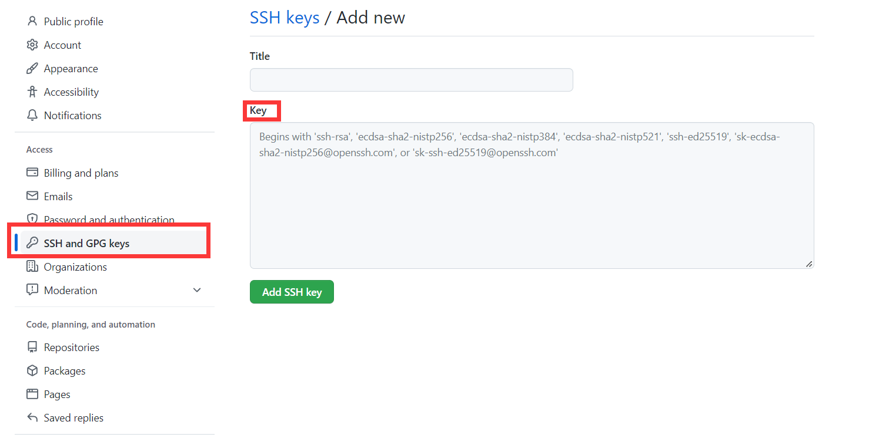
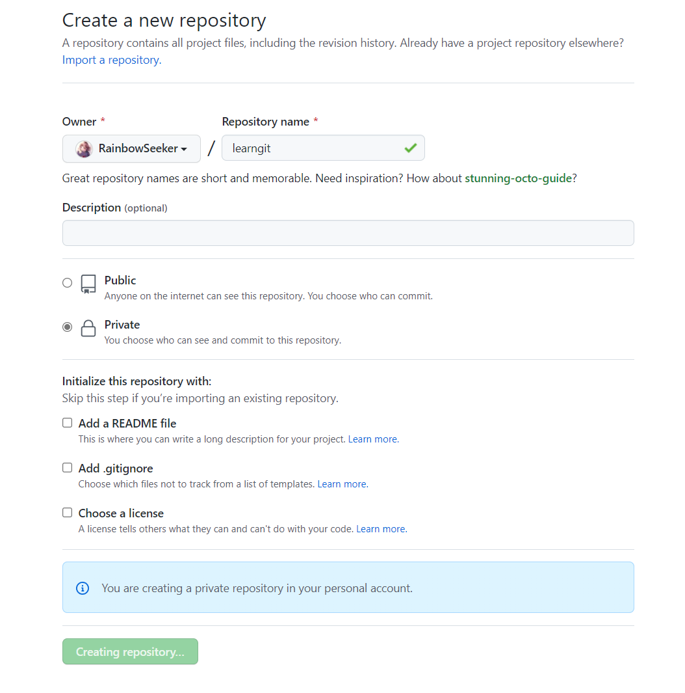

[TOC]

# Git Tutorial

[Usage pdf]: ./git-cheat-sheet.pdf

## Simple usage

------

> First configuration

```bash
git config --global user.name "RainbowSeeker_"
git config --global user.email "y1911466766@gmail.com"
```

1. 初始化一个 Git 仓库

```bash
git init
```

2. 添加文件到 Git 仓库

```bash
git add <file>  #Tips:  可反复多次使用，添加多个文件
git commit -m <message>
```

3. 查看当前工作区的状态

```bash
git status
```

> :dizzy: 如果`git status`告诉你有文件被修改过，用`git diff`可以查看修改内容

4. 版本回退

```bash
git reset --hard commit_id
git reset --soft HEAD~1		#撤销上 1 次commit
```

特殊的，`git reset --hard HEAD^` 可以回退到上一个版本（HEAD 指针指向第一个版本）。

Git提供了一个命令`git reflog`用来记录你的每一次命令，以便确定要回到未来的哪个版本

> Tips:
>
> - 当你改乱了工作区某个文件的内容，想直接丢弃工作区的修改时，用命令`git checkout -- file`。
> - 当你不但改乱了工作区某个文件的内容，还添加到了暂存区时，想丢弃修改，分两步，第一步用命令`git reset HEAD <file>`/`git reset -- <file>`，就回到了场景1，第二步按场景1操作。

## Remote repository

------

1. 创建`ssh-keygen`

```bash
ssh-keygen -t rsa -C "1911466766@qq.com"
```

接着接可以在用户主目录里找到`.ssh`目录，里面有`id_rsa`和`id_rsa.pub`两个文件。

2. 添加ssh keys到github 

> 复制id_rsa.pub中的内容到Key中



3. 创建一个新的repo



4. 将本地库的所有内容推送到远程库上


```bash
git remote add origin git@github.com:RainbowSeeker/learngit.git
git branch -M main
git push -u origin main		#push!

git remote get-url --all origin		#查看已保存的远程库链接
```

> :dizzy:之后提交新版本只需要 `git push origin [master]`

## Branch

------

> ***分支图*** `git log --graph`

1. 创建和切换分支

```bash
git switch -c dev		#创建并切换到新的dev分支
git switch master			#切换到master分支
```

然后，用`git branch`命令查看当前分支：

> $ git branch
>
> * dev
>   master

2. 将`dev`分支的工作成果合并到`master`分支上

```bash
git merge dev
git merge --no-ff -m "merge with no-ff" dev  #禁用Fast forward
```

3. 删除分支

```bash
git branch -d dev		#删除本地分支
git push -d origin dev	#删除远程分支
```

4. 分支暂存

```bash
git stash		#暂存分支
git stash list	#查看已暂存的分支
git stash apply	#恢复分支，不删除stash内容（删除需要 git stash drop）
git stash pop	#恢复分支，并删除stash内容
```

5.将`master`分支的提交所做的修改**复制**到dev分支

```bash
git cherry-pick commit_id
```

6. 拉取分支

```bash
git pull
```

> :dizzy: 如果`git pull`提示`no tracking information`，则说明本地分支和远程分支的链接关系没有创建，用命令`git branch --set-upstream-to <branch-name> origin/<branch-name>`。

## Tag

------

1. 打上Tag，默认为`HEAD`，`-m`指定说明文字

```bash
git tag <name> (-m "intro" commit_id)	#新建标签
git tag									#查看标签
git show <name>							#查看更详细版本信息
git tag -f <name> -m "intro"			#更新标签介绍信息
```

2. 删除tag

```bash
git tag -d v1.0							#删除本地标签
git push -d origin v1.0					#删除远程标签
```

3.推送某个标签到远程

```bash
git push origin <tagname>
```

或者，一次性推送全部尚未推送到远程的本地标签：`git push origin --tags`

## Gitignore

------

​			--->忽略某些文件

`vi .gitignore`在 .gitignore 文件中加上你自己定义的文件

> #### 排除所有.开头的隐藏文件:
> .*
> ### 排除所有.class文件:
> *.class
>
> #### 不排除.gitignore和App.class:
> !.gitignore
> !App.class

## Git Alias

------

当前用户的Git配置文件一般放在用户主目录下的一个隐藏文件，因此只需 `vi .gitconfig` 

> [alias]
> 	co = checkout

直接修改这个文件就好啦

# Git Server

1. 安装`git`

```bash
sudo apt install git
```

2. 创建一个`git`用户，用来运行`git`服务

```bash
sudo useradd -m git		# -r:root;-m:create home
sudo passwd git
```

3. 创建证书登录

收集所有需要登录的用户的公钥，就是他们自己的`id_rsa.pub`文件，把所有公钥导入到`/home/./.ssh/authorized_keys`文件里，一行一个。

4. 初始化Git仓库

先选定一个目录作为Git仓库，假定是`/srv/sample.git`，在`/srv`目录下输入命令

```bash
sudo git init --bare sample.git
sudo chown -R git:git sample.git
```

5. 禁用shell登录

出于安全考虑，git用户不允许登录shell，这可以通过编辑`/etc/passwd`文件完成。找到类似下面的一行

> git:x:1002:1003::/home/git:/bin/sh

改为：

> git:x:1002:1003::/home/git:/usr/bin/git-shell

这样，`git`用户可以正常通过ssh使用git，但无法登录shell，因为我们为`git`用户指定的`git-shell`每次一登录就自动退出。
