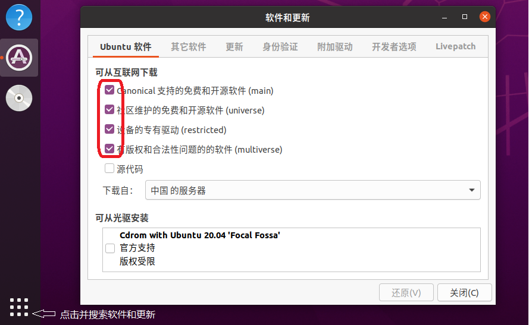

# Installation For ROS Noetic

### 1.配置ubuntu的软件和更新

配置你的Ubuntu软件仓库（repositories）以允许使用“restricted”“universe”和“multiverse”存储库



### 2.设置安装源

官方默认安装源:

```bash
sudo sh -c 'echo "deb http://packages.ros.org/ros/ubuntu $(lsb_release -sc) main" > /etc/apt/sources.list.d/ros-latest.list'
```

或来自国内清华的安装源:

```bash
sudo sh -c '. /etc/lsb-release && echo "deb http://mirrors.tuna.tsinghua.edu.cn/ros/ubuntu/ `lsb_release -cs` main" > /etc/apt/sources.list.d/ros-latest.list'
```

### 3.设置key

```bash
sudo apt-key adv --keyserver 'hkp://keyserver.ubuntu.com:80' --recv-key C1CF6E31E6BADE8868B172B4F42ED6FBAB17C654
```

### 4.安装

```bash
sudo apt update
```

**完整桌面版安装（Desktop-Full，推荐）**：除了**桌面版**的全部组件外，还包括2D/3D模拟器（simulator）和2D/3D 感知包（perception package）。

```bash
sudo apt install ros-noetic-desktop-full
```

### 5.配置环境变量

配置环境变量，方便在任意终端中使用 ROS。

```bash
echo "source /opt/ros/noetic/setup.bash" >> ~/.bashrc
source ~/.bashrc
```

### 6.测试

启动三个命令行(ctrl + alt + T)，分别运行

```bash
roscore
rosrun turtlesim turtlesim_node
rosrun turtlesim turtle_teleop_key
```

------

## Uninstall

如果需要卸载ROS可以调用如下命令:

```bash
sudo apt remove ros-noetic-*
```
