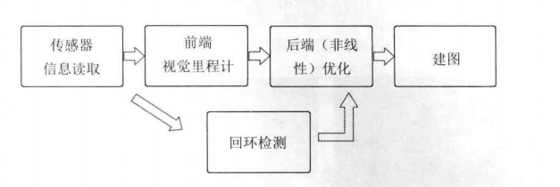
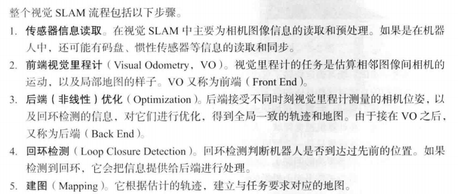

# Chapter 2  初识SLAM

> SLAM：定位+建图

## 1.Sensor

-  单目相机：二维投影，单张无法计算距离，只能通过运动产生的**视差**定量判断距离，尺度不确定性；
- 双目和深度相机：双目间距离(基线)一定，非常消耗计算资源；RGB-D：物理测量，主动发射光并接收返回的光，节省计算资源，但测量范围窄，噪声大，视野小，易受日光干扰，无法测量投射材质等。

## 2.经典视觉SLAM框架

