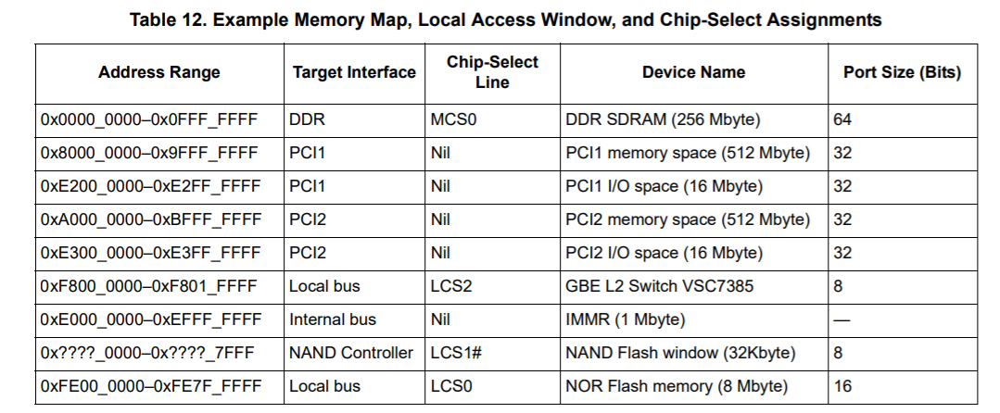
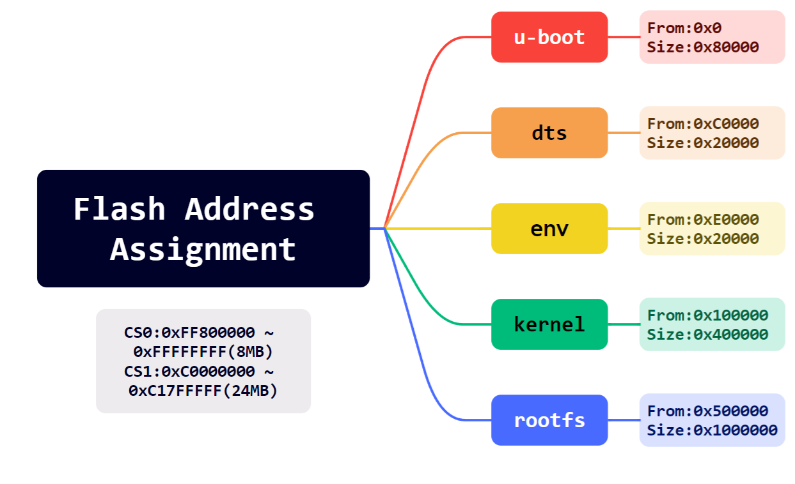
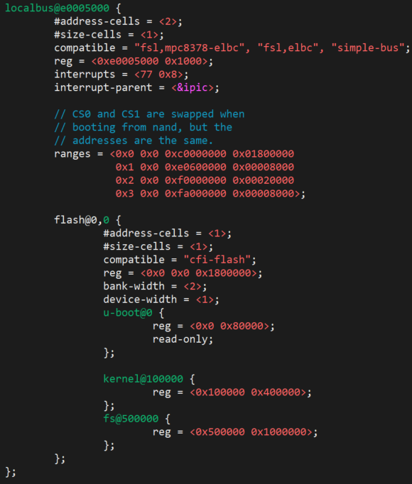

# uboot & linux & rootfs

## Part 1: u-boot

### 1.安装编译工具链

```bash
sudo apt install build-essential bison flex libncurses-dev libssl-dev gcc-powerpc-linux-gnu binutils-powerpc-linux-gnu
```

```bash
#echo 'export ARCH=powerpc;export CROSS_COMPILE=powerpc-linux-gnu-;' >> ~/.bashrc
#source ~/.bashrc
```

### 2.下载源码并编译

```bash
git clone https://github.com/u-boot/u-boot.git
cd u-boot/
sudo make distclean
sudo make ARCH=powerpc CROSS_COMPILE=powerpc-linux-gnu- MPC837XERDB_defconfig
sudo make ARCH=powerpc CROSS_COMPILE=powerpc-linux-gnu- -j8
```

修改配置文件：

```bash
CONFIG_TEXT_BASE=0xFE000000	--> 0xC0000000
CONFIG_DEBUG_UART_BASE=0xe0004500 √
CONFIG_ENV_SIZE=0x4000 --> 0x2000
CONFIG_ENV_ADDR=0xFE080000 --> 0xC00E0000
CONFIG_BAT0_BASE=0x00000000 √ （256MB DDR2）
CONFIG_BAT1_BASE=0x10000000 √ （256MB DDR2）
CONFIG_BAT2_BASE=0xE0000000 √ （IMMR）
CONFIG_BAT3_BASE=0xC1800000 --> 0xC1800000 （L2_SWITCH）
++CONFIG_BAT3_LENGTH_512_KBYTES=y （NVRAM）
CONFIG_BAT4_BASE=0xFE000000 --> 0xC0000000（FLASH）
CONFIG_BAT4_LENGTH_32_MBYTES=y --> CONFIG_BAT4_LENGTH_16_MBYTES=y
CONFIG_BAT5_BASE=0xE6000000 --> 0xC2000000 （STACH_IN_DCACHE）
++CONFIG_BAT5_LENGTH_1_MBYTES=y （FPGA）
++CONFIG_BAT5_ICACHE_INHIBITED=y
++CONFIG_BAT5_DCACHE_INHIBITED=y
CONFIG_BAT6_BASE=0x80000000 √（PCI_MEM）
CONFIG_BAT7_BASE=0x90000000 √（PCI_MMIO）
CONFIG_LBLAW0_BASE=0xFE000000 --> 0xC0000000（FLASH）
CONFIG_LBLAW1_BASE=0xE0600000 --> 0xC1800000（NVRAM）
CONFIG_LBLAW2_BASE=0xF0000000 --> 0xC2000000（FPGA）
CONFIG_SYS_BR0_PRELIM=0xFE001001 --> 0xC0001001 （Addr + PortSize）
CONFIG_SYS_OR0_PRELIM=0xFF800193 --> 0xFF000193	（使用16M空间，因此前16位AM掩码为0xFF00）
CONFIG_SYS_BR1_PRELIM=0xE0600C21 --> 0xC1801001
CONFIG_SYS_OR1_PRELIM=0xFFFF8396 --> 0xFFF801C5
CONFIG_SYS_BR2_PRELIM=0xF0000801 --> 0xC2001801
CONFIG_SYS_OR2_PRELIM=0xFFFE09FF --> 0xFFF001C5
#++ CONFIG_TIMER=y
#++ CONFIG_MPC83XX_TIMER=y
```



## Part 2: linux

```bash
sudo ln -s /home/yangyu/vmc/u-boot/tools/mkimage /usr/bin/mkimage
```

```bash
git clone https://github.com/torvalds/linux.git
cd linux/
sudo make mrproper
sudo make ARCH=powerpc 83xx/mpc837x_rdb_defconfig
sudo make ARCH=powerpc CROSS_COMPILE=powerpc-linux-gnu- -j8
```

修改配置文件：

```bash

```

## Part 3: dts

空间分配：



```bash
cd linux/ 
vi arch/powerpc/boot/dts/mpc8378_rdb.dts

sudo make ARCH=powerpc CROSS_COMPILE=powerpc-linux-gnu- mpc8378_rdb.dtb
```

配置外存：



## Part 4: rootfs


