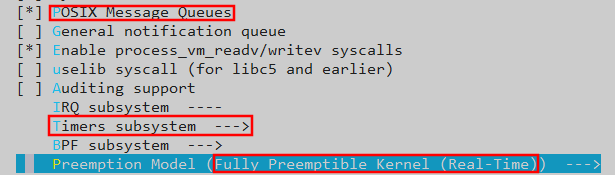
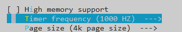
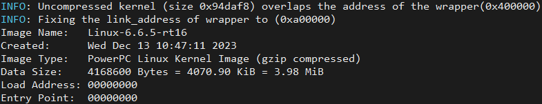
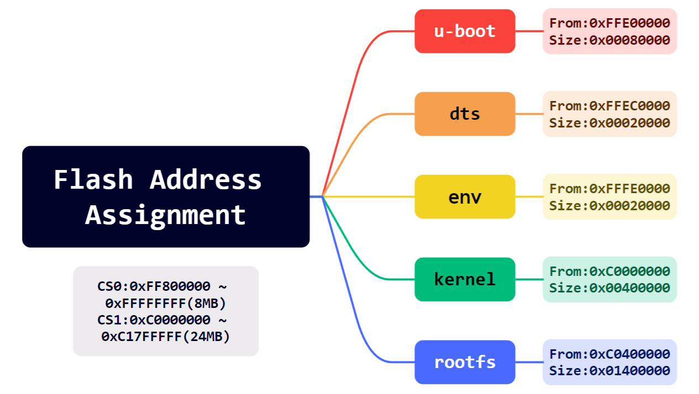
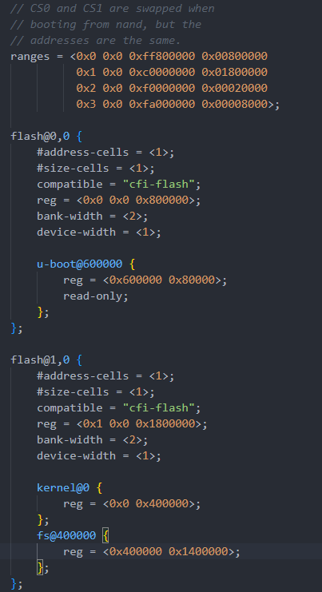
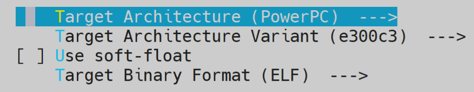
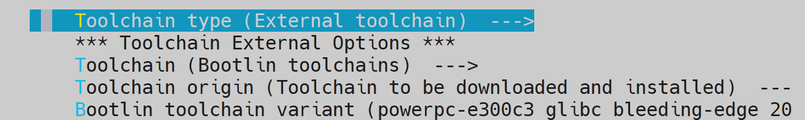
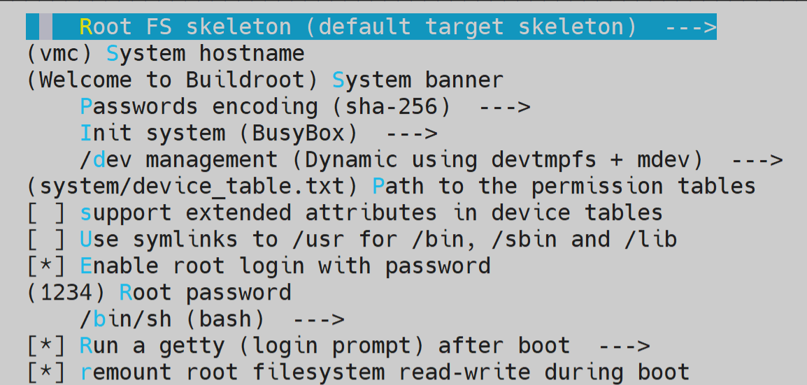
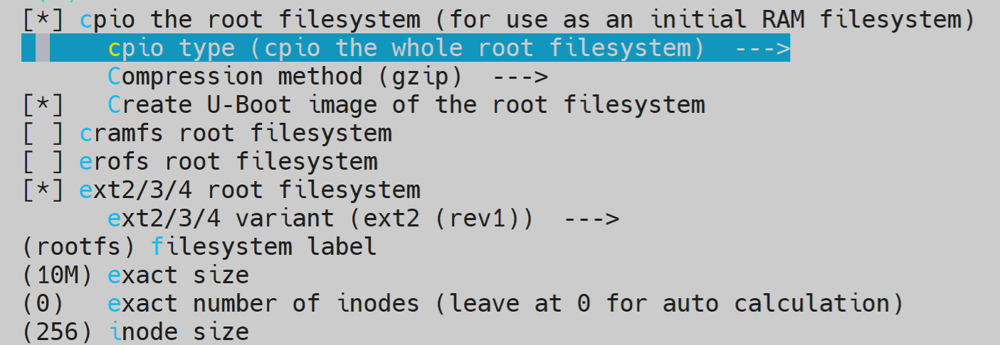

# uboot & linux & rootfs

## Part 1: u-boot

### 1.安装编译工具链

```bash
sudo apt install build-essential bison flex libncurses-dev libssl-dev gcc-powerpc-linux-gnu binutils-powerpc-linux-gnu
```

```bash
#echo 'export ARCH=powerpc;export CROSS_COMPILE=powerpc-linux-gnu-;' >> ~/.bashrc
#source ~/.bashrc
```

### 2.下载源码并编译

```bash
git clone https://github.com/u-boot/u-boot.git
cd u-boot/
sudo make distclean
sudo make ARCH=powerpc CROSS_COMPILE=powerpc-linux-gnu- MPC837XERDB_defconfig
sudo make ARCH=powerpc CROSS_COMPILE=powerpc-linux-gnu- -j8

#sudo make ARCH=powerpc CROSS_COMPILE=powerpc-linux-gnu- menuconfig
```

修改配置文件：

```bash
CONFIG_TEXT_BASE=0xFE000000	--> 0xC0000000
CONFIG_DEBUG_UART_BASE=0xe0004500 √
CONFIG_ENV_SIZE=0x4000 --> 0x2000
CONFIG_ENV_ADDR=0xFE080000 --> 0xC00E0000
CONFIG_BAT0_BASE=0x00000000 √ （256MB DDR2）
CONFIG_BAT1_BASE=0x10000000 √ （256MB DDR2）
CONFIG_BAT2_BASE=0xE0000000 √ （IMMR）
CONFIG_BAT3_BASE=0xC1800000 --> 0xC1800000 （L2_SWITCH）
++CONFIG_BAT3_LENGTH_512_KBYTES=y （NVRAM）
CONFIG_BAT4_BASE=0xFE000000 --> 0xC0000000（FLASH）
CONFIG_BAT4_LENGTH_32_MBYTES=y --> CONFIG_BAT4_LENGTH_16_MBYTES=y
CONFIG_BAT5_BASE=0xE6000000 --> 0xC2000000 （STACH_IN_DCACHE）
++CONFIG_BAT5_LENGTH_1_MBYTES=y （FPGA）
++CONFIG_BAT5_ICACHE_INHIBITED=y
++CONFIG_BAT5_DCACHE_INHIBITED=y
CONFIG_BAT6_BASE=0x80000000 √（PCI_MEM）
CONFIG_BAT7_BASE=0x90000000 √（PCI_MMIO）
CONFIG_LBLAW0_BASE=0xFE000000 --> 0xC0000000（FLASH）
CONFIG_LBLAW1_BASE=0xE0600000 --> 0xC1800000（NVRAM）
CONFIG_LBLAW2_BASE=0xF0000000 --> 0xC2000000（FPGA）
CONFIG_SYS_BR0_PRELIM=0xFE001001 --> 0xC0001001 （Addr + PortSize）
CONFIG_SYS_OR0_PRELIM=0xFF800193 --> 0xFF000193	（使用16M空间，因此前16位AM掩码为0xFF00）
CONFIG_SYS_BR1_PRELIM=0xE0600C21 --> 0xC1801001
CONFIG_SYS_OR1_PRELIM=0xFFFF8396 --> 0xFFF801C5
CONFIG_SYS_BR2_PRELIM=0xF0000801 --> 0xC2001801
CONFIG_SYS_OR2_PRELIM=0xFFFE09FF --> 0xFFF001C5

CONFIG_USE_BOOTCOMMAND=y
CONFIG_BOOTCOMMAND="bootm 0xc0000000 0xC0400000 0xffec0000"
CONFIG_USE_BOOTARGS=y
CONFIG_BOOTARGS="console=ttyS0,115200 rootfstype=ramfs init=/linuxrc rw"
```

### Optional

配置uboot启动命令：

```bash
setenv bootcmd 'bootm 0xc0000000 0xC0400000 0xffec0000'
setenv bootargs 'console=ttyS0,115200 rootfstype=ramfs init=/linuxrc rw'
saveenv
```

## Part 2: linux

```bash
sudo ln -s /home/yangyu/vmc/u-boot/tools/mkimage /usr/bin/mkimage
```

```bash
git clone https://github.com/torvalds/linux.git
cd linux/
sudo make mrproper
sudo make ARCH=powerpc 83xx/mpc837x_rdb_defconfig
sudo make ARCH=powerpc CROSS_COMPILE=powerpc-linux-gnu- -j8

sudo make ARCH=powerpc CROSS_COMPILE=powerpc-linux-gnu- menuconfig //set tick hz to 1000,enable Preemptible Kernel
patch -p1 < ../patch-6.6.5-rt16.patch
```







## Part 3: dts

空间分配：



```bash
cd linux/ 
vi arch/powerpc/boot/dts/mpc8378_rdb.dts

sudo make ARCH=powerpc CROSS_COMPILE=powerpc-linux-gnu- mpc8378_rdb.dtb
```

修改设备树dts：

注释掉pci，usb等驱动项，修改flash空间分配项：



## Part 4: rootfs

进入配置页面

```bash
cd buildroot/
sudo make menuconfig
sudo make -j8

cd ../linux-6.6.7
sudo make ARCH=powerpc CROSS_COMPILE=powerpc-linux-gnu- modules
sudo make ARCH=powerpc modules_install INSTALL_MOD_PATH=/home/yangyu/buildroot-2023.02.8/output/target

cd ../buildroot-2023.02.8/
sudo vi output/target/etc/network/interfaces
auto eth0
iface eth0 inet static
address 192.168.8.25
netmask 255.255.255.0
gateway 192.168.8.1

sudo vi output/target/etc/profile
PS1='\u@\h:\w$:'
export PS1
#if [ "$PS1" ]; then
#       if [ "`id -u`" -eq 0 ]; then
#               export PS1='# '
#       else
#               export PS1='$ '
#       fi
#fi

sudo vi output/target/etc/init.d/S80mod
#! /bin/sh
DESC="modprobe"
case "$1" in
  start)
        printf "Starting $DESC: "
        modprobe m1394
        modprobe uart
        modprobe gaio
        modprobe gdio
        echo "OK"
        ;;
  stop)
        printf "Stopping $DESC: "
        echo "OK"
        ;;
  restart|force-reload)
        echo "Restarting $DESC: "
        $0 stop
        sleep 1
        $0 start
        echo ""
        ;;
  *)
        echo "Usage: $0 {start|stop|restart|force-reload}" >&2
        exit 1
        ;;
esac
exit 0
sudo chmod 755 output/target/etc/init.d/S80mod

sudo vi output/target/etc/init.d/S50dropbear
DROPBEAR_ARGS="-ER"
```

### 1.Target



### 2.Toolchain



### 3.System Configuration



### 4.Filesystem Images



### Optional

```bash
cd ./rootfs
find . | cpio -H newc -ov --owner root:root > ../initramfs.cpio && cd ..
gzip initramfs.cpio
mkimage -A ppc -O linux -T ramdisk -C gzip -d initramfs.cpio.gz initramfs.cpio.gz.uboot
```

