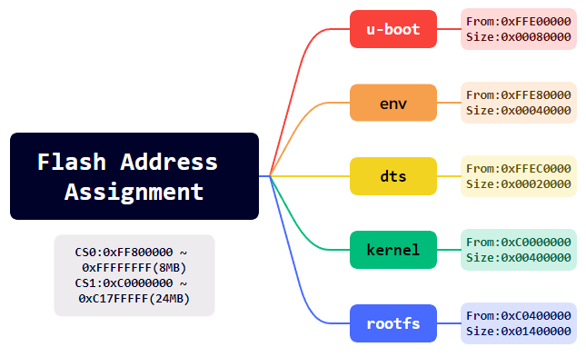

# uboot & linux & rootfs

## Part 1: u-boot

### 1.安装编译工具链

```bash
sudo apt install build-essential bison flex libncurses-dev libssl-dev gcc-powerpc-linux-gnu binutils-powerpc-linux-gnu
```

```bash
#echo 'export ARCH=powerpc;export CROSS_COMPILE=powerpc-linux-gnu-;' >> ~/.bashrc
#source ~/.bashrc
```

### 2.下载源码并编译

```bash
git clone https://github.com/u-boot/u-boot.git
cd u-boot/
sudo make distclean
sudo make ARCH=powerpc CROSS_COMPILE=powerpc-linux-gnu- MPC837XERDB_defconfig
sudo make ARCH=powerpc CROSS_COMPILE=powerpc-linux-gnu- -j8

#sudo make ARCH=powerpc CROSS_COMPILE=powerpc-linux-gnu- menuconfig
```

修改配置文件：

````bash
CONFIG_TEXT_BASE=0xFE000000	--> 0xFFE00000
CONFIG_DEBUG_UART_BASE=0xe0004500 √
CONFIG_DEBUG_UART_CLOCK=333333000 --> 266000000
CONFIG_SYS_CLK_FREQ=66666667 --> 33000000
CONFIG_ENV_SIZE=0x4000 --> 0x2000
CONFIG_ENV_ADDR=0xFE080000 --> 0xFFEE0000
CONFIG_BAT0_BASE=0x00000000 √ （256MB DDR2）
CONFIG_BAT1_BASE=0x10000000 --> 
```
	CONFIG_BAT1=y
	CONFIG_BAT1_NAME="IMMR"
	CONFIG_BAT1_BASE=0xE0000000
	CONFIG_BAT1_LENGTH_8_MBYTES=y
	CONFIG_BAT1_ACCESS_RW=y
	CONFIG_BAT1_ICACHE_INHIBITED=y
	CONFIG_BAT1_DCACHE_INHIBITED=y
	CONFIG_BAT1_DCACHE_GUARDED=y
	CONFIG_BAT1_USER_MODE_VALID=y
	CONFIG_BAT1_SUPERVISOR_MODE_VALID=y
```
CONFIG_BAT2_BASE=0xE0000000 -->
```
	CONFIG_BAT2=y
	CONFIG_BAT2_NAME="FLASH0"
	CONFIG_BAT2_BASE=0xFF800000
	CONFIG_BAT2_LENGTH_8_MBYTES=y
	CONFIG_BAT2_ACCESS_RW=y
	CONFIG_BAT2_ICACHE_MEMORYCOHERENCE=y
	CONFIG_BAT2_DCACHE_INHIBITED=y
	CONFIG_BAT2_DCACHE_GUARDED=y
	CONFIG_BAT2_USER_MODE_VALID=y
	CONFIG_BAT2_SUPERVISOR_MODE_VALID=y
```
CONFIG_BAT3_BASE=0xC1800000 --> 
```
	CONFIG_BAT3=y
	CONFIG_BAT3_NAME="FLASH1"
	CONFIG_BAT3_BASE=0xC0000000
	CONFIG_BAT3_LENGTH_32_MBYTES=y
	CONFIG_BAT3_ACCESS_RW=y
	CONFIG_BAT3_ICACHE_MEMORYCOHERENCE=y
	CONFIG_BAT3_DCACHE_INHIBITED=y
	CONFIG_BAT3_DCACHE_GUARDED=y
	CONFIG_BAT3_USER_MODE_VALID=y
	CONFIG_BAT3_SUPERVISOR_MODE_VALID=y
```
CONFIG_BAT4_BASE=0xFE000000 --> 
```
	CONFIG_BAT4=y
	CONFIG_BAT4_NAME="FPGA"
	CONFIG_BAT4_BASE=0xC2000000
	CONFIG_BAT4_LENGTH_32_MBYTES=y
	CONFIG_BAT4_ACCESS_RW=y
	CONFIG_BAT4_ICACHE_INHIBITED=y
	CONFIG_BAT4_DCACHE_INHIBITED=y
	CONFIG_BAT4_DCACHE_GUARDED=y
	CONFIG_BAT4_USER_MODE_VALID=y
	CONFIG_BAT4_SUPERVISOR_MODE_VALID=y
```
CONFIG_LBLAW0_BASE=0xFE000000 --> 0xFF800000（FLASH0）
CONFIG_LBLAW1_BASE=0xE0600000 --> 0xC0000000（FLASH1）
CONFIG_LBLAW1_LENGTH_32_KBYTES=y --> CONFIG_LBLAW1_LENGTH_32_MBYTES=y
CONFIG_LBLAW2_BASE=0xF0000000 --> 0xC2000000（FPGA）
CONFIG_LBLAW2_LENGTH_512_KBYTES=y --> CONFIG_LBLAW2_LENGTH_32_MBYTES=y
CONFIG_BOOTDELAY=6 --> CONFIG_BOOTDELAY=2
CONFIG_SYS_BR0_PRELIM=0xFE001001 --> 0xFF801001 （Addr + PortSize）
CONFIG_SYS_OR0_PRELIM=0xFF800193 --> 0xFF800FF7	（使用8M空间，因此前16位AM掩码为0xFF80）
CONFIG_SYS_BR1_PRELIM=0xE0600C21 --> 0xC0001001
CONFIG_SYS_OR1_PRELIM=0xFFFF8396 --> 0xFE000FF7
CONFIG_SYS_BR2_PRELIM=0xF0000801 --> 0xC2001801
CONFIG_SYS_OR2_PRELIM=0xFFFE09FF --> 0xFE000025
CONFIG_VSC7385_ENET=y --> n
CONFIG_RTC_DS1374=y --> n
CONFIG_CMD_DATE=y --> n
++CONFIG_SYS_FLASH_CFI_WIDTH_16BIT=y
CONFIG_USE_BOOTCOMMAND=y
CONFIG_BOOTCOMMAND="bootm 0xc0000000 0xc0400000 0xffec0000"
CONFIG_USE_BOOTARGS=y
CONFIG_BOOTARGS="console=ttyS0,115200 rootfstype=ramfs init=/linuxrc rw"
CONFIG_USE_IPADDR=y
CONFIG_IPADDR="192.168.8.6"
CONFIG_USE_NETMASK=y
CONFIG_NETMASK="255.255.255.0"
CONFIG_USE_SERVERIP=y
CONFIG_SERVERIP="192.168.8.1"
CONFIG_SHOW_BOOT_PROGRESS=y
CONFIG_CMD_MTDPARTS=y
CONFIG_MTDIDS_DEFAULT="nor0=ff800000.nor_flash0,nor1=c0000000.nor_flash1"
CONFIG_MTDPARTS_DEFAULT="mtdparts=ff800000.nor_flash0:6m(unused),512k(uboot),256k(env),256k(dtb),1m(xianboot);c0000000.nor_flash1:4m(kernel),20m(rootfs)"

#define CFG_SYS_FLASH_BASE  0xFE000000 --> 0xFF800000
#define CFG_SYS_NAND_BASE	0xE0600000 --> 0xC0000000

#define CFG_SYS_DDR_SDRAM_CFG	(SDRAM_CFG_SREN \
					| SDRAM_CFG_SDRAM_TYPE_DDR2 | SDRAM_CFG_32_BE)
					/* 0x43080000 */
````

```markdown
serial0: serial@4500 {
			cell-index = <0>;
			device_type = "serial";
			compatible = "fsl,ns16550", "ns16550";
			reg = <0x4500 0x100>;
			clock-frequency = <266000000>;
			interrupts = <9 0x8>;
			interrupt-parent = <&ipic>;
			bootph-all;
		};

enet0: ethernet@24000 {
			#address-cells = <1>;
			#size-cells = <1>;
			cell-index = <0>;
			device_type = "network";
			model = "eTSEC";
			compatible = "gianfar";
			reg = <0x24000 0x1000>;
			ranges = <0x0 0x24000 0x1000>;
			local-mac-address = [ 00 00 00 00 00 00 ];
			interrupts = <32 0x8 33 0x8 34 0x8>;
			phy-connection-type = "mii";
			interrupt-parent = <&ipic>;
			fixed-link = <1 0 1000 0 0>;
			phy-handle = <&phy>;
			fsl,magic-packet;
		};

		mdio@24520 {
			#address-cells = <1>;
			#size-cells = <0>;
			compatible = "fsl,gianfar-mdio";
			reg = <0x24520 0x20>;

			phy: ethernet-phy@0 {
				reg = <0x0>;
				device_type = "ethernet-phy";
			};
		};
```


### Optional

配置uboot启动命令：

```bash
setenv bootcmd 'bootm 0xc0000000 0xC0400000 0xffec0000'
setenv bootargs 'console=ttyS0,115200 rootfstype=ramfs init=/linuxrc rw'

//boot from nfs
setenv bootargs 'console=ttyS0,115200 root=/dev/nfs nfsroot=$serverip:/nfsroot rw ip=$ipaddr:$serverip:$serverip:255.255.255.0::eth0:off'
setenv bootcmd_nfs "dhcp; nfs ${loadaddr} $serverip:/nfsroot; bootm ${loadaddr}"
setenv bootcmd "run bootcmd_nfs;bootm 0xc0000000 - 0xffec0000"
saveenv
```

## Part 2: linux

```bash
sudo ln -s /home/yangyu/u-boot/tools/mkimage /usr/bin/mkimage
```

```bash
git clone https://github.com/torvalds/linux.git
cd linux/
sudo make mrproper
sudo make ARCH=powerpc 83xx/mpc837x_rdb_defconfig
sudo make ARCH=powerpc CROSS_COMPILE=powerpc-linux-gnu- -j8

sudo make ARCH=powerpc CROSS_COMPILE=powerpc-linux-gnu- menuconfig //set tick hz to 1000,enable Preemptible Kernel
patch -p1 < ../patch-6.6.5-rt16.patch
```


## Part 3: dts

空间分配：



```bash
cd linux/ 
vi arch/powerpc/boot/dts/mpc8378_rdb.dts

sudo make ARCH=powerpc CROSS_COMPILE=powerpc-linux-gnu- mpc8378_rdb.dtb
```

修改设备树dts：

注释掉pci，usb等驱动项，修改flash空间分配项：


## Part 4: rootfs

进入配置页面

```bash
cd buildroot/
sudo make menuconfig
sudo make -j8

cd ../linux-6.6.7
sudo make ARCH=powerpc CROSS_COMPILE=powerpc-linux-gnu- modules
sudo make ARCH=powerpc modules_install INSTALL_MOD_PATH=/home/yangyu/buildroot-2023.02.8/output/target

cd ../buildroot-2023.02.8/
sudo vi output/target/etc/network/interfaces
auto eth0
iface eth0 inet static
address 192.168.8.25
netmask 255.255.255.0
gateway 192.168.8.1

sudo vi output/target/etc/profile
PS1='\u@\h:\w$:'
export PS1
#if [ "$PS1" ]; then
#       if [ "`id -u`" -eq 0 ]; then
#               export PS1='# '
#       else
#               export PS1='$ '
#       fi
#fi

sudo vi output/target/etc/init.d/S80mod
#! /bin/sh
DESC="modprobe"
case "$1" in
  start)
        printf "Starting $DESC: "
        modprobe m1394
        modprobe uart
        modprobe gaio
        modprobe gdio
        echo "OK"
        ;;
  stop)
        printf "Stopping $DESC: "
        echo "OK"
        ;;
  restart|force-reload)
        echo "Restarting $DESC: "
        $0 stop
        sleep 1
        $0 start
        echo ""
        ;;
  *)
        echo "Usage: $0 {start|stop|restart|force-reload}" >&2
        exit 1
        ;;
esac
exit 0

sudo chmod 755 output/target/etc/init.d/S80mod

sudo mkdir output/target/var/empty
echo "sshd:x:74:74:Privilege-separated SSH:/var/empty/sshd:/sbin/nologin" | sudo tee -a output/target/etc/passwd

sudo vi output/target/etc/ssh/sshd_config
PermitRootLogin yes
PasswordAuthentication yes

sudo vi output/target/etc/init.d/sshd_check
#! /bin/sh
null_file="/dev/null"
if [[ ! -c "$null_file" ]]; then
    echo "recreate /dev/null..."
    rm "$null_file"
    mknod "$null_file" c 1 3
    chmod 666 "$null_file"
fi
sudo chmod 755 output/target/etc/init.d/sshd_check
sudo vi output/target/etc/init.d/S50sshd
#!/bin/sh
#
# sshd        Starts sshd.
#
/etc/init.d/sshd_check
# Make sure the ssh-keygen progam exists
[ -f /usr/bin/ssh-keygen ] || exit 0
```

### 1.Target


### 2.Toolchain


### 3.System Configuration


### 4.Filesystem Images


### Optional

```bash
sudo mkimage -A powerpc -O linux -T ramdisk -C gzip -d output/images/rootfs.ext2.gz output/images/rootfs.ext2.gz.uboot

cd ./rootfs
find . | cpio -H newc -ov --owner root:root > ../initramfs.cpio && cd ..
gzip initramfs.cpio
mkimage -A ppc -O linux -T ramdisk -C gzip -d initramfs.cpio.gz initramfs.cpio.gz.uboot
```

