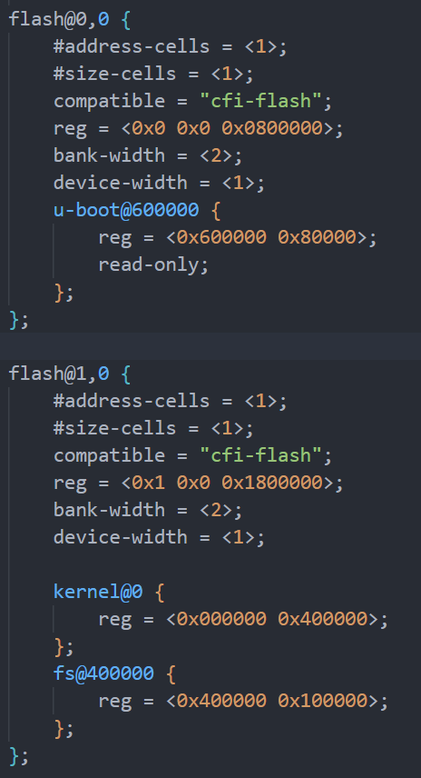

# uboot & linux & rootfs

## Part 1: u-boot

### 1.安装编译工具链

```bash
sudo apt install build-essential bison flex libncurses-dev libssl-dev gcc-powerpc-linux-gnu binutils-powerpc-linux-gnu
```

```bash
#echo 'export ARCH=powerpc;export CROSS_COMPILE=powerpc-linux-gnu-;' >> ~/.bashrc
#source ~/.bashrc
```

### 2.下载源码并编译

```bash
git clone https://github.com/u-boot/u-boot.git
cd u-boot/
sudo make distclean
sudo make ARCH=powerpc CROSS_COMPILE=powerpc-linux-gnu- MPC837XERDB_defconfig
sudo make ARCH=powerpc CROSS_COMPILE=powerpc-linux-gnu- -j8

#sudo make ARCH=powerpc CROSS_COMPILE=powerpc-linux-gnu- menuconfig
```

修改配置文件：

```bash
CONFIG_TEXT_BASE=0xFE000000	--> 0xC0000000
CONFIG_DEBUG_UART_BASE=0xe0004500 √
CONFIG_ENV_SIZE=0x4000 --> 0x2000
CONFIG_ENV_ADDR=0xFE080000 --> 0xC00E0000
CONFIG_BAT0_BASE=0x00000000 √ （256MB DDR2）
CONFIG_BAT1_BASE=0x10000000 √ （256MB DDR2）
CONFIG_BAT2_BASE=0xE0000000 √ （IMMR）
CONFIG_BAT3_BASE=0xC1800000 --> 0xC1800000 （L2_SWITCH）
++CONFIG_BAT3_LENGTH_512_KBYTES=y （NVRAM）
CONFIG_BAT4_BASE=0xFE000000 --> 0xC0000000（FLASH）
CONFIG_BAT4_LENGTH_32_MBYTES=y --> CONFIG_BAT4_LENGTH_16_MBYTES=y
CONFIG_BAT5_BASE=0xE6000000 --> 0xC2000000 （STACH_IN_DCACHE）
++CONFIG_BAT5_LENGTH_1_MBYTES=y （FPGA）
++CONFIG_BAT5_ICACHE_INHIBITED=y
++CONFIG_BAT5_DCACHE_INHIBITED=y
CONFIG_BAT6_BASE=0x80000000 √（PCI_MEM）
CONFIG_BAT7_BASE=0x90000000 √（PCI_MMIO）
CONFIG_LBLAW0_BASE=0xFE000000 --> 0xC0000000（FLASH）
CONFIG_LBLAW1_BASE=0xE0600000 --> 0xC1800000（NVRAM）
CONFIG_LBLAW2_BASE=0xF0000000 --> 0xC2000000（FPGA）
CONFIG_SYS_BR0_PRELIM=0xFE001001 --> 0xC0001001 （Addr + PortSize）
CONFIG_SYS_OR0_PRELIM=0xFF800193 --> 0xFF000193	（使用16M空间，因此前16位AM掩码为0xFF00）
CONFIG_SYS_BR1_PRELIM=0xE0600C21 --> 0xC1801001
CONFIG_SYS_OR1_PRELIM=0xFFFF8396 --> 0xFFF801C5
CONFIG_SYS_BR2_PRELIM=0xF0000801 --> 0xC2001801
CONFIG_SYS_OR2_PRELIM=0xFFFE09FF --> 0xFFF001C5

CONFIG_USE_BOOTCOMMAND=y
CONFIG_BOOTCOMMAND="bootm 0xc0000000 0xC0400000 0xffec0000"
CONFIG_USE_BOOTARGS=y
CONFIG_BOOTARGS="console=ttyS0,115200 rootfstype=ramfs init=/linuxrc rw"
```

### Optional

配置uboot启动命令：

```bash
setenv bootcmd 'bootm 0xc0000000 0xC0400000 0xffec0000'
setenv bootargs 'console=ttyS0,115200 rootfstype=ramfs init=/linuxrc rw'
saveenv
```

## Part 2: linux

```bash
sudo ln -s /home/yangyu/vmc/u-boot/tools/mkimage /usr/bin/mkimage
```

```bash
git clone https://github.com/torvalds/linux.git
cd linux/
sudo make mrproper
sudo make ARCH=powerpc 83xx/mpc837x_rdb_defconfig
sudo make ARCH=powerpc CROSS_COMPILE=powerpc-linux-gnu- -j8

sudo make ARCH=powerpc CROSS_COMPILE=powerpc-linux-gnu- menuconfig //set tick hz to 1000 
```

## Part 3: dts

空间分配：


```bash
cd linux/ 
vi arch/powerpc/boot/dts/mpc8378_rdb.dts

sudo make ARCH=powerpc CROSS_COMPILE=powerpc-linux-gnu- mpc8378_rdb.dtb
```

修改设备树dts：

注释掉pci，usb等驱动项，修改flash空间分配项：



## Part 4: rootfs

进入配置页面

```bash
cd buildroot/
sudo make menuconfig
sudo make -j1

cd ../linux/
sudo ln -s ~/vmc/buildroot/output/target/ ./rootfs
sudo make ARCH=powerpc CROSS_COMPILE=powerpc-linux-gnu- modules
sudo make ARCH=powerpc modules_install INSTALL_MOD_PATH=~/vmc/linux/rootfs

sudo vi ./rootfs/etc/network/interfaces
auto eth0
iface eth0 inet static
address 192.168.0.2
netmask 255.255.255.0
gateway 192.168.0.1

sudo vi ./rootfs/etc/vsftpd.conf
local_enable=YES
write_enable=YES

sudo vi ./rootfs/etc/profile
PS1='\u@\h:\w$:'
export PS1
#if [ "$PS1" ]; then
#       if [ "`id -u`" -eq 0 ]; then
#               export PS1='# '
#       else
#               export PS1='$ '
#       fi
#fi
cd ../buildroot/

sudo cp package/busybox/S10mdev output/target/etc/init.d/
sudo chmod +x output/target/etc/init.d/S10mdev
sudo mkimage -A ppc -O linux -T ramdisk -C gzip -d output/images/rootfs.ext2.gz output/images/rootfs.ext2.gz.uboot

sudo make -j1
```

### 1.Target


### 2.Toolchain


### 3.System Configuration


### 4.Filesystem Images


### Optional

```bash
cd ./rootfs
find . | cpio -H newc -ov --owner root:root > ../initramfs.cpio && cd ..
gzip initramfs.cpio
mkimage -A ppc -O linux -T ramdisk -C gzip -d initramfs.cpio.gz initramfs.cpio.gz.uboot
```

