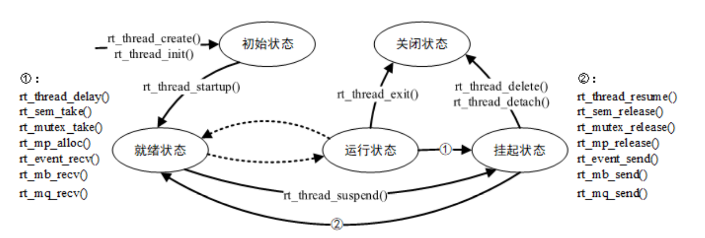
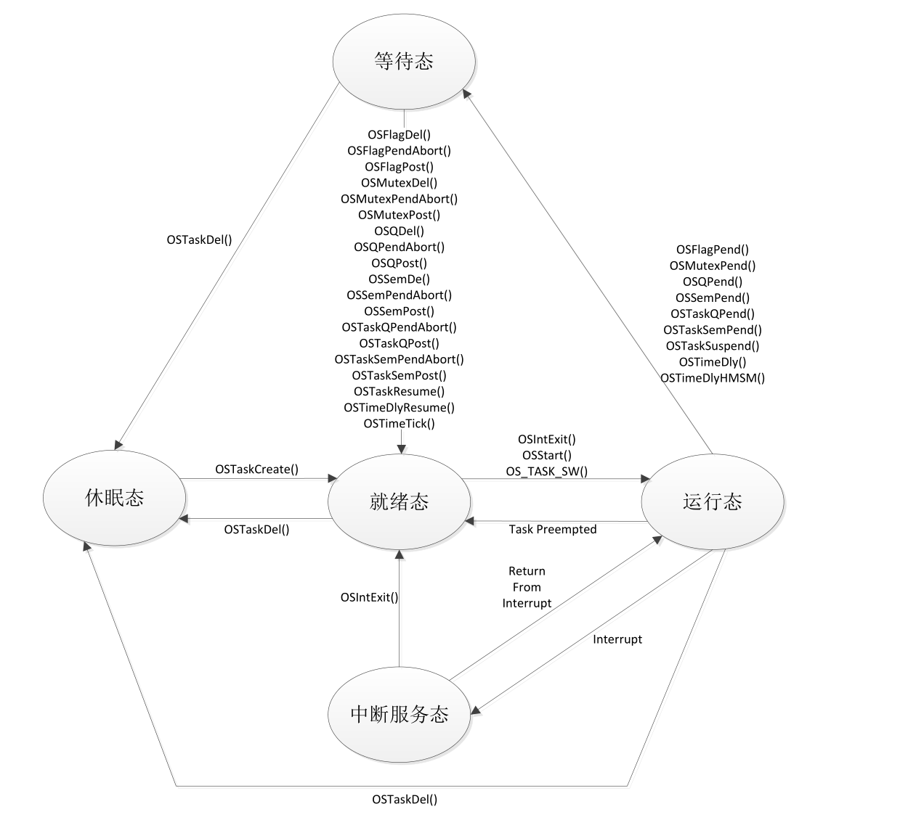
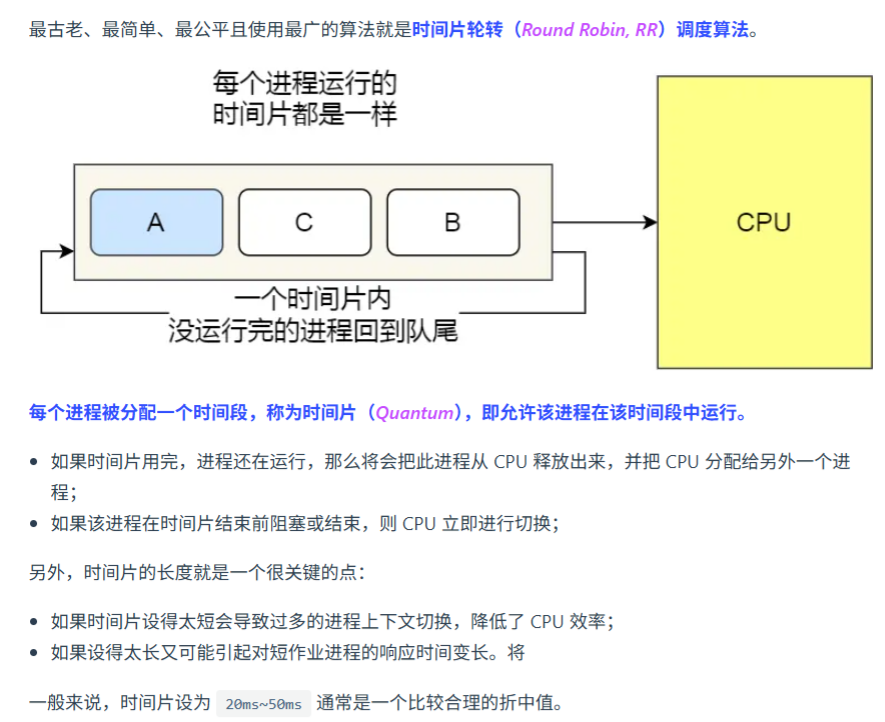
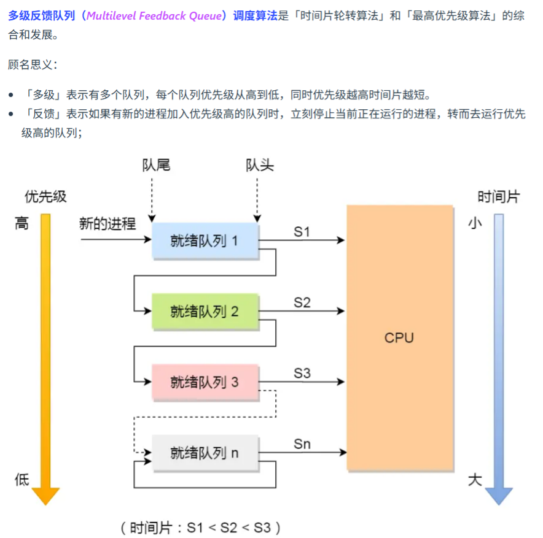
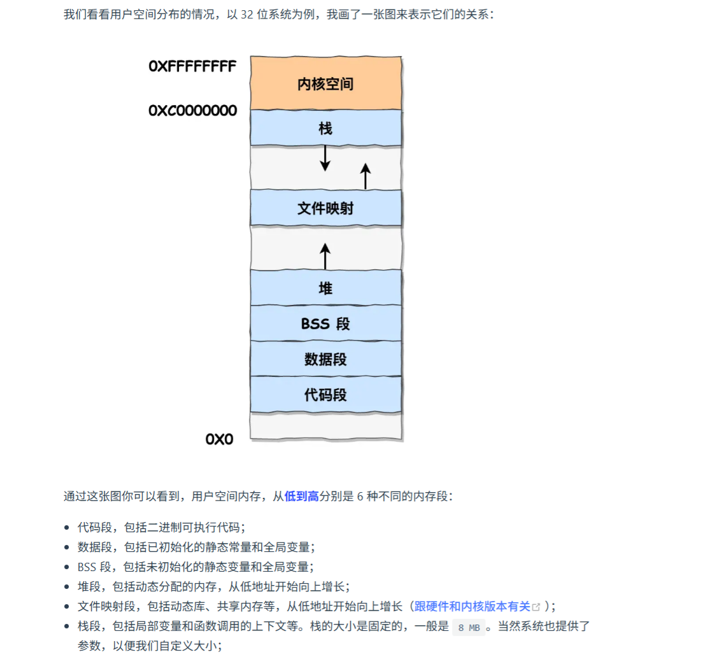
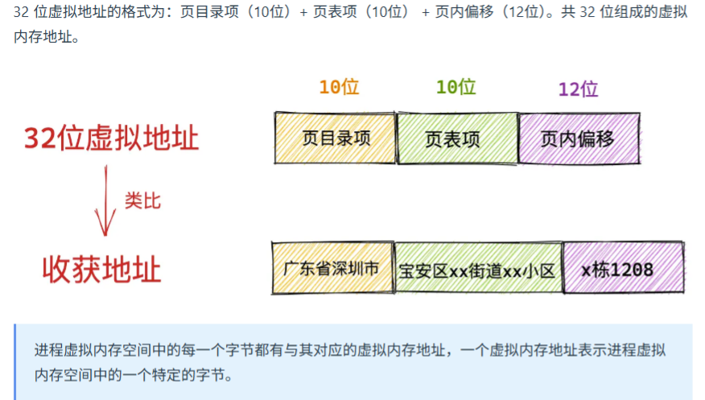

# Note For Embedding

## 1. Basic C/C++

### fopen

```c
FILE *fopen(const char *filename, const char *mode);
```

`mode`参数:

| mode |                    desc                    |
| :--: | :----------------------------------------: |
|  r   |           只读文本，不存在则失败           |
|  w   |      只写文本，截断文件，不存在则创建      |
|  a   | 追加文本，写入位置在文件末尾，不存在则创建 |
|  b   |            替换为**二进制**操作            |
|  +   |                    读写                    |

> `rb+`：读写（二进制），文件必须存在

### :question:struct

```c
struct Question1 {
    char a;			// 占用 1 字节
    double b;		// 占用 8 字节，但为对齐前面补上 7 字节
    int c;			// 占用 4 字节
    char d[];		// 占用 0 字节
    // 需整体对齐到8（最大成员`double`），故填充4字节
};	
```

- 实际占 `24` 个字节

```c
#pragma pack(2)
struct Question2 {
    char a;
    int b;
    short c;
}; //__attribute__((packed))
#pragma pack()
```

- 实际占 `8` 个字节

### setvbuf

- 缓冲类型：

  - **全缓冲**（`_IOFBF`）：缓冲区满时刷新（默认用于文件）。
  - **行缓冲**（`_IOLBF`）：遇到换行符或缓冲区满时刷新（默认用于终端）。
  - **无缓冲**（`_IONBF`）：直接读写。

- 手动设置缓冲

  ```c
  char buffer[1024];
  setvbuf(fp, buffer, _IOFBF, sizeof(buffer)); // 设置全缓冲
  ```

## 2. Hardware

### 8051 系列

#### 基础知识

1. RST引脚上出现持续 **`2`** 个机器周期即 **`24`** 个振荡周期以上的高电平时，系统复位。
2. 51单片机除了DPTR寄存器是16位，其他所有的寄存器，无论普通寄存器还是特殊功能寄存器都是8位的。
3. 单片机EA引脚表示存取外部程序代码之意，低电平有效，当此引脚接低电平后，系统会取用外部的程序代码（存于外部EPROM中）来执行程序。8031的EA引脚必须接低电平，因为其内部无程序存储器空间。
4. 传统51单片机的工作频率为时钟频率（晶振频率）的1/12，但增强型单片机的工作频率可达时钟频率的1倍，51单片机晶振频率为11.0592或12M，所以最高工作频率最高为12M。
5. PSEN（程序存储使能，低电平有效）是用于读取外部**程序存储器**的控制信号。
6. RD（读使能，低电平有效）是用于读取外部**数据存储器**的控制信号。
7. P0、P1口做输入用途之前必须相应端口先置1。
8. 指令AJMP的寻址范围是2KB，SJMP是-128-127B，LJMP是64KB。
9. 51单片机的RST引脚除了做为复位信号输入端外，还做为 备用电源 的输入端。
10. 定时器T0的溢出标志位TF0在CPU响应中断后既可以通过软件清零，也可以通过硬件自动清零。
11. 51单片机复位后SBUF＝不确定。
12. 8051单片机的振荡晶体频率是12MHz，其定时／计数器T0作为计数器使用时的最高计数频率是500KHz。

#### **内部RAM地址分配表**

| **地址范围**       | **分区名称**          | **大小** | **功能说明**                                      | **访问方式**     | **特殊备注**               |
| :----------------- | :-------------------- | :------- | :------------------------------------------------ | :--------------- | :------------------------- |
| **00H - 1FH**      | **工作寄存器组**      | 32字节   | 4组通用寄存器R0-R7                                | 寄存器名直接访问 | 分组切换见注①              |
| 00H - 07H          | 寄存器组0 (Bank0)     | 8字节    | 默认复位组：`R0=00H`, `R1=01H`, ..., `R7=07H`     | `R0`- `R7`       |                            |
| 08H - 0FH          | 寄存器组1 (Bank1)     | 8字节    | 启用后：`R0=08H`, `R1=09H`, ..., `R7=0FH`         | `R0`- `R7`       |                            |
| 10H - 17H          | 寄存器组2 (Bank2)     | 8字节    | 启用后：`R0=10H`, `R1=11H`, ..., `R7=17H`         | `R0`- `R7`       |                            |
| 18H - 1FH          | 寄存器组3 (Bank3)     | 8字节    | 启用后：`R0=18H`, `R1=19H`, ..., `R7=1FH`         | `R0`- `R7`       |                            |
| **20H - 2FH**      | **位寻址区**          | 16字节   | 支持位操作（128个独立位）                         | 字节地址/位地址  | 位地址见注②                |
| (例) 20H.0 - 20H.7 | 位地址00H - 07H       | -        | 位指令可直接操作：`SETB 00H`（设置20H字节的bit0） | `bit`类型变量    |                            |
| **30H - 7FH**      | **通用数据存储区**    | 80字节   | 用户变量、堆栈区（默认SP初始化位置）              | 字节/字访问      | 堆栈区见注③                |
| **80H - FFH**      | **SFR区（仅52系列）** | 128字节  | 特殊功能寄存器区                                  | 直接地址访问     | **仅扩展型号**             |
| 80H, 90H, ...      | SFR：P0, P1...        | -        | 控制外设：`P0=80H`, `SP=81H`, `PCON=87H`...       | `sfr`定义访问    | 地址与高128字节重叠（注④） |

------

注①：寄存器组切换：通过程序状态字PSW的RS1和RS0位控制（PSW地址=D0H）

| PSW设置      | 寄存器组 | 使用场景     |
| :----------- | :------- | :----------- |
| RS1=0, RS0=0 | Bank0    | 复位默认组   |
| RS1=0, RS0=1 | Bank1    | 中断服务常用 |
| RS1=1, RS0=0 | Bank2    | 嵌套中断     |
| RS1=1, RS0=1 | Bank3    | 高级中断嵌套 |

注②：位寻址区地址计算公式：`位地址 = (字节地址 - 20H) * 8 + 位偏移`

注③：堆栈区使用要点

- **复位后SP=07H**：位于Bank0的末尾（R7位置），需在main()中重置：

  ```
  void main() {
      SP = 0x60;  // 将堆栈移出寄存器区（建议设置到30H以上）
      // 其他初始化
  }
  ```

> 8051 的堆栈生长方向为向上生长，与常规 ARM32/x86 架构不同（向下）。

注④：80H-FFH的双重身份（仅52系列）

- **高128字节普通RAM**：通过**间接寻址**访问（`MOV R0, #80H; MOV A, @R0`）
- **SFR区**：通过**直接寻址**访问（`MOV 80H, #0FFH`即操作P0端口）

------

####  **I/O 端口功能表**

| **端口** | **引脚数量**  | **默认功能** | **复用功能**                   | **电气特性**              | **上拉电阻**   | **关键设计要点**            |
| :------- | :------------ | :----------- | :----------------------------- | :------------------------ | :------------- | :-------------------------- |
| **P0**   | 8 (P0.0-P0.7) | **通用I/O**  | **地址/数据总线** (AD0-AD7)    | **开漏输出**              | ❌ 无（需外接） | 总线模式下需外接10KΩ上拉    |
|          |               |              | - 外部存储器低8位地址+数据线   | 高阻输入（输入时需先写1） |                |                             |
| **P1**   | 8 (P1.0-P1.7) | **通用I/O**  | **特殊型号扩展**：             | 准双向口（内置弱上拉）    | ✅ 内置         | 最安全的通用I/O，无复用冲突 |
|          |               |              | - P1.5/P1.6/P1.7：ISP编程      | 驱动能力4个TTL负载        |                |                             |
|          |               |              | - P1.0/T2(52)：定时器2时钟输入 |                           |                |                             |
| **P2**   | 8 (P2.0-P2.7) | **通用I/O**  | **高8位地址总线** (A8-A15)     | 准双向口（内置弱上拉）    | ✅ 内置         | 总线模式下输出高8位地址     |
|          |               |              | - 外部存储器寻址               | 驱动能力4个TTL负载        |                |                             |
| **P3**   | 8 (P3.0-P3.7) | **通用I/O**  | **全功能复用引脚**：           | 准双向口（内置弱上拉）    | ✅ 内置         | **需优先满足复用需求！**    |
|          |               |              | - P3.0/RXD：串口接收           |                           |                |                             |
|          |               |              | - P3.1/TXD：串口发送           |                           |                |                             |
|          |               |              | - P3.2/INT0：外部中断0         |                           |                |                             |
|          |               |              | - P3.3/INT1：外部中断1         |                           |                |                             |
|          |               |              | - P3.4/T0：定时器0计数输入     |                           |                |                             |
|          |               |              | - P3.5/T1：定时器1计数输入     |                           |                |                             |
|          |               |              | - P3.6/WR：外部RAM写控制       |                           |                |                             |
|          |               |              | - P3.7/RD：外部RAM读控制       |                           |                |                             |

------

#### **:bulb:中断向量表**

| **中断源**               | **入口地址** | **中断号** | **优先级** | **触发条件**                                     | **典型应用**       |
| :----------------------- | :----------- | :--------- | :--------- | :----------------------------------------------- | :----------------- |
| **复位向量**             | **0000H**    | -          | 最高       | 上电复位或硬件复位                               | 程序启动入口       |
| **外部中断0 (INT0)**     | **0003H**    | 0          | 1 (默认)   | `INT0`引脚低电平/下降沿（由TCON.0 IT0配置）      | 紧急按键、限位开关 |
| **定时器0溢出 (TF0)**    | **000BH**    | 1          | 2          | 定时器0计数器溢出（TCON.5 TF0=1）                | 精确定时、PWM生成  |
| **外部中断1 (INT1)**     | **0013H**    | 2          | 3          | `INT1`引脚低电平/下降沿（由TCON.2 IT1配置）      | 次优先级外部事件   |
| **定时器1溢出 (TF1)**    | **001BH**    | 3          | 4          | 定时器1计数器溢出（TCON.7 TF1=1）                | 串口波特率发生器   |
| **串口收发完成 (RI/TI)** | **0023H**    | 4          | 5 (最低)   | 串口接收完成(SCON.0 RI=1)或发送完成(SCON.1 TI=1) | UART通信           |
| **定时器2溢出 (TF2)**    | **002BH**    | 5          | -          | 定时器2溢出（T2CON.7 TF2=1）                     | **仅8052扩展型号** |

> 8051 默认两个中断优先级：**高优先级**和**低优先级**，支持嵌套，通过 `IP`(B8H) 配置。

#### **数据寻址方式表**

| **寻址方式**           | **指令格式**                         | **示例**          | **说明**                                                     | **可访问区域**                       | **优缺点**             |
| ---------------------- | ------------------------------------ | ----------------- | ------------------------------------------------------------ | ------------------------------------ | ---------------------- |
| **立即寻址**           | `MOV A, #data`                       | `MOV A, #25H`     | 操作数直接在指令中给出，`#`表示立即数。指令执行时，立即数直接送入寄存器。 | 不访问存储器，直接取指令内操作数     | 执行快，常用于常量赋值 |
| **寄存器寻址**         | `MOV A, Rn`                          | `MOV A, R1`       | 操作数在寄存器 R0~R7 中，寄存器号由指令直接给出。            | 访问内部RAM的工作寄存器区（00H~1FH） | 指令短、速度快         |
| **直接寻址**           | `MOV A, addr`                        | `MOV A, 30H`      | 操作数地址直接在指令中给出，单片机直接去内部 RAM 或 SFR 中取数据。 | 内部RAM（00H~7FH）和SFR（80H~FFH）   | 常用于访问RAM或SFR     |
| **寄存器间接寻址**     | `MOV A, @Ri`                         | `MOV A, @R0`      | 操作数的地址存放在寄存器 R0/R1 中，通过寄存器内容间接访问数据。 | 内部RAM（00H~7FH）                   | 常用于数组访问         |
| **变址寻址**           | `MOVC A, @A+DPTR` 或 `MOVC A, @A+PC` | `MOVC A, @A+DPTR` | A+DPTR 或 A+PC 得到ROM地址，从代码存储器（程序存储器）中取常量数据。 | 访问程序存储器ROM（代码区）          | 常用于查表             |
| **基址寄存器寻址**     | `MOVX A, @DPTR` 或 `MOVX A, @Ri`     | `MOVX A, @DPTR`   | 使用DPTR或R0/R1作为基址，访问外部数据存储器XDATA（外部RAM）。 | 外部RAM（XDATA）                     | 常用于访问扩展RAM      |
| **位寻址**             | `SETB bit` / `CLR bit`               | `SETB P1.0`       | 对内部RAM 20H~2FH（位地址区）或SFR的位可寻址区直接操作单个位。 | 位地址区(20H~2FH) & SFR位操作寄存器  | 常用于IO口和状态位控制 |
| **相对寻址**           | `SJMP rel` / `JNZ rel`               | `SJMP LOOP`       | 跳转偏移量 = 当前PC + rel，用于短跳转（-128~+127字节范围）。 | 程序存储器                           | 主要用于短程序跳转     |
| **长/绝对寻址**        | `LJMP addr16`                        | `LJMP 2000H`      | 直接给出16位地址，CPU直接跳转到程序存储器的该位置。          | 程序存储器                           | 常用于大范围跳转       |
| **间接访问程序存储器** | `JMP @A+DPTR`                        | `JMP @A+DPTR`     | 用于跳转表，A+DPTR得到程序地址后直接跳转。                   | 程序存储器                           | 多用于查表             |

>**寻址方式总结**
>
>- **内部数据存储器（IRAM，00H~7FH）**
>  - 00H~~1FH：工作寄存器区（R0~~R7），支持**寄存器寻址、间接寻址**
>  - 20H~2FH：**位寻址区**，支持 `SETB` / `CLR`
>  - 30H~7FH：通用数据区，支持**直接寻址、间接寻址**
>- **SFR（特殊功能寄存器，80H~FFH）**
>  - 只能**直接寻址**（除部分SFR可位寻址）
>- **外部数据存储器（XDATA）**
>  - 通过 `MOVX` 访问
>- **程序存储器（CODE）**
>  - 通过 `MOVC`、`LJMP`、`SJMP`、`JMP`、`CALL` 等访问

#### 🧩 **关键寄存器详解**

##### **1. TMOD (89H) - 定时器模式控制**

| **位组**    | **位名**  | **取值** | **功能**                                               |
| :---------- | :-------- | :------- | :----------------------------------------------------- |
| **定时器1** | GATE1     | 0        | 定时器1仅由TR1控制                                     |
|             |           | 1        | 定时器1由TR1 + INT1引脚联合控制                        |
|             | C/T1      | 0        | 定时器模式（计数机器周期）                             |
|             |           | 1        | 计数器模式（计数T1引脚下降沿）                         |
|             | M1_1/M0_1 | 00       | 模式0：13位计数器（TL1低5位+TH1）                      |
|             |           | 01       | 模式1：16位计数器（TL1+TH1）                           |
|             |           | 10       | 模式2：8位自动重载定时器（TL1计数，TH1存初值）         |
|             |           | 11       | 模式3：无效（T1在T0模式3时停止）                       |
| **定时器0** | GATE0     | 0        | 定时器0仅由TR0控制                                     |
|             |           | 1        | 定时器0由TR0 + INT0引脚联合控制                        |
|             | C/T0      | 0        | 定时器模式                                             |
|             |           | 1        | 计数器模式                                             |
|             | M1_0/M0_0 | 00       | 模式0：13位计数器                                      |
|             |           | 01       | 模式1：16位计数器                                      |
|             |           | 10       | 模式2：8位自动重载                                     |
|             |           | 11       | 模式3：T0分成两个独立8位计数器（TL0用于T0，TH0用于T1） |

##### 2. 串口寄存器总表

| **寄存器**          | **地址** | **位定义** | **符号** | **功能说明**                                          | **复位值** | **配置示例**                |
| :------------------ | :------- | :--------- | :------- | :---------------------------------------------------- | :--------- | :-------------------------- |
| **SCON** (串口控制) | 98H      | D7         | SM0      | **工作模式选择位** 与SM1组合定义模式                  | 0          | `SM0=1, SM1=1`→ 模式3       |
|                     |          | D6         | SM1      |                                                       | 0          |                             |
|                     |          | D5         | SM2      | **多机通信使能** 模式2/3下允许多主机                  | 0          | `SM2=1`（从机接收）         |
|                     |          | D4         | REN      | **接收使能** 1=允许接收                               | 0          | `REN=1`                     |
|                     |          | D3         | TB8      | **发送第9位** 模式2/3时有效                           | 0          | 奇偶校验位                  |
|                     |          | D2         | RB8      | **接收第9位** 模式2/3时存储校验位                     | 0          |                             |
|                     |          | D1         | TI       | **发送中断标志** 发送完成时硬件置1，**需软件清零**    | 0          | `CLR TI`                    |
|                     |          | D0         | RI       | **接收中断标志** 接收完成时硬件置1，**需软件清零**    | 0          | `CLR RI`                    |
| **SBUF** (数据缓冲) | 99H      | 8位        | -        | **串行数据缓冲器** 写入时启动发送，读取时获取接收数据 | **不定**   | `MOV SBUF, A` `MOV A, SBUF` |
| **PCON** (电源控制) | 87H      | D7         | SMOD     | **波特率倍增位** 1=波特率×2（仅模式1/2/3）            | 0XXX0000B  | `SMOD=1`（高速）            |
|                     |          | D0         | -        | 保留位（其他位用于低功耗控制）                        | -          |                             |

1. **SCON工作模式配置（SM0/SM1）**

| **SM0** | **SM1** | **工作模式** | **功能**                  | **波特率公式**                 |
| :------ | :------ | :----------- | :------------------------ | :----------------------------- |
| 0       | 0       | **模式0**    | 同步移位寄存器（扩展I/O） | `f_osc / 12`                   |
| 0       | 1       | **模式1**    | 8位UART（可变波特率）     | `(2^{SMOD} / 32) × (T1溢出率)` |
| 1       | 0       | **模式2**    | 9位UART（固定波特率）     | `(2^{SMOD} / 64) × f_osc`      |
| 1       | 1       | **模式3**    | 9位UART（可变波特率）     | 同模式1                        |

2. **波特率计算（以模式1为例）**

- **公式**：

  ```
  Baud=2SMOD×fosc / [32×12×(256−TH1)]
  ```

- **示例**（11.0592MHz晶振，9600bps）：

  ```
  TH1=256−21×11059200/[32×12×9600]=256−3=253→0xFD
  ```

#####  3. 定时器初值计算表

| **定时器** | **工作模式**         | **最大计数值** | **计数初值公式**            | **关键参数**        | **示例（输出 1kHz）**          |
| :--------- | :------------------- | :------------- | :-------------------------- | :------------------ | :----------------------------- |
| **T0/T1**  | **模式1（16位）**    | 65536 (0xFFFF) | *X*=65536−*t*×*f*osc/12     | *t*：定时时间（μs） | *t*=500*μs*→ *X*=65036=FE0C*H* |
|            | **模式2（8位自动）** | 256 (0xFF)     | *X*=256−*t*×*f*osc/12       | 重载值存入 THx      | *t*=100*μs*→ *X*=156=9C*H*     |
| **T2**     | **时钟发生器模式**   | 65536 (0xFFFF) | *X*=65536−*t*×*f*osc/2      | 计数速率 = *f*osc/2 | *t*=500*μs*→ *X*=62536=F448*H* |
|            | **波特率发生器**     | 256 (0xFF)     | *X*=256−*f*osc/(32×12×Baud) | Baud：目标波特率    | Baud=9600 → *X*=253=FD*H*      |

------

#### 📊 **时序周期对比表**

| **周期类型** | **别名**     | **定义**                                         | **与振荡周期关系**                          | **典型芯片应用**    | **计算公式**                                                |
| :----------- | :----------- | :----------------------------------------------- | :------------------------------------------ | :------------------ | :---------------------------------------------------------- |
| **振荡周期** | 时钟周期     | 晶振震荡一次的时间（最小时间单元）               | **1倍基准**                                 | 所有数字电路        | *T*osc=*f*osc1                                              |
| **状态周期** | 相位周期     | 8051中CPU处理一个总线相位的时间（分为P1/P2两相） | **2个振荡周期**                             | 8051及衍生型号      | *T*state=2×*T*osc                                           |
| **机器周期** | 指令周期基准 | 完成一个基本操作（如取指）的时间                 | **8051：12个振荡周期** **ARM：1个时钟周期** | 8051（12T模式）     | 8051: *T*mach=12×*T*osc                                     |
| **时钟周期** | 处理器周期   | 现代ARM中CPU主频的倒数（每个时钟脉冲的时间）     | **等同于振荡周期**                          | STM32等Cortex-M系列 | T_{\text{clk}} = T_{\text{osc}} = \frac{1}{f_{\text{CPU}}}} |
| **指令周期** | -            | 执行一条完整指令的时间（因指令复杂度变化）       | **可变倍数**                                | 所有处理器          | 单周期指令：*T*clk 多周期指令：*N*×*T*clk                   |

#### 📊 **8051系列单片机对比总表**

| **特性**         | **8051**        | **8032**     | **8751**                      | **89C52**                     |
| :--------------- | :-------------- | :----------- | :---------------------------- | :---------------------------- |
| **ROM类型**      | **4KB 掩膜ROM** | 无（需外扩） | **4KB EPROM**（紫外线擦除）   | **8KB Flash**（电可擦写）     |
| **RAM容量**      | **128B**        | **256B**     | **128B**                      | **256B**                      |
| **定时器数量**   | 2（T0/T1）      | 2（T0/T1）   | 2（T0/T1）                    | **3（T0/T1/T2）**             |
| **中断源**       | 5               | 5            | 5                             | **6**（增加T2中断）           |
| **I/O引脚数**    | 32（P0-P3）     | 32           | 32                            | 32                            |
| **串口**         | UART            | UART         | UART                          | UART                          |
| **编程方式**     | 外部ROM烧录     | 外部ROM烧录  | **片内EPROM烧录**（需紫外灯） | **ISP在线编程**（无需紫外灯） |
| **工作电压**     | 5V ±10%         | 5V ±10%      | 5V ±10%                       | **2.7-5.5V**（宽电压）        |
| **最大时钟频率** | 12MHz           | 12MHz        | 12MHz                         | **24MHz**                     |
| **功耗**         | 25mA@12MHz      | 25mA@12MHz   | 25mA@12MHz                    | **5mA@12MHz**（低功耗模式）   |
| **封装**         | DIP40/PLCC44    | DIP40        | **陶瓷窗口封装**（可擦写）    | DIP40/PLCC44/QFP44            |

### Cortex-M 系列

#### 基础知识

1. 进入休眠的指令分别是WFI（等待中断唤醒 ）和WFE（等待事件唤醒 ）。

#### 通用寄存器

Cortex-M 系列包含多个通用寄存器，用于数据的存储和处理，在程序执行过程中发挥着重要作用，以下是通用寄存器列表：

R0 R1 R2 R3 R4 R5 R6 R7 R8 R9 R10 R11 R12

#### M3/M4/M7的特殊寄存器

Cortex-M3、M4、M7 在 M0 特殊寄存器的基础上，还增加了一些特殊寄存器，以满足更复杂的功能需求，以下是它们的特殊寄存器：

| 寄存器               |                                                              |
| -------------------- | ------------------------------------------------------------ |
| SP                   | R13                                                          |
| LR                   | R14                                                          |
| PC                   | R15                                                          |
| CONTROL              | CONTROL 寄存器具有多种功能，其中第 1 位写 1 表示切换成 PSP；第 0 位用于控制线程模式的特权级别，0 表示特权级的线程模式，1 表示用户级的线程模式，而 Handler 模式永远都是特权级的。 |
| xPSR(程序状态寄存器) | xPSR（程序状态寄存器）中的 IPSR（中断号寄存器）可以用来判断当前处于什么中断，帮助程序进行中断处理和状态判断。 |
| PRIMASK              | PRIMASK 是中断屏蔽寄存器，向其写 1 可以屏蔽所有中断（除了不可屏蔽中断和 hardfault 硬件错误中断），从而在需要时保护关键代码段不被中断干扰。 |
| FAULTMASK            | FAULTMASK 寄存器用于屏蔽所有的 fault（NMI 不可屏蔽中断不受影响），当需要临时屏蔽错误异常时，可以使用该寄存器。 |
| BASEPRI              | BASEPRI 寄存器可以屏蔽所有优先级不高于某个具体数值的中断，通过设置该寄存器的值，可以灵活控制中断的响应。 |

1. MSP 和 PSP

- **MSP（主堆栈指针）**：在中断处理中使用，系统复位后默认使用 MSP，在中断处理过程中也使用 MSP。
- **PSP（进程堆栈指针）**：用于线程栈，通过配置 CONTROL 寄存器的相关位来切换使用 MSP 或 PSP。当 CONTROL 寄存器的第 1 位写 1 时，表示切换成 PSP。

2. 栈空间操作

- **栈的增长方向**：栈向下递减，即栈顶地址随着数据的入栈而减小。

- **栈指针的指向**：栈指针（SP）始终指向栈的最后一个数据，每次执行数据存储操作（push）前，SP 会首先减小，为新数据腾出空间。

3. 压栈的寄存器

当发生中断或函数调用等情况时，需要将一些寄存器的值压入栈中保存，以便在恢复时能够还原现场，以下是常见的压栈寄存器：

```
xPSR（程序状态寄存器）--> PC（程序计数器）--> LR（链接寄存器）--> R12 --> R0-R3
```

4. M0/M3/M4/M7 区别

| 架构                   | ARMv6-M            | ARMv7-M                              | ARMv7-M              | ARMv7-M                                  |
| ---------------------- | ------------------ | ------------------------------------ | -------------------- | ---------------------------------------- |
| basepri 寄存器         | 无                 | 有，可阻止某优先级或更低优先级的中断 | 有                   | 有                                       |
| faultmask 寄存器       | 无                 | 有，提供更多错误管理特性             | 有                   | 有                                       |
| CONTROL 寄存器 bit0    | 无此功能           | 用于决定是特权模式还是用户线程模式   | 有                   | 有                                       |
| 指令集                 | 16 位 Thumb 指令   | 32 位 Thumb 指令                     | 32 位 Thumb 指令     | 32 位 Thumb 指令                         |
| 位段特性               | 无                 | 有                                   | 有                   | 有                                       |
| 位域处理               | 无                 | 有                                   | 有                   | 有                                       |
| 多处理器支持           | 无                 | 有                                   | 有                   | 有                                       |
| 中断数量               | 最多 32 个外部中断 | 最多 240 个外部中断                  | 最多 240 个外部中断  | 最多 240 个外部中断                      |
| 硬件除法               | 无                 | 有                                   | 有                   | 有                                       |
| 存储器保护单元（MPU）  | 无                 | 有（可选）                           | 有（可选）           | 有（可选）                               |
| 调试和跟踪特性         | 较少               | 更多                                 | 较多                 | 丰富                                     |
| 浮点特性               | 无                 | 无                                   | 有，支持基本浮点运算 | 强大，支持更多浮点运算指令和更高精度运算 |
| SIMD 指令              | 无                 | 无                                   | 有（单周期多指令）   | 有，且功能更强大                         |
| 饱和算法               | 无                 | 无                                   | 有                   | 有                                       |
| 单周期 MAC（乘法累加） | 无                 | 无                                   | 有                   | 有                                       |
| 性能（主频）           | 较低               | 中等                                 | 较高                 | 高                                       |
| 缓存容量               | 较小或无           | 有一定缓存                           | 较大缓存             | 更大容量的 I-Cache 和 D-Cache            |
| DSP 指令集             | 无                 | 基本                                 | 有扩展               | 进一步扩展                               |
| 总线带宽               | 较窄               | 中等                                 | 较宽                 | 更宽                                     |

5. 异常和中断

Cortex‐M3 支持大量异常，包括 16 - 4 - 1 = 11 个系统异常，和最多 240 个外部中断——简称 IRQ。

| 编号   | 类型                           | 优先级         | 简介                                                         |
| ------ | ------------------------------ | -------------- | ------------------------------------------------------------ |
| 0      | N/A                            | N/A            | 表示当前没有异常在运行，系统处于正常执行状态。               |
| 1      | 复位                           | -3（最高）     | 系统上电或手动复位时触发，是系统启动的起点。在复位后，系统会进行一系列的初始化操作，如寄存器的初始化、内存的初始化等，然后开始执行用户程序。 |
| 2      | NMI（不可屏蔽中断）            | -2             | 由外部 NMI 输入脚触发，具有很高的优先级，不可被屏蔽。常用于处理关键的紧急事件，如电源故障、硬件安全事件等，确保系统能够及时响应这些重要的外部信号。 |
| 3      | 硬(hard) fault                 | -1             | 当系统出现严重的硬件错误或故障时触发，如存储器访问错误、总线错误等。所有被除能的 fault（当前被禁用或 FAULTMASK 被置位），都将“上访”成硬 fault。硬 fault 的处理需要特别谨慎，因为它可能涉及到系统的严重问题，需要及时排查和修复。 |
| 4      | MemManage（存储器管理 fault）  | 可编程         | 当 MPU（存储器保护单元）检测到访问犯规（如非法访问、越界访问等）以及访问非法位置时，会引发此 fault。此外，企图在“非执行区”取指也会触发该异常。该异常的优先级可编程设置，以便根据具体需求进行灵活处理。 |
| 5      | 存储器管理 fault（总线 fault） | 可编程         | 从总线系统收到错误响应时触发，原因可以是预取流产（Abort）或数据流产，或者企图访问协处理器失败等。总线 fault 同样可以通过编程设置优先级，以确保系统能够及时处理总线相关的错误。 |
| 6      | 用法(usage) Fault              | 可编程         | 当发生一些不符合指令用法的操作时触发，如未定义的指令、无效的操作数等。该异常可以帮助开发人员检测和纠正程序中的错误，提高代码的质量和稳定性。 |
| 7 - 10 | 保留                           | N/A            | 这些编号保留给未来的系统扩展或特定用途，当前未使用。         |
| 11     | SVCall（系统调用）             | 可编程         | 当执行系统服务调用指令（SVC）时引发的异常，用于实现用户程序与操作系统之间的交互。通过 SVC 指令，用户程序可以请求操作系统提供的服务，如内存分配、文件操作等，从而实现系统资源的管理和共享。 |
| 12     | 调试监视器                     | 可编程         | 当触发调试相关的事件时，如设置断点、数据观察点或者接收到外部调试请求时，会引发调试监视器异常。开发人员可以利用该异常进行程序的调试和跟踪，查找和解决代码中的问题。 |
| 13     | 保留                           | N/A            | 保留给未来的系统扩展或特定用途。                             |
| 14     | PendSV（挂起系统调用）         | 可编程         | 为系统设备而设的“可悬挂请求”，常用于实现任务切换等场景。在多任务系统中，当一个任务需要切换到另一个任务时，可以通过 PendSV 异常来实现平滑的任务切换，确保系统的高效运行。 |
| 15     | SysTick（系统滴答定时器）      | 可编程         | 系统滴答定时器是一个周期性溢出的时基定时器，通过配置相关寄存器可以设置其定时周期。当定时器溢出时，会引发 SysTick 异常，常用于实现系统的定时任务、延时操作等。 |
| 16     | IRQ（外部中断）                | #0（可编程）   | 外部中断是由外部设备（如传感器、按键等）触发的中断请求，最多支持 240 个外部中断。每个外部中断的优先级可以通过编程进行设置，以满足不同外部设备的实时性要求。 |
| 17     | IRQ（外部中断）                | #1（可编程）   | 同上述外部中断，可根据需求设置优先级。                       |
| ...    | ...                            | ...            | ...                                                          |
| 255    | IRQ（外部中断）                | #239（可编程） | 外部中断的编号范围从 16 到 255，共 240 个外部中断，可灵活配置优先级。 |

#### **EXC_RETURN 位域功能表**


### I2C

I2C（由飞利浦发明，现由 NXP 维护）是一种**同步、半双工、串行、主从式、多主控**的通信总线协议。因其接口简单（仅需两根线）、支持多设备、成本低廉，被广泛应用于连接传感器、EEPROM、RTC、LCD 驱动器、微控制器等低速外设。

#### 通信过程

一次完整的 I2C 数据传输包含以下几个基本阶段：


1. **起始条件：**

   - SCL 为**高电平**期间，SDA 发生一个**从高到低**的下降沿。
   - 唯一标志总线空闲且开始通信，由主设备产生。

2. **地址传输与读/写指示：**

   - 主设备紧接着发送7位（或10位）**从设备地址**和一个**读/写控制位（R/W#）**。
     - `R/W# = 0`：表示主设备**写**操作（主发给从）。
     - `R/W# = 1`：表示主设备**读**操作（从发给主）。
   - 这8位（或10位地址对应的9/11位）构成第一个数据字节。

3. **应答位 (ACK/NACK)：**

   - 每个数据字节（8位）传输后，**接收方**必须发送一个**应答位（ACK）**。
   - **第9个时钟周期**：发送方释放 SDA（拉高），接收方负责在 SCL 高电平期间将 SDA 拉低表示 ACK，保持高电平表示 NACK。
   - **地址 ACK/NACK：**
     - 所有从设备将自己的地址与线上地址比对。
     - 地址匹配且支持该操作（读/写）的从设备发送 ACK（拉低SDA），否则忽略（保持SDA高=NACK）。
   - **数据 ACK/NACK：**
     - 接收方收到每个数据字节后发送 ACK。
     - 主设备读数据时，在收到最后一个字节后发送 NACK 给从设备表示停止读取。
     - 接收方无法接收更多数据或无应答能力时发送 NACK。

4. **数据传输：**

   - 在 SCL 控制下进行，**SCL 低电平期间允许 SDA 变化**。
   - **SCL 高电平期间 SDA 必须稳定**（采样窗口）。
   - 数据按**最高有效位（MSB）** 最先传输。
   - 每次传输一个字节（8位）后紧跟一个应答位（共9个时钟周期）。
   - 读/写由首个字节中的 R/W# 位决定，整个传输过程方向不变（除了应答位）。

5. **停止条件：**

   - SCL 为**高电平**期间，SDA 发生一个**从低到高**的上升沿。

   - 标志通信结束，由主设备产生，释放总线。

   - **重复起始条件：** 在停止条件前不产生停止条件，而是重新发一个起始条件。用于发送不同地址或切换读/写方向，避免释放总线后被其他主抢占。

#### 总线仲裁

I2C 允许多个主设备共享同一总线，**仲裁机制确保只有一个主设备最终获得控制权而不破坏正在进行的数据传输**，这是其强大之处。

1. **仲裁时机：**
   - 仲裁发生在**起始条件之后**和**传输数据的每一位（包括SDA和ACK）期间**。仲裁在每一位的 SCL **高电平**期间进行。
2. **仲裁原理：**
   - 基于**线与（Wire-AND）**特性：总线 SDA 状态 = 所有连接设备输出的与（AND）逻辑。
   - 仲裁实际上是两个（或多个）主设备比较它们各自发出的位流的**内容**。
   - 只要两个主设备发出的位流**完全相同**，它们会一直共存于总线上，**没有仲裁失败**（但实际上它们发出相同地址或数据的概率极低）。
   - **第一位出现分歧就决定胜负：** 当两个主设备的位流首次出现不同位（例如，A 发 `1`，B 发 `0`）时：
     - 由于线与，总线显示为 `0`（因为 B 把 SDA 拉低了）。
     - 主设备 A（发 `1`）看到总线是 `0`（≠1），**判负退出**。
     - 主设备 B（发 `0`）看到总线是 `0`（=0），**继续掌控总线**。
   - 仲裁继续进行到地址、数据甚至 ACK/NACK 位，直到只有“获胜”的主设备单独存在。

3. **特点：**

   - **无破坏性：** 获得仲裁的主设备发送的数据**从不会被丢失或破坏**。退出仲裁的主设备停止发送时，总线状态与胜出主设备发送的状态一致（因为它是靠发0胜出的）。

   - **透明：** 从设备**无法感知**总线仲裁的发生，它只看到一场正常的通信。

### SPI

SPI（Serial Peripheral Interface）是一种用于短距离、芯片间通信的同步串行通信协议。它是由Motorola公司开发的，并在许多微控制器、传感器、存储器和其他外设中得到了广泛应用。SPI协议的主要特点是其**高速度**、全双工通信能力和相对简单的接口设计。

#### 基本组成

SPI接口通常包括以下四个信号线：

1. **MOSI（Master Out Slave In）**：这是主设备向从设备发送数据的信号线。
2. **MISO（Master In Slave Out）**：这是从设备向主设备发送数据的信号线。
3. **SCK（Serial Clock）**：这是时钟信号线，由主设备产生，用于同步数据的发送和接收。
4. **SS/CS（Slave Select/Chip Select）**：这是一个或多个信号线，用于选择特定的从设备。当一个从设备的SS/CS被激活（通常为低电平）时，它才参与通信。

#### 工作原理

SPI通信是基于主从架构的，其中至少有一台主设备和一台或多台从设备。主设备控制通信的时序和速率。

1. 数据通过MOSI和MISO线同时传输，实现了全双工通信。
2. 主设备通过SCK线提供时钟信号，从设备根据这个时钟信号同步接收和发送数据。

3. SS/CS线用于选择具体的从设备，只有当SS/CS被激活时，相应的从设备才会响应。

#### CPOL/CPHA 及通讯模式

1. **时钟极性 (Clock Polarity - CPOL)：**定义 **SCK在空闲状态**（未传输数据时）下的电平。
   - **CPOL = 0:** SCK **空闲时为低电平**。
   - **CPOL = 1:** SCK **空闲时为高电平**。
2. **时钟相位 (Clock Phase - CPHA)：**定义 **数据在SCK的哪个边沿被采样（读取）**。
   - **CPHA = 0:** **数据在时钟的第一个边沿（跳变沿）被采样**，并在其相反的下一个边沿切换数据。
   - **CPHA = 1:** **数据在时钟的第二个边沿（跳变沿）被采样**，并在其相同的前一个边沿切换数据。

CPOL = 0/1，CPHA=0时，SPI 的时序图：


CPOL = 0/1，CPHA=1时，SPI 的时序图：


### QSPI

**Queued Serial Peripheral Interface**，即 **队列串行外设接口**。它是一种专为与闪存存储器（尤其是 Nor Flash）通信而设计的增强型 SPI 协议。其核心思想是通过引入“队列”和“内存映射”机制，极大地提高了数据吞吐效率，并降低了主控器（CPU/MCU）的负载。

1. **基于标准 SPI**：通常使用 6 根线（包括 4 根数据线），兼容标准 SPI 的单线模式。
2. **队列操作**：主控制器可以将一系列读写指令（如写使能、擦除、读数据）预先放入一个队列中。QSPI 控制器会自动按顺序执行整个队列，无需 CPU 频繁干预，实现了“指令集”式的操作。
3. **内存映射模式**：外部 Flash 存储空间可以被直接映射到 MCU 的地址空间。CPU 可以像访问本地内存一样，通过指针直接读取 Flash 中的数据，而无需发起复杂的 SPI 传输指令。这被称为 **eXecute-In-Place**。
4. **多线数据传输**：可以实现 2 线（双线）或 4 线（四线）的数据传输，理论带宽是标准 SPI 的 4 倍。

#### 通信帧

一个完整的 QSPI 传输事务通常由以下几个阶段组成，每个阶段都可以独立配置使用多少根数据线：

1. **指令阶段**：发送 8-bit 或 16-bit 的操作指令码（如 `0xEB`表示四线快速读）。
2. **地址阶段**：发送要访问的 Flash 内存地址（通常是 24-bit 或 32-bit）。
3. **交替字节阶段**：可选阶段，发送一些额外的字节用于配置 Flash 的特殊功能（如延迟、模式位等）。
4. **空周期阶段**：可选阶段，在地址发送后和数据读取前插入一段延迟，等待 Flash 内部准备数据。
5. **数据阶段**：发送或接收实际的数据。读操作时，这个阶段可以持续非常长（连续读取）。

**示例：四线快速读命令（0xEB）**

- **指令阶段**：在 **SIO0** 上发送 `0xEB`（单线）。
- **地址阶段**：在 **SIO0 ~ SIO3** 四根线上并行发送 24-bit 地址（四线，速度极快）。
- **空周期**：插入几个时钟周期的延迟。
- **数据阶段**：从 **SIO0 ~ SIO3** 四根线上并行接收数据（四线，每个时钟周期传输 4 bit 数据）。

### CAN:star2:

特点：

- **多主架构**：任何节点均可主动发起通信。
- **非破坏性仲裁**：基于标识符优先级解决冲突，高优先级帧继续发送。
- **差分信号**：使用CAN_H和CAN_L双绞线传输，抗干扰能力强。（压差2V：逻辑 0 **显性**电平，压差0V：逻辑 1 **隐性**电平）。
- **高可靠性**：内置CRC校验、错误检测与恢复机制。

#### **数据链路层**:sparkles:：

|   帧类型   |                        用途                        |
| :--------: | :------------------------------------------------: |
| **数据帧** |        用于发送单元向接收单元传送数据的帧。        |
| **遥控帧** | 用于接收单元向具有相同 ID 的发送单元请求数据的帧。 |
| **错误帧** |     用于当检测出错误时向其它单元通知错误的帧。     |
| **过载帧** |      用于接收单元通知其尚未做好接收准备的帧。      |

##### 数据帧：

用于发送单元向接收单元传送数据的帧。

- **标准帧（11位ID）**：

  ```
  SOF | ID (11位) | RTR | IDE | r0 | DLC (4位) | Data (0-8字节) | CRC (15位) | CRC Delimiter | ACK Slot | ACK Delimiter | EOF
  帧起始 --> 仲裁段       --> 控制段              --> 数据段        --> CRC                     --> 帧结束
  ```

- **扩展帧（29位ID）**：

  ```
  SOF | ID (11位) | SRR | IDE | ID扩展 (18位) | RTR | r1 | DLC (4位) | Data (0-8字节) | CRC | CRC Delimiter | ACK Slot | ACK Delimiter | EOF
  ```

**关键字段说明**：

- **SOF（Start Of Frame）**：显性电平，标志帧开始。
- **ID（Identifier）**：决定帧优先级，数值越小优先级越高。
- **RTR（Remote Transmission Request）**：0表示数据帧，1表示远程帧。
- **DLC（Data Length Code）**：数据段长度（0-8字节）。
- **CRC（Cyclic Redundancy Check）**：校验数据段和控制场。
- **ACK Slot**：发送节点发送隐性位，接收节点以显性位确认。

> Q1：CAN的CRC校验是否覆盖ACK场？
>
> A1：不覆盖。ACK场由接收方在确认阶段填充，不属于发送方数据的一部分。CRC校验范围包括SOF、仲裁场、控制场、数据场。
>
> Q2：CAN的CRC校验是否包含填充位？
> A2：不包含。CRC计算基于原始未填充的数据，填充位由数据链路层在CRC计算后插入。

##### **遥控帧**

用于接收单元向具有相同 ID 的发送单元请求数据的帧。

### USB

USB 是一种支持热插拔的高速串行传输总线，共支持控制传输，中断传输，批量传输，同步传输四种传输模式。

#### 物理层

USB 采用**小端**字节顺序传输，使用 **NRZI** 编码方式，用信号跳变来表示“0”，无跳变表示“1”。若遇到连续的 6 个1 要求进行为填充，即插入一个0。常见的**比特率**为：低速（1.5 Mbps）、全速（12 Mbps）、高速（480 Mbps）、超速（5 Gbps）等。

#### 协议层

USB 通信的核心，它建立在物理层之上，规定了数据是如何被组织、传输和管理的。它确保了数据能够可靠、有序地在主机和设备之间交换。

- **作用**：
  - **数据包化**：将数据切割并打包成标准格式的**包**。这是协议层最基本的数据单元。
    - **令牌包**：由主机发出，用于启动一次事务（如 `IN`, `OUT`, `SETUP`）。
    - **数据包**：承载实际的有效数据（如 `DATA0`, `DATA1`）。
    - **握手包**：用于应答和流控（如 `ACK`, `NAK`, `STALL`）。
  - **事务处理**：将一次数据交换组织成**事务**。一次事务通常包含**令牌包、数据包（可选）、握手包（可选）**。
  - **传输类型管理**：定义了四种基本传输类型，以适应不同的数据需求。
    - **控制传输**：用于配置和设备命令（枚举过程）。
    - **中断传输**：用于定期查询小数据（如鼠标、键盘）。
    - **批量传输**：用于大量无时效要求的数据（如U盘）。
    - **等时传输**：用于实时流数据（如摄像头、音箱）。
  - **错误检测**：通过 **CRC** 校验码来检测数据包在传输过程中的错误。
  - **流量控制**：通过握手包（如 `NAK`）来协调发送和接收方的速度，防止数据溢出。
- **简单来说**：协议层解决了“**数据如何打包、发送和确认**”的问题。

#### 设备层

这是最上层的逻辑功能层，它定义了设备是什么、能做什么，以及如何与主机的软件（驱动程序和操作系统）进行交互。

- **作用**：
  - **设备描述**：通过一系列**描述符**来向主机报告设备的身份、能力和资源需求。
    - **设备描述符**：包含厂商ID、产品ID等全局信息。
    - **配置描述符**：定义设备的一种工作模式。
    - **接口描述符**：描述设备的一个功能（如一个设备可以有音频接口和HID接口）。
    - **端点描述符**：描述一个数据通道的属性（地址、方向、传输类型、最大包大小）。
  - **标准请求命令**：定义了一套主机用于控制和查询设备的命令（通过控制传输发送），如 `GET_DESCRIPTOR`, `SET_ADDRESS`, `SET_CONFIGURATION`。这就是著名的 **USB 枚举过程** 的核心。
  - **设备类规范**：USB-IF 为常见设备类型（如HID人机接口设备、大容量存储设备、音频设备等）定义了额外的规范。这些规范建立在标准协议层之上，规定了设备层的数据格式和功能命令，确保了同类设备的驱动兼容性。
  - **驱动程序交互**：设备层的最终目的是为操作系统和驱动程序提供一个清晰的、标准化的接口，以便应用程序能够使用设备的功能。
- **简单来说**：设备层解决了“**设备是什么、怎么用**”的问题。

### SDIO

SDIO 是一种基于 SD 卡标准扩展的接口标准。它的核心思想是：**在保留 SD 卡物理形态和基本协议的基础上，增加用于输入输出（I/O）功能的引脚和指令**。


#### 物理接口与引脚定义

SDIO 接口支持三种物理总线模式：

1. **1-bit SD 模式** （默认模式）
2. **4-bit SD 模式** （高速模式）
3. **SPI 模式** （兼容性模式，较少用于 SDIO 设备）

我们主要关注前两种模式。一张 SDIO 卡/设备通常有 9 个引脚（微型 MicroSD 和迷你 MiniSD 有 8 个，缺少 DAT3/CD）。

| 引脚编号 | 引脚名称 | 类型 | 1-bit SD 模式功能   | 4-bit SD 模式功能            | SPI 模式功能    |
| :------: | :------- | :--- | :------------------ | :--------------------------- | :-------------- |
|    1     | CD/DAT3  | I/O  | 卡检测              | 数据线 3 (DAT3)              | 卡检测 (CS)     |
|    2     | CMD      | I/O  | 命令/响应 (Command) | 命令/响应 (Command)          | 数据输入 (MOSI) |
|    3     | VSS1     | S    | 地 (GND)            | 地 (GND)                     | 地 (GND)        |
|    4     | VDD      | S    | 供电电压 (3.3V)     | 供电电压 (3.3V)              | 供电电压 (3.3V) |
|    5     | CLK      | I    | 时钟 (Clock)        | 时钟 (Clock)                 | 时钟 (SCLK)     |
|    6     | VSS2     | S    | 地 (GND)            | 地 (GND)                     | 地 (GND)        |
|    7     | DAT0     | I/O  | 数据线 0 (Data)     | 数据线 0 (DAT0)              | 数据输出 (MISO) |
|    8     | DAT1     | I/O  | **中断线**          | 数据线 1 (DAT1) / **中断线** | IRQ             |
|    9     | DAT2     | I/O  | **读等待（可选）**  | 数据线 2 (DAT2) / **读等待** | NC              |

> 类型说明：**S**：电源 Supply；**I/O**：双向输入输出。

#### 总线协议

SD数据是以块(Black)形式传输的，SDHC卡数据块长度一般为512字节，数据可以从主机到卡， 也可以是从卡到主机。数据块需要CRC位来保证数据传输成功。CRC位由SD卡系统硬件生成。


SD数据传输支持单块和多块读写，它们分别对应不同的操作命令，多块写入还需要使用命令来停止整个写入操作。 数据写入前需要检测SD卡忙状态，因为SD卡在接收到数据后编程到存储区过程需要一定操作时间。SD卡忙状态通过把D0线拉低表示。

####  命令

SD命令格式固定为48bit，都是通过CMD线连续传输的（数据线不参与）。


SD命令的组成如下：

- 起始位和终止位：命令的主体包含在起始位与终止位之间，它们都只包含一个数据位，起始位为0，终止位为1。
- 传输标志：用于区分传输方向，该位为1时表示命令，方向为主机传输到SD卡，该位为0时表示响应，方向为SD卡传输到主机。

命令主体内容包括命令、地址信息/参数和CRC校验三个部分。

- 命令号：它固定占用6bit，所以总共有64个命令(代号：CMD0~CMD63)，每个命令都有特定的用途， 部分命令不适用于SD卡操作，只是专门用于MMC卡或者SD I/O卡。
- 地址/参数：每个命令有32bit地址信息/参数用于命令附加内容，例如，广播命令没有地址信息， 这32bit用于指定参数，而寻址命令这32bit用于指定目标SD卡的地址。
- CRC7校验：长度为7bit的校验位用于验证命令传输内容正确性， 如果发生外部干扰导致传输数据个别位状态改变将导致校准失败，也意味着命令传输失败，SD卡不执行命令。

#### 常用命令表格

| CMD 编号  | 参数                                                         | 响应类型 | 缩写                     | 全称与描述                                                   |
| :-------: | :----------------------------------------------------------- | :------: | :----------------------- | :----------------------------------------------------------- |
| **CMD0**  | —                                                            |    —     | **GO_IDLE_STATE**        | 让所有设备复位并进入**空闲状态**（Idle State）。这是上电后的第一个命令。 |
| **CMD2**  | —                                                            |    R2    | **ALL_SEND_CID**         | 请求设备发送其**唯一的卡标识号**（CID）。                    |
| **CMD3**  | —                                                            |    R1    | **SEND_RELATIVE_ADDR**   | 请求设备发布一个新的**相对地址**（RCA），主机用这个短地址来寻址设备，代替长CID。 |
| **CMD5**  | [31:8] OCR [7:0] 保留                                        |    R4    | **IO_SEND_OP_COND**      | **（SDIO 特有）** 主机查询 SDIO 设备的能力（电压、支持模式），并激活它。这是识别 SDIO 设备的关键命令。 |
| **CMD7**  | [31:16] RCA                                                  |   R1b    | **SELECT/DESELECT_CARD** | 通过 RCA **选中**一个设备，使其进入**传输状态**（Transfer State）。对另一个设备发 CMD7 会**取消选中**当前设备。 |
| **CMD52** | [31] R/W [30:28] F [27] RAW [26:9] Reg Addr [8] F [7:0] Data/Write Data |    R5    | **IO_RW_DIRECT**         | **（SDIO 核心命令）** **直接读写**一个 I/O 设备的**单个控制寄存器**（Function 0）或数据端口寄存器（其他 Function）。 • **R/W**: 1=读, 0=写 • **F**: Function Number (0-7) • **Reg Addr**: 寄存器地址 |
| **CMD53** | [31] R/W [30:28] F [27:26] OP Code [25] Block Mode [24:9] Reg Addr [8:0] Count/Register |    R5    | **IO_RW_EXTENDED**       | **（SDIO 核心命令）** **扩展读写**，以**数据块**为单位读写 I/O 设备的数据缓冲区。 • **R/W**: 1=读, 0=写 • **F**: Function Number • **OP Code**: 0=字节模式, 1=块模式 • **Block Mode**: 0=字节数, 1=块数 • **Count**: 字节数或块数 • **Reg Addr**: 起始地址 |
| **CMD55** | [31:16] RCA                                                  |    R1    | **APP_CMD**              | 指示下一个命令是**特定应用命令**（ACMD），而不是标准命令。例如，ACMD41 用于 SD 内存卡初始化。 |

------

> 响应类型说明
>
> | 响应类型 |   位宽   | 描述                                                         |
> | :------: | :------: | :----------------------------------------------------------- |
> |  **R1**  | 48 bits  | 正常命令响应。包含命令索引、状态位（就绪、错误等）。         |
> | **R1b**  | 48 bits  | 与 R1 相同，但之后可能在 DAT0 线上伴随**忙信号**（设备正忙，无法处理新命令）。 |
> |  **R2**  | 136 bits | 发送 CID 或 CSD 寄存器内容的响应。                           |
> |  **R4**  | 48 bits  | **CMD5 的特定响应**。包含 SDIO 设备的 OCR（操作条件寄存器）信息。 |
> |  **R5**  | 48 bits  | **CMD52 和 CMD53 的特定响应**。包含命令状态和（对于读操作）读回的数据。 |

**典型 SDIO 设备初始化与通信流程：**

1. **上电、时钟初始化** (`CLK`~ 400 kHz)
2. **发送 CMD0**：让所有设备复位到空闲状态。
3. **发送 CMD5**：查询 SDIO 设备。主机在参数中告知其支持的电压（如 3.3V）。如果设备支持该电压，它会在 R4 响应中设置其“I/O 就绪”位，并告知其能力（如是否支持中断、是否支持 4-bit 模式等）。•**关键点**：如果插入的是 SD 内存卡，它不会响应 CMD5。这是主机区分 SD 卡和 SDIO 设备的方法。
4. **发送 CMD3**：为设备分配一个相对地址 (RCA)。
5. **发送 CMD7**：通过 RCA 选中该设备，使其进入传输状态（Transfer State）。
6. **切换到高速模式**：通过 `CMD52`/`CMD53`访问设备的控制寄存器（Function 0），配置设备（例如，启用 4-bit 总线模式、启用中断等）。然后主机提高 `CLK`频率至最高速率。
7. **正常数据通信**：•**控制**：使用 **`CMD52`** 来读写设备的控制寄存器，例如配置 Wi-Fi 芯片的信道、功率模式等。•**大数据传输**：使用 **`CMD53`** 来以块模式（Block Mode）高效地读写设备的数据缓冲区，例如收发 Wi-Fi 数据包、读取 GPS 数据流等。
8. **中断处理**：当 SDIO 设备需要主机服务时，它可以通过拉低 `DAT3`（CD 引脚）来发起中断。主机检测到中断后，会通过 `CMD52`读取设备的中断状态寄存器，以确定中断原因并进行相应处理。

### PCIe

一种**高速串行点对点**总线标准，用于连接处理器与外围设备（如显卡、SSD、网卡等）。

特点：

- **差分信号传输**：使用TX+/TX-和RX+/RX-双绞线，抗干扰能力强。
- **点对点拓扑**：每个设备独占链路（Lane），避免总线争用。
- **分层协议栈**：物理层、数据链路层、事务层与应用层分离，支持模块化设计。
- **可扩展带宽**：通过增加通道数（x1、x4、x8、x16）和提升速率（Gen1~Gen6）扩展带宽。

#### **PCIe 与 PCI 核心技术对比表**

| 特性                | PCI                                                          | PCI Express                                                  |
| :------------------ | :----------------------------------------------------------- | :----------------------------------------------------------- |
| **总线类型**        | **并行**总线                                                 | **串行**总线                                                 |
| **拓扑结构**        | **共享并行总线**。所有设备共享同一条带宽，连接到同一组总线。 | **点对点串行连接**。每个设备独享自己的通道，通过交换器与根复合体连接。 |
| **数据传输**        | 多条数据线（32位或64位）同时传输数据。                       | 使用**差分信号**通过 Lane（通道）进行串行传输。每个 Lane 包含两对差分线（一发一收）。 |
| **带宽计算**        | 带宽 = **总线频率 × 位宽** 例：33 MHz × 32 bit = 133 MB/s    | 带宽 = **传输速率 × Lane 数量** 每个 Lane 的速率逐代翻倍（见下文）。带宽是**双向的**。 |
| **峰值带宽** (单向) | 133 MB/s (32-bit @ 33 MHz) 533 MB/s (64-bit @ 66 MHz)        | **随版本和 Lane 数变化**： PCIe 1.0 x16: **4 GB/s** PCIe 2.0 x16: **8 GB/s** PCIe 3.0 x16: **~16 GB/s** PCIe 4.0 x16: **~32 GB/s** PCIe 5.0 x16: **~64 GB/s** PCIe 6.0 x16: **~128 GB/s** |
| **带宽性质**        | **共享带宽**。所有挂载的设备共同占用总线带宽。               | **独享带宽**。每个设备独享其 Lane 的带宽，互不干扰。         |
| **引脚/连接器**     | **多引脚**（通常124或188 pin），长条形连接器。               | **针数少**。接口尺寸灵活，通过 **Lane 数量 (x1, x4, x8, x16)** 来区分。x16 最长，用于显卡。 |
| **热插拔**          | **不支持**                                                   | **原生支持**                                                 |
| **主要优势**        | 简单、成熟、成本低（在当年）。                               | **高带宽、可扩展性强（通过 Lane 数量）、点对点架构避免冲突、支持高级功能（如电源管理）。** |
| **主要劣势**        | **带宽共享导致瓶颈**、时钟同步问题（并行）、中断冲突、已**被淘汰**。 | 协议更复杂，需要交换芯片，成本相对较高。                     |
| **现状**            | **已淘汰**。见于2005年以前的老电脑。                         | **绝对主流**。是现代计算机（从PC到服务器）唯一的外部设备互连标准。 |

------

#### 物理层

1. **通道（Lane）与链路（Link）**

   - **单通道（x1）**：包含1对TX和1对RX差分线，独立传输数据。
   - **多通道链路**：x4、x8、x16链路通过聚合多个通道提升带宽（如x16=16条双向通道）。

2. **编码与速率**

   | PCIe版本 |  编码方式   | 单通道速率（GT/s） | 单通道带宽 |
   | :------: | :---------: | :----------------: | :--------: |
   |   Gen1   |   8b/10b    |        2.5         |  250 MB/s  |
   |   Gen2   |   8b/10b    |        5.0         |  512 MB/s  |
   |   Gen3   |  128b/130b  |        8.0         |  ~1 GB/s   |
   |   Gen4   |  128b/130b  |        16.0        |  ~2 GB/s   |
   |   Gen5   |  128b/130b  |        32.0        |  ~4 GB/s   |
   |   Gen6   | PAM4 + FLIT |        64.0        |  ~8 GB/s   |

3. **物理层功能**

   - **信号调制**：NRZ（Non-Return-to-Zero）或PAM4（Gen6）。
   - **时钟恢复**：接收端通过CDR（Clock Data Recovery）从数据流中提取时钟。
   - **链路训练**：自动协商速率、通道极性、均衡参数（如预加重/去加重）。

#### 协议层

##### 1. **事务层（Transaction Layer）**

- **TLP（Transaction Layer Packet）**：

  - **头部（Header）**：包含事务类型（读/写/配置）、地址、长度等信息。
  - **数据载荷（Data Payload）**：最大4096字节（Gen3及以上）。
  - **ECRC（End-to-End CRC）**：可选校验字段，保护端到端数据完整性。

- **事务类型**：

  |       类型        |          用途          |
  | :---------------: | :--------------------: |
  | Memory Read/Write |    访问设备内存空间    |
  |   Configuration   |    读写设备配置空间    |
  |      Message      | 传递中断、电源管理信号 |

##### 2. **数据链路层（Data Link Layer）**

- DLLP（Data Link Layer Packet）：
  - **流量控制**：发送ACK/NAK管理缓冲区状态。
  - **链路维护**：心跳包（Keepalive）检测链路存活。
- 序列号与重传：
  - 每个TLP分配序列号，接收端通过ACK确认，超时或错误触发重传。
  - **LCRC（Link CRC）**：校验TLP在链路上的传输完整性。


## 3. RTOS

### OSInit

- **初始化 μC/OS-II 内核的所有数据结构**（初始化**内核变量** `OSRunning`/`OSIntNesting`，空闲任务`Idle Task`，任务控制块`TCB`，就绪列表，内存管理，定时器等），为多任务环境搭建基础框架。

- 必须在创建任务（`OSTaskCreate()`）和启动调度器（`OSStart()`）前调用。

> Q1：`OSInit()` 是否会初始化用户任务的堆栈？
>
> A1：不会。`OSInit()` 仅初始化内核数据结构和系统任务（如空闲任务），用户任务的堆栈需在 `OSTaskCreate()` 中自行分配。

### OSIntEnter/OSIntExit

- **`OSIntEnter()`**：

  - 将全局变量 `OSIntNesting` 加 1，记录嵌套层数。

  - **不关闭中断**，允许更高优先级中断抢占。

```c
void OSIntEnter(void) {
    if (OSRunning == OS_TRUE) {
        OS_CPU_CRITICAL_ENTER();
        OSIntNesting++;  // 嵌套计数器递增
        OS_CPU_CRITICAL_EXIT();
    }
}
```

- **`OSIntExit()`**：
  - 递减 `OSIntNesting`，当嵌套层数为 0 时触发任务调度。
  - 调用 `OS_SchedNew()` 查找最高优先级任务，若需要切换则执行上下文切换。
  - 必须 **在 ISR 末尾调用**，否则可能导致任务调度延迟。

> Q1：若忘记调用 `OSIntExit()` 会导致什么问题？
>
> A1：`OSIntNesting` 无法递减，任务调度被阻塞，系统可能卡在中断上下文无法返回任务模式。

### IPC

| IPC 机制 |      |      |
| -------- | ---- | ---- |
| 信号量   |      |      |
| 互斥锁   |      |      |
| 条件变量 |      |      |
| 事件集   |      |      |

### FreeRTOS 

#### 内核启动流程

```
vTaskStartScheduler()  
    ├─> 关中断（临界区保护）  
    ├─> 创建空闲任务（xIdleTaskHandle）  
    ├─> 若启用计时统计，创建守护任务（prvTimerTask）  
    ├─> 初始化系统节拍定时器（SysTick）  
    ├─> 调用 xPortStartScheduler() [硬件相关]  
        ├─> 配置 PendSV/SVC 中断优先级为最低  
        ├─> 初始化系统时钟（如 SysTick）  
        ├─> 调用 prvStartFirstTask() [启动第一个任务]  
            ├─> 设置 msp = VTOR[0] （恢复中断栈）  
            ├─> 手动触发 SVC 中断
                └─> 进入 SVC_Handler()  
                    ├─> 加载第一个任务的上下文（栈帧）即PSP = *pxCurrentTCB 
                    ├─> 执行 `bx lr` → 跳转到任务入口函数  
    └─> 系统调度器开始运行（正式进入多任务环境）
```

#### 内核状态切换





#### Task

```c
typedef enum
{
    eRunning = 0,  // 运行态
    eReady,        // 就绪态
    eBlocked,      // 阻塞态
    eSuspended,    // 挂起态
    eDeleted,      // 已删除，但未释放TCB
    eInvalid       // 无效
} eTaskState;

// 获取任务状态
void vTaskGetInfo(TaskHandle_t xTask, 
                  TaskStatus_t *pxTaskStatus, 		// 返回的结果
                  BaseType_t xGetFreeStackSpace, 	// 为pdTrue时，检查该任务的栈空间使用情况
                  eTaskState eState)				// 为eInvalid时，获取xHandle任务的当前状态，否则以传入的eState为当前任务状态
```

#### Heap

##### *堆管理方案对比表*

| **特性**     | **heap_1**             | **heap_2**                      | **heap_3**                     | **heap_4**                     | **heap_5**                    |
| :----------- | :--------------------- | :------------------------------ | :----------------------------- | :----------------------------- | :---------------------------- |
| **算法类型** | 静态分配（无释放）     | 首次适应（FF） + **碎片化严重** | 标准库封装（`malloc/free`）    | **最佳适应（BF） + 碎片合并**  | heap_4 + **多内存区域支持**   |
| **内存释放** | ❌ 不支持               | ✅ 支持                          | ✅ 支持                         | ✅ 支持                         | ✅ 支持                        |
| **碎片控制** | -                      | ❌ 高碎片（易内存空洞）          | 依赖标准库实现                 | ✅ **低碎片**（相邻空闲块合并） | ✅ 同 heap_4 + 跨区域合并      |
| **适用场景** | 仅分配不释放的简单系统 | 已废弃（FreeRTOS v9.0+ 移除）   | 需兼容现有 `malloc/free`的移植 | **通用嵌入式系统（默认推荐）** | 复杂内存布局（如 SRAM+SDRAM） |
| **确定性**   | ✅ 极高（O(1)分配）     | ⚠️ 中（查找空闲块）              | 依赖标准库                     | ⚠️ 中（合并操作耗时）           | ⚠️ 中（多区域搜索）            |
| **内存开销** | 0 额外元数据           | 每块 16 字节（链表指针+大小）   | 标准库开销（通常≥16字节）      | 每块 16 字节（双向链表）       | 同 heap_4 + 区域描述符        |
| **移植依赖** | 无                     | 无                              | 需完整 `malloc/free`实现       | 无                             | 无                            |
| **源码文件** | `heap_1.c`             | `heap_2.c`（已废弃）            | `heap_3.c`                     | `heap_4.c`                     | `heap_5.c`                    |

#### Queue

线程安全的 **FIFO 缓冲区**，支持任务间/中断与任务间通信。

> FreeRTOS消息队列传递的是**实际数据**，并不是**数据地址**，RTX，uCOS-II 和 uCOS-III 是传递的地址，其底层是通过memcpy把要传递的数据复制到队列创建时所开辟的空间中的，因创建时开辟空间的限制，导致消息队列最大传递数据为一个32位值，且在队列中存取数据时，可以选择存取位置是队列的首部还是尾部（即FIFO还是LIFO的形式）

**核心 API 行为速查表**

| **API 函数**             | **功能**                         | **阻塞行为**                              | **中断安全** |
| :----------------------- | :------------------------------- | :---------------------------------------- | :----------- |
| `xQueueCreate()`         | 动态创建队列                     | 依赖 `configTOTAL_HEAP_SIZE`              | ❌            |
| `xQueueCreateStatic()`   | 静态创建队列（预分配内存）       | 无内存依赖                                | ❌            |
| **`xQueueSend()`**       | 队尾入队 (同 `xQueueSendToBack`) | 满队列阻塞 ≤ `xTicksToWait`               | ❌            |
| `xQueueSendToFront()`    | 队首入队 (插队)                  | 满队列阻塞                                | ❌            |
| `xQueueOverwrite()`      | 覆盖写（仅限长度=1的队列）       | **永不阻塞**（强制覆盖旧数据）            | ❌            |
| **`xQueueReceive()`**    | 出队（删除数据）                 | 空队列阻塞 ≤ `xTicksToWait`               | ❌            |
| `xQueuePeek()`           | 读数据（不删除）                 | 空队列阻塞                                | ❌            |
| `xQueueSendFromISR()`    | 中断内入队                       | **永不阻塞**（失败返回 `errQUEUE_FULL`）  | ✅            |
| `xQueueReceiveFromISR()` | 中断内出队                       | **永不阻塞**（失败返回 `errQUEUE_EMPTY`） | ✅            |

#### Timer

> 在FreeRTOS中，软件定时器的状态有三种：**休眠**，**活动**和**期满**。定时器初始化后就会进入休眠状态，启动定时器以后就处于互动状态，定时器计时到期就会进入期满状态，如果此时重启定时器又会进入活动状态。

| **函数名称**            | **功能描述**                               | **参数说明**                                                 | **返回值**                         | **适用场景**                                 | **是否中断安全**                |
| :---------------------- | :----------------------------------------- | :----------------------------------------------------------- | :--------------------------------- | :------------------------------------------- | :------------------------------ |
| **定时器创建**          |                                            | 默认**休眠**不启动，除非调用**Start**                        |                                    |                                              |                                 |
| `xTimerCreate()`        | 动态分配内存创建定时器                     | `pcTimerName`: 定时器名称 `xTimerPeriod`: 周期(ticks) `uxAutoReload`: 自动重载(pdTRUE/pdFALSE) `pvTimerID`: 自定义ID `pxCallbackFunction`: 回调函数 | `TimerHandle_t`(成功)/`NULL`(失败) | 需动态管理定时器的场景                       | ❌                               |
| `xTimerCreateStatic()`  | 静态分配内存创建定时器                     | 同上 + `pxTimerBuffer`: 控制块内存指针                       | `TimerHandle_t`(成功)/`NULL`(失败) | RAM 受限系统/要求确定内存的场景              | ❌                               |
| **定时器控制**          |                                            |                                                              |                                    |                                              |                                 |
| `xTimerStart()`         | 启动定时器（若已启动则重启）               | `xTimer`: 定时器句柄 `xTicksToWait`: 命令发送超时(ticks)     | `pdPASS`(成功)/`pdFAIL`(队列满)    | 首次启动/重新计时                            | ✅ `xTimerStartFromISR()`        |
| `xTimerStop()`          | 停止运行中的定时器                         | 同上                                                         | 同上                               | 暂停定时器执行                               | ✅ `xTimerStopFromISR()`         |
| `xTimerReset()`         | 重置定时器（重新开始计时）                 | 同上                                                         | 同上                               | 需要重复触发但保持周期不变 (e.g. 看门狗刷新) | ✅ `xTimerResetFromISR()`        |
| `xTimerChangePeriod()`  | 动态修改定时器周期                         | `xTimer`: 句柄 `xNewPeriod`: 新周期(ticks) `xTicksToWait`: 超时 | 同上                               | 运行时调整定时频率 (e.g. 自适应采样)         | ✅ `xTimerChangePeriodFromISR()` |
| **定时器状态查询**      |                                            |                                                              |                                    |                                              |                                 |
| `xTimerIsTimerActive()` | 检查定时器是否处于活跃状态（已启动未停止） | `xTimer`: 定时器句柄                                         | `pdTRUE`(活跃)/`pdFALSE`(未启动)   | 避免重复启动/状态监控                        | ❌                               |
| `pvTimerGetTimerID()`   | 获取定时器关联的自定义ID                   | `xTimer`: 定时器句柄                                         | `void*`(指向ID的指针)              | 区分共享回调函数的定时器源                   | ❌                               |
| `vTimerSetTimerID()`    | 设置/修改定时器自定义ID                    | `xTimer`: 句柄 `pvNewID`: 新ID指针                           | 无                                 | 动态切换定时器标识 (e.g. 状态机切换)         | ❌                               |
| **定时器删除**          |                                            |                                                              |                                    |                                              |                                 |
| `xTimerDelete()`        | 永久删除定时器并释放资源                   | `xTimer`: 句柄 `xTicksToWait`: 命令发送超时                  | `pdPASS`/`pdFAIL`                  |                                              |                                 |

#### Notify

发送任务通知函数，参数eAction 指定任务通知更新的方法。eNotifyAction是个枚举类型，定义如下：

```c
typedef enum { 
    eNoAction = 0,            // 只通知
    eSetBits,                 // 更新接收任务通知值的一个或多个 bit
    eIncrement,               // 增加接收任务的通知值
    eSetValueWithOverwrite,   // 覆盖接收任务的通知值
    eSetValueWithoutOverwrite // 不覆盖接收任务的通知值
} eNotifyAction;
```

FreeRTOS的任务通知**只能有一个**接收任务。任务通知函数对比表：

| **函数**                       | **行为描述**                                                 | **关键参数**                                                 | **返回值**                                        | **典型应用场景**        | **是否支持中断版**           |
| :----------------------------- | :----------------------------------------------------------- | :----------------------------------------------------------- | :------------------------------------------------ | :---------------------- | :--------------------------- |
| **`xTaskNotifyGive()`**        | 直接增加目标任务的**通知值+1**（原子操作）。                 | `TaskHandle_t xTaskToNotify`                                 | 通知前旧值 (旧版) / 无 (新版)                     | 轻量级二值信号量 `give` | ✅ `xTaskNotifyGiveFromISR()` |
| **`vTaskNotifyGiveFromISR()`** | 中断安全版本，需配合 `portYIELD_FROM_ISR()`。                | `TaskHandle_t xTaskToNotify`, `BaseType_t *pxHigherPriorityTaskWoken` | 无                                                | 在 ISR 中触发信号量     | -                            |
| **`ulTaskNotifyTake()`**       | **等待**通知值 >0 时：通知值 **-1**（`xClearCountOnExit=pdFALSE`）  或**清零**（`xClearCountOnExit=pdTRUE`） | `BaseType_t xClearCountOnExit`, `TickType_t xTicksToWait`    | 调用前通知值计数                                  | **计数信号量替代方案**  | ❌                            |
| **`xTaskNotify()`**            | **多功能通知**： 通过 `eAction`指定操作方式：`eNotifyAction` | `TaskHandle_t xTaskToNotify`, `uint32_t ulValue`, `eNotifyAction eAction` | 操作前的通知值 (某些操作下返回 `pdPASS`/`pdFAIL`) | 灵活的事件触发/数据传输 | ✅ `xTaskNotifyFromISR()`     |
| **`xTaskNotifyWait()`**        | **高级等待**： 1. 可配置入参时清除位 (`ulBitsToClearOnEntry`) 2. 阻塞等待新通知 3. 退出时清除位 (`ulBitsToClearOnExit`) | `uint32_t ulBitsToClearOnEntry`, `uint32_t ulBitsToClearOnExit`, `uint32_t *pulNotificationValue`, `TickType_t xTicksToWait` | `pdTRUE`(成功)/`pdFALSE`(超                       |                         |                              |

#### Semaphore

| **信号量类型**     | **特性**                                     | **适用场景**                     | **创建函数**                       |
| :----------------- | :------------------------------------------- | :------------------------------- | :--------------------------------- |
| **二值信号量**     | 值仅为 0 或 1，不可累加                      | 任务同步（如中断唤醒任务）       | `xSemaphoreCreateBinary()`         |
| **计数型信号量**   | 值范围 0~N（N为初始值），支持累加/递减       | 资源池管理（如缓冲区空闲块计数） | `xSemaphoreCreateCounting()`       |
| **互斥信号量**     | 带优先级继承机制的二值信号量，解决优先级反转 | 共享资源保护（如外设操作互斥）   | `xSemaphoreCreateMutex()`          |
| **递归互斥信号量** | 允许同一任务多次获取锁，需等量释放           | 递归函数/复杂逻辑中的重入保护    | `xSemaphoreCreateRecursiveMutex()` |

#### Event Groups

位掩码（bitmask）机制，每1位代表一个独立事件。事件组的最高8字节用于控制事件组的行为，因此默认**24位**事件可用，当**configUSE_16_BIT_TICKS=1**时，只有**8位**可用。

**核心 API 行为速查表**

| **API 函数**                      | **功能**                     | **关键参数说明**                                             | **返回值**                           |
| :-------------------------------- | :--------------------------- | :----------------------------------------------------------- | :----------------------------------- |
| **`xEventGroupCreate()`**         | 动态创建事件组               | 无                                                           | 事件组句柄（失败返回 `NULL`）        |
| **`xEventGroupCreateStatic()`**   | 静态创建事件组（预分配内存） | `pxEventGroupBuffer`：静态内存指针                           | 事件组句柄                           |
| **`xEventGroupSetBits()`**        | 设置指定事件位（置1）        | `xEventGroup`：句柄 `uxBitsToSet`：待置位的位掩码（如 `0x01 \| 0x08`） | 设置后的事件组值                     |
| **`xEventGroupClearBits()`**      | 清除指定事件位（置0）        | `xEventGroup`：句柄 `uxBitsToClear`：待清除的位掩码          | 清除后的事件组值                     |
| **`xEventGroupWaitBits()`**       | 等待指定事件位组合           | `xEventGroup`：句柄 `uxBitsToWaitFor`：等待的位掩码 `xClearOnExit`：退出时是否清除 `xWaitForAllBits`：与/或等待 `xTicksToWait`：超时时间 | 满足条件的事件位值（超时返回当前值） |
| **`xEventGroupSetBitsFromISR()`** | 中断内设置事件位             | `xEventGroup`：句柄 `uxBitsToSet`：位掩码 `pxHigherPriorityTaskWoken`：任务唤醒标志 | `pdPASS`（成功）或错误码             |
| **`xEventGroupGetBits()`**        | 非阻塞获取当前事件值         | `xEventGroup`：句柄                                          | 当前事件组值                         |
| **`xEventGroupGetBitsFromISR()`** | 中断内安全获取事件值         | 同上                                                         | 当前事件组值                         |

#### 常见宏定义整理

以下是 **FreeRTOS 核心配置宏**的详细总结表，适用于 `FreeRTOSConfig.h`文件：

| **宏定义**                             | **默认值** | **功能说明**                                                 | **影响范围**    | **配置建议**                     |
| :------------------------------------- | :--------- | :----------------------------------------------------------- | :-------------- | :------------------------------- |
| **任务调度相关**                       |            |                                                              |                 |                                  |
| `configUSE_PREEMPTION`                 | 1          | 启用抢占式调度（1）或协作式调度（0）                         | 系统实时性      | 实时系统必设为1                  |
| `configUSE_TIME_SLICING`               | 1          | 启用时间片轮转（同优先级**无限**任务轮流执行）               | 多任务公平性    | 通常保持1                        |
| `configMAX_PRIORITIES`                 | 5          | 最大任务优先级数（范围0~`configMAX_PRIORITIES-1`）           | 任务优先级分配  | 根据需求扩展（建议7~32）         |
| `configMINIMAL_STACK_SIZE`             | 128        | 空闲任务栈大小（单位字，非字节）                             | 内存占用        | Cortex-M3至少128，ESP32需≥768    |
| `configMAX_TASK_NAME_LEN`              | 16         | 任务名称最大长度                                             | 调试信息可读性  | 建议≥20                          |
| **时间管理相关**                       |            |                                                              |                 |                                  |
| `configTICK_RATE_HZ`                   | 1000       | 系统节拍频率（Hz），决定时间精度                             | 时间相关API精度 | 100~1000（平衡精度与开销）       |
| `configUSE_TICKLESS_IDLE`              | 0          | 启用低功耗Tickless模式                                       | 功耗            | 电池供电设备设为1                |
| `configCPU_CLOCK_HZ`                   | (未定义)   | CPU主频（Hz），用于准确计算时间                              | 时间相关计算    | 必须根据硬件设置（如`72000000`） |
| **内存管理相关**                       |            |                                                              |                 |                                  |
| `configCHECK_FOR_STACK_OVERFLOW`       | 0          | > 0 时启用堆栈溢出检查，可选值为0-3。                        |                 |                                  |
| `configTOTAL_HEAP_SIZE`                | (未定义)   | 动态内存堆总大小（字节）                                     | 系统可用内存    | 根据任务栈总和+队列空间计算      |
| `configAPPLICATION_ALLOCATED_HEAP`     | 0          | 堆内存由用户自定义（=1时需应用声明堆，大小`configTOTAL_HEAP_SIZE`） | 内存来源        | 需自定义内存池时启用             |
| `configSUPPORT_STATIC_ALLOCATION`      | 0          | 启用静态内存分配（任务/队列等可静态创建）                    | 内存确定性      | 高可靠性系统建议启用             |
| **中断与异常处理**                     |            |                                                              |                 |                                  |
| `configKERNEL_INTERRUPT_PRIORITY`      | 255        | 内核中断优先级（数值越大优先级越低）                         | 中断嵌套行为    | Cortex-M设为最低优先级（如0xFF） |
| `configMAX_SYSCALL_INTERRUPT_PRIORITY` | 191        | 可调用FreeRTOS API的最高中断优先级（数值越大优先级越低）     | 中断安全        | 比关键中断低1~2级（如0x80）      |
| `configASSERT(x)`                      | (空)       | 断言宏，用于调试检查                                         | 系统稳定性      | 开发阶段必须实现                 |
| **功能模块开关**                       |            |                                                              |                 |                                  |
| `configUSE_TIMERS`                     | 0          | 启用软件定时器功能                                           | 定时任务        | 需周期任务时设为1                |
| `configUSE_MUTEXES`                    | 0          | 启用互斥锁                                                   | 资源互斥访问    | 共享资源操作时启用               |
| `configUSE_RECURSIVE_MUTEXES`          | 0          | 启用递归互斥锁                                               | 任务内重复加锁  | 复杂锁逻辑时启用                 |
| `configUSE_COUNTING_SEMAPHORES`        | 0          | 启用计数信号量                                               | 事件计数        | 资源池管理时启用                 |
| `configUSE_QUEUES`                     | 1          | 启用队列功能                                                 | 任务间通信      | 通常保持1                        |
| `configUSE_TASK_NOTIFICATIONS`         | 0          | 启用任务通知（轻量级信号量）                                 | 高效任务同步    | 建议启用（节省内存）             |
| **调试与统计**                         |            |                                                              |                 |                                  |
| `configGENERATE_RUN_TIME_STATS`        | 0          | 启用运行时间统计                                             | 性能分析        | 调试优化时启用                   |
| `configUSE_TRACE_FACILITY`             | 0          | 启用可视化跟踪工具支持（如Tracealyzer）                      | 系统行为分析    | 深度调试时启用                   |
| `configUSE_STATS_FORMATTING_FUNCTIONS` | 0          | 启用统计信息格式化函数（`vTaskList()`等）                    | 调试输出        | CLI调试时启用                    |

### RTOS调度策略对比表

|           策略           | 实时性 | CPU利用率 | 特点                               |                             原理                             |        适用场景        |
| :----------------------: | :----: | :-------: | ---------------------------------- | :----------------------------------------------------------: | :--------------------: |
|   **优先级抢占式调度**   | ⭐⭐⭐⭐⭐  |  中到高   | 硬实时系统，保证关键任务及时响应。 |       高优先级任务可立即抢占低优先级任务的CPU使用权。        | 硬实时系统（工业控制） |
|      **时间片轮转**      |   ⭐⭐   |    中     | 公平性高，避免低优先级任务饿死。   | 同优先级任务平分CPU时间，每个任务执行固定时间片（Quantum）后切换。 |  平等任务调度（GUI）   |
| **多级反馈队列（MLFQ）** |  ⭐⭐⭐   |    高     | 兼顾响应时间与吞吐量               | 任务可在队列间动态升降级（如CPU密集型任务降级，I/O密集型任务升级）。 |     通用嵌入式系统     |

## 4. Linux

### 面试题

Q1：malloc 分配的内存是在物理内存上是立即分配的吗？

A1：`malloc`返回的地址仅是**虚拟内存**，首次访问时触发 **缺页异常（Page Fault）**，内核才分配物理页。

Q2：malloc 分配大内存和小内存是分别是什么方式？

A2：

1. **小内存分配（通常 ≤ 128KB）**通过 `brk`/`sbrk`系统调用扩展 **进程堆** 空间，从堆中切割一块内存。释放时被 `free` 缓存至 **内存池**，供后续复用，**不立即归还操作系统**。
2. **大内存分配（通常 > 128KB）**通过 `mmap`系统调用在内存映射区创建独立匿名映射。分配时直接向内核申请独立内存块，释放时通过 `munmap`**立即归还操作系统**。

Q3：linux 中模块加载的原理？

A3：🔔用户空间通过 `init_module`系统调用将独立编译的 ELF 格式内核对象（.ko 文件）安全地动态链接到内核地址空间，解析其符号依赖并执行初始化函数，从而无缝扩展内核功能。

流程：`insmod`-> `sys_init_module`-> 权限校验 -> ELF解析 -> 符号查找与重定位 -> 执行`module_init()`-> 加入内核模块链表。

Q4：多线程和多进程的区别？

A4：多线程是在同一进程内部并发执行的多个线程，它们共享进程的内存空间和资源；而多进程是指同时运行多个独立的进程，每个进程有自己独立的内存空间和资源。

Q5：Linux的用户态和内核态？

A5：内核态和用户态是操作系统中两种不同的运行状态。在内核态下，程序可以访问操作系统的所有资源和指令，可以执行特权指令；而在用户态下，程序只能访问受限的资源和指令，不能执行特权指令。

Q6：C 语言编译到执行的4个阶段？

A6：

1. **预处理阶段**（Preprocessing）：在预处理阶段，编译器会处理源文件，包括展开宏定义、头文件的展开、条件编译等，生成一个经过预处理后的文本文件。此阶段的结果是一个以 .i 为扩展名的文件。 
2. **编译阶段**（Compilation）：在编译阶段，编译器将经过预处理的文本文件翻译成汇编代码。汇编代码是一种低级的、与机器相关的语言。此阶段的结果是一个以 .s 为扩展名的文件。 
3. **汇编阶段**（Assembly）：在汇编阶段，汇编器将汇编代码转换成机器可以执行的指令。此阶段的结果是一个以 .o 为扩展名的文件。 
4. **链接阶段**（Linking）：在链接阶段，连接器将目标文件以及一些必要的库文件进行链接，生成可执行文件。此阶段的结果是一个没有扩展名的可执行文件。

### 进程管理

调度算法：

1. 时间片轮转



2. 优先级调度


3. 多级反馈队列



### 💖内存管理💖






#### net_device

描述网络设备的**核心数据结构**，每个网络接口（如以太网卡、虚拟网卡）在内核中均对应一个 `net_device` 实例。

1. **基础信息与配置**

- `mtu`：最大传输单元（Maximum Transmission Unit），默认 1500 字节。
- `flags`：设备状态标志，如 `IFF_UP`（设备已启动）、`IFF_PROMISC`（混杂模式）。
- `features`：硬件特性支持，如校验和卸载（`NETIF_F_HW_CSUM`）、TSO。

2. **操作函数集**

- `ndo_open`：打开设备（如申请资源、启用中断）。

- `ndo_stop`：关闭设备（如释放资源、禁用中断）。

- `ndo_start_xmit`：发送数据包（将 `sk_buff` 提交到硬件队列）。

- `ndo_get_stats`：获取设备统计信息（发送/接收字节数、错误计数等）。

- `ndo_do_ioctl`：处理用户空间 `ioctl` 命令（如设置混杂模式）。

- `ndo_set_rx_mode`：设置接收模式（如更新 MAC 过滤器）。

3. **队列与中断管理**

- `napi_struct`：NAPI（New API）结构体，用于在高负载时轮询接收数据包，减少中断开销。
- `tx_queue_len`：发送队列最大长度（若设备支持队列管理）。


## 5. 计算机网络 

### 一、计算机网络基础


#### 1. OSI 七层模型

- **物理层** ：定义电气、机械和时序接口，传输原始**`比特流`**（0/1）。

- **数据链路层** ：将比特流封装成**`帧`**（Frame），提供节点到节点的可靠传输（如MAC地址寻址、CRC校验）。
- **网络层** ：实现逻辑寻址（IP地址）和路由选择（跨网络的数据传输）。数据单位为**`数据报`**。
- **传输层** ：提供端到端的数据传输服务：传输控制协议 TCP，提供面向连接、可靠的数据传输服务，数据单位为**`报文段`**；用户数据报协议 UDP，提供无连接、尽最大努力的数据传输服务，数据单位为用户**`用户数据报`**。
- 会话层 ：管理会话（连接建立、维护、终止）。
- 表示层 ：数据格式转换（加密、压缩、编码）。
- **应用层** ：提供用户接口和网络服务（如HTTP、DNS、FTP、SMTP/POP3、MQTT）。

#### 2. 数据封装

数据在发送时从高层向低层逐层封装，接收时反向解封装：

- **封装过程**（以发送HTTP数据为例）：
  1. 应用层：HTTP报文 → 添加HTTP头。
  2. 传输层：添加TCP头（源端口、目的端口）。
  3. 网络层：添加IP头（源IP、目的IP）。
  4. 数据链路层：添加以太网头（源MAC、目的MAC）和CRC校验。
  5. 物理层：转换为比特流通过网卡发送。

### 二、物理层

​	物理层是OSI模型的最底层，负责在物理介质上透明传输原始比特流，不关心数据的含义，仅关注如何通过电信号、光信号或电磁波表示“0”和“1”。

#### 1. 通信方式

(1) 单工/半双工/全双工通信

- **单工（Simplex）**：单向通信（如广播、传感器只发送数据）。
- **半双工（Half-Duplex）**：双向交替通信（如对讲机、I2C总线）。
- **全双工（Full-Duplex）**：双向同时通信（如电话、UART、SPI双线通信）。

(2) 串行通信 vs 并行通信

- **串行通信**：逐位传输（单条数据线），抗干扰强，适合长距离。
- **并行通信：**多位同时传输（多条数据线），速率快但易受干扰，适合短距离。

#### 2. 传输介质

(1) 有线介质：双绞线、同轴电缆、光纤。

(2) 无线介质：无线电波、微波、红外线。

#### 3. 物理层设备

- 中继器（Repeater）：
  - **功能**：放大电信号，延长传输距离（解决信号衰减）。
  - **局限**：不识别数据内容，可能放大噪声。
- 集线器（Hub）：
  - **功能**：多端口中继器，广播式转发数据（所有端口收到相同数据）。
  - **缺点**：效率低（半双工），不能隔离冲突域也不能隔离广播域。

#### 4. 物理层技术

**（1）调制与编码**

- 调制（Modulation）：将数字信号转换为模拟信号（适应信道传输）
  - **调幅（ASK）**：通过振幅表示“0”和“1”。
  - **调频（FSK）**：通过频率变化表示数据。
  - **调相（PSK）**：通过相位变化表示数据（如QPSK、8PSK）。
  - **正交幅度调制（QAM）**：结合相位和幅度（如16-QAM、64-QAM）。
- 编码（Encoding）：数字信号到数字信号的转换（优化传输）。
  - **曼彻斯特编码**：每位中间跳变表示“0”或“1”（自带同步时钟）。
  - **差分曼彻斯特编码**：每位开始跳变表示“0”，无跳变表示“1”。

**（2）信道复用技术**

- 频分复用（FDM）：不同信号分配不同频段（如广播电台、Wi-Fi信道）。
- 时分复用（TDM）：不同信号轮流占用信道时间片（如传统电话网络）。
- 码分复用（CDM）：通过唯一编码区分信号（如CDMA移动通信）。
- 波分复用（WDM）：光纤中不同波长（颜色）传输多路信号（如DWDM密集波分复用）。

#### 5. 性能指标

- 比特率（Bit Rate）：单位时间传输的比特数 = 波特率 × 每个信号携带的比特数。

- 奈奎斯特定理（Nyquist Theorem）：理想无噪声信道最大比特率 = 2 × 带宽 × log₂V（V为信号离散等级数）。
- 香农定理（Shannon Theorem）：有噪声信道最大比特率 = 带宽 × log₂(1 + S/N)（S/N为信噪比）。

### 三、数据链路层

​	数据链路层负责在直接相连的节点（通过物理层）之间实现可靠的数据传输。它通过帧（Frame）为单位传输数据，解决物理层可能出现的错误，并管理多设备共享信道的问题。

#### 1. 核心功能

（1）封装成帧

将网络层传下来的分组添加首部和尾部，用于标记帧的开始和结束。

- 帧结构：首部（目标MAC地址、源MAC地址、类型等） + 数据（上层协议报文） + 尾部（校验码）。


（2）透明传输

解决数据中与帧界定符冲突的问题。

- **字节填充**：在特殊字符（如`0x7E`）前插入转义字符（如`0x7D`）。
- **比特填充**：在连续5个1后插入一个0（如HDLC协议）。

（3）差错控制

差错类型：比特差错（0变1或1变0）、帧丢失、帧重复、帧失序。

差错检测：

- **CRC（循环冗余校验）**：通过多项式除法生成校验码（如以太网FCS字段）。
- **奇偶校验**：简单但漏检率高（仅检测奇数位错误）。

#### 2. 关键协议与技术

（1）点对点协议（PPP）

- 用途：拨号上网、路由器间广域网连接。
- 特点：支持身份验证（PAP/CHAP）和多种网络层协议（通过协议字段区分IP/IPX等）。
- 帧格式：标志位（`0x7E`）+地址/控制字段（固定值）+协议+数据+FCS。

（2）**以太网（IEEE 802.3）**

- **CSMA/CD（载波侦听多路访问/冲突检测）**

1. 发送前侦听信道是否空闲。
2. 若空闲则发送，若冲突则等待随机时间后重试。
3. 冲突检测：边发送边监听，冲突时发送拥塞信号。

- MAC地址：48位全局唯一标识符，用于唯一标识网络适配器（网卡）。
- 以太网**帧格式**：前导码（7B） + 帧起始定界符（1B） + 目标MAC（6B） + 源MAC（6B） + 类型（2B） + 数据（46-1500B） + FCS（4B）。

（3）虚拟局域网（VLAN）

在物理局域网中划分逻辑子网，隔离广播域。

- 实现方式：
  - 基于端口：交换机端口绑定到不同VLAN。
  - 基于MAC地址：按设备MAC划分VLAN。
  - 基于协议/IP子网：按上层协议类型或IP地址划分。
- VLAN标签（IEEE 802.1Q）：在以太网帧头部插入4字节标识（包含VLAN ID）。

#### 3. 数据链路层设备

（1）网桥（Bridge）

连接两个局域网，基于MAC地址过滤转发帧。

- 特点：分割冲突域（每个端口是一个冲突域），不分割广播域（所有端口属于同一广播域）。

（2）交换机（Switch）

多端口网桥（支持全双工）。

- MAC地址表：记录端口与MAC地址的映射，通过自学习更新。

### 四、网络层

​	负责在不同网络之间实现逻辑寻址、路由选择和分组转发。它通过`IP`协议实现端到端的数据传输，解决数据链路层无法跨网络通信的问题。

#### 1. 网络层核心功能

**（1）逻辑寻址与IP协议**

- IP地址：
  - **IPv4**：32位地址，分为**网络号**和**主机号**（通过子网掩码划分）。
  - **IPv6**：128位地址，解决IPv4地址耗尽问题，支持无状态地址自动配置。
- 子网划分与CIDR：
  - **子网掩码**：标识IP地址的网络部分（如`255.255.255.0`）。
  - **CIDR（无类域间路由）**：用斜杠表示法（如`192.168.1.0/24`）替代传统子网划分，提高地址利用率。

**（2）路由选择**

- **路由表**：存储目标网络与下一跳的映射关系（通过直连、静态或动态路由生成）。
- 动态路由协议：
  - RIP（路由信息协议）：
    - 基于距离向量算法，最大跳数15，适用于小型网络。
    - 每隔30秒广播路由表，收敛速度慢。

  - OSPF（开放最短路径优先）：
    - 基于链路状态算法，划分区域（Area 0为骨干区域）减少计算量。
    - 支持分层路由和负载均衡。

  - BGP（边界网关协议）：
    - 用于自治系统（AS）之间的路由（路径向量协议）。
    - 通过属性（AS_PATH、NEXT_HOP等）选择最佳路径。

**（3）分组转发**

- 转发流程：
  1. 提取目标IP地址，查询路由表。
  2. 匹配最长前缀（Longest Prefix Match）确定下一跳。
  3. 通过ARP协议（IPv4）或NDP协议（IPv6）解析下一跳的MAC地址。
  4. 将数据包封装为数据链路层帧并发送。
- 分片与重组：
  - **MTU（最大传输单元）**：数据链路层允许的最大数据长度（如以太网MTU=1500字节）。
  - 若数据包超过MTU，网络层将其分片（IPv4支持，IPv6仅在源端分片）。
  - 分片字段：标识（16位）+标志（3位，DF/MF）+片偏移（13位）。

**（4）网络层服务**

- NAT（网络地址转换）：将私有IP地址映射为公有IP地址（解决IPv4地址不足）。

  - 类型：
    - 静态NAT（一对一映射）。
    - 动态NAT（多对多映射，需地址池）。
    - PAT（端口地址转换，多对一映射，通过端口号区分会话）。
  
- **ICMP**（互联网控制报文协议）：传递网络错误信息，它封装在IP数据报当中，但不属于高层协议。

    - **应用**：`ping`测试两台主机之间的连通性; `traceroute`探测IP数据包在网络中走过的路径

    - 报文类型：
      - 查询报文（如Echo Request/Reply）。
      - 差错报文（如Destination Unreachable）。


#### 2. 关键协议与技术

**（1）IPv4协议**


- 数据包结构

  ```plaintext
  | 版本(4b) | 头部长度(4b) | 服务类型(8b) | 总长度(16b) |
  |--------------标识(16b)---------------|
  | 标志(3b) | 片偏移(13b) | TTL(8b) | 协议(8b) | 头部校验和(16b) |
  | 源IP地址(32b) | 目标IP地址(32b) |
  | 选项(可选) | 数据 |
  ```

  - 版本 : 4（IPv4）或 6（IPv6）。
  - 总长度 : 包括首部长度和数据部分长度。
  - **TTL**（生存时间）：防止数据包无限循环（每经过路由器减1，为0时丢弃）。
  - **协议号**：标识上层协议（如6=TCP，17=UDP）。
  - 协议 ：指出携带的数据应该上交给哪个协议进行处理，例如 ICMP、TCP、UDP 等。
  - 首部检验和 ：不包含数据部分。
  - **标识** : 在数据报长度过长从而发生分片的情况下，相同数据报的不同分片具有相同的标识符。
  - **片偏移** : 和标识符一起，用于发生分片的情况。片偏移的单位为 8 字节。


**（3）ARP/RARP/NDP**

- ARP（地址解析协议）：建立IP地址到对应的硬件MAC地址的动态映射。ARP表是自动建立的，不需要系统管理员来配置。
  - 通过广播查询目标IP对应的MAC地址，缓存结果（ARP表）。
  - 报文类型：ARP Request（广播）、ARP Reply（单播）。
- RARP（逆地址解析协议）：把数据链路层MAC48位地址转化为网络层32位地址。
- NDP（邻居发现协议，IPv6）：
  - 替代ARP，支持无状态地址配置（SLAAC）和重复地址检测（DAD）。

#### 3. 网络层设备

**（1）路由器（Router）**

- 功能：
  - 连接不同网络，基于IP地址转发数据包。
  - 运行路由协议（如OSPF、BGP），维护路由表。
- 与交换机的区别：
  - 交换机基于MAC地址转发（数据链路层），路由器基于IP地址转发（网络层）。
  - **路由器分割广播域，交换机分割冲突域**。

#### :question:常见问题

Q1：将`192.168.1.0/24`划分为4个子网，写出每个子网的地址范围（包括网络地址和广播地址）。

A1：需要借用2位主机位，新子网掩码：`/26`，子网间隔：64，每个子网可用地址数：$2^6-2=62$（排除网络地址和广播地址）。

Q2：一个数据包长度为4000字节，链路层MTU为1500字节，计算分片数量和每个分片的偏移量（假设IP头部为20字节）。

A2：

1. 计算分片数量：

   - **MTU限制**：数据部分最大为1500−20=1480字节。
   - **原始数据长度**：4000字节（总长度） - 20字节（IP头部） = 3980字节。
   - 除最后一个分片外，其他分片的数据长度必须是8的倍数（偏移量按8字节为单位计算）。

   - 第一个分片：数据长度1480字节（满足8的倍数：1480÷8=185）。

   - 第二个分片：数据长度1480字节。

   - 第三个分片：剩余数据 = 3980−1480×2=1020字节。

2. 计算偏移量 = 前一个分片的数据长度 / 8

| **分片** | **总长度（字节）** | **偏移量**  | **MF标志** |
| :------: | :----------------: | :---------: | :--------: |
|  分片1   |        1500        |      0      |     1      |
|  分片2   |        1500        | 1480÷8=185  |     1      |
|  分片3   |        1040        | 185+185=370 |     0      |

### 五、传输层

​	负责端到端（进程到进程）的通信，核心任务是**可靠传输**（TCP）或**高效传输**（UDP）。

#### 1. 传输层核心功能

（1）进程到进程通信

- 端口号（Port）：标识主机上的应用程序（16位整数，0~65535）。

**（2）传输服务类型**

- TCP（传输控制协议）：
  - 面向连接（需三次握手建立连接）。
  - 可靠传输（确认、重传、流量控制、拥塞控制）。
  - 适用于文件传输、网页浏览等需可靠性的场景。
- UDP（用户数据报协议）：
  - 无连接（直接发送数据）。
  - 不可靠传输（无确认、无重传）。
  - 低延迟、低开销，适用于实时音视频、DNS查询等场景。

------

#### 2. TCP协议详解:eight_spoked_asterisk:

（1）TCP报文格式


```plaintext
| 源端口(16b) | 目的端口(16b) |
|--------------序列号(32b)---------------|
|------------确认号(32b)------------------|
| 数据偏移(4b) | 保留(6b) | 控制位(6b) | 窗口大小(16b) |
| 校验和(16b) | 紧急指针(16b) |
| 选项(可选) | 数据 |
```

- 关键字段：
  - **序列号（Sequence Number）**：数据字节流的编号（解决乱序）。例如序号为 301，表示第一个字节的编号为 301，如果携带的数据长度为 100 字节，那么下一个报文段的序号应为 401。
  - **确认号（Acknowledgment Number）**：期望收到的下一个字节序号。例如 B 正确收到 A 发送来的一个报文段，序号为 501，携带的数据长度为 200 字节，因此 B 期望下一个报文段的序号为 701，B 发送给 A 的确认报文段中确认号就为 701。
  - 控制位：
    - `SYN`：建立连接。
    - `ACK`：确认报文有效。
    - `FIN`：关闭连接。
    - `RST`：强制断开连接。
    - `PSH`：接收方应立即推送数据给应用层。
    - `URG`：紧急数据（需配合紧急指针使用）。
  - **窗口大小（Window Size）**：接收方剩余缓冲区大小（流量控制）。

**（2）TCP连接管理** :star2:


- **三次握手（建立连接）**：

  1. 客户端→服务端：发送`SYN=1, seq=x`。
  2. 服务端→客户端：发送`SYN=1, ACK=1, seq=y, ack=x+1`。
  3. 客户端→服务端：发送`ACK=1, seq=x+1, ack=y+1`。

  - **目的**：同步初始序列号（ISN），协商参数。

> ***三次握手的原因***：第三次握手是为了防止失效的连接请求到达服务器，让服务器错误打开连接。

- **四次挥手（关闭连接）**：


  1. 客户端→服务端：发送`FIN=1, seq=u`。
  2. 服务端→客户端：发送`ACK=1, ack=u+1`。
  3. 服务端→客户端：发送`FIN=1, ACK=1, seq=v, ack=u+1`。
  4. 客户端→服务端：发送`ACK=1, seq=u+1, ack=v+1`。

  - **TIME_WAIT状态**：等待2MSL（**确保最后一个ACK被接收**）。

> ***四次挥手的原因***：客户端发送了 FIN 连接释放报文之后，服务器收到了这个报文，就进入了 CLOSE-WAIT 状态。这个状态是**为了让服务器端发送还未传送完毕的数据**，传送完毕之后，服务器会发送 FIN 连接释放报文。

**（3）可靠传输机制**

- 确认与重传：
  - **超时重传**：发送数据后启动定时器，超时未收到ACK则重传。
  - **快速重传**：收到3个重复ACK时立即重传（无需等待超时）。
- 滑动窗口协议：

​	滑动窗口是缓存的一部分，用来暂时存放字节流。发送方和接收方各有一个窗口，接收方通过 TCP 报文段中的窗口字段告诉发送方自己的窗口大小，发送方根据这个值和其它信息设置自己的窗口大小。

- **发送窗口**：允许连续发送的未确认数据范围。
- **接收窗口**：接收方缓冲区剩余空间，只会对窗口内最后一个按序到达的字节进行确认。


（4）流量控制

通过接收方窗口大小限制发送速率（防止接收方缓冲区溢出）。

> 接收方发送的确认报文中的窗口字段可以用来控制发送方窗口大小，从而影响发送方的发送速率。将窗口字段设置为 0，则发送方**不能**发送数据。

（5）拥塞控制

流量控制是为了让接收方能来得及接收，而拥塞控制是为了降低整个网络的拥塞程度。即当网络出现拥塞时，控制发送方的速率。

- **慢开始**：窗口大小从1开始指数增长（直到阈值ssthresh）。
- **拥塞避免**：窗口线性增长 cwnd+1。如果出现了超时，则令 ssthresh = cwnd / 2，然后重新执行慢开始。


- **快重传**：收到重复ACK时窗口减半，进入拥塞避免阶段。此时，ssthresh = cwnd / 2 ，cwnd = ssthresh。


#### **3. UDP协议详解**

**（1）UDP报文格式**


```plaintext
| 源端口(16b) | 目的端口(16b) |
| 长度(16b) | 校验和(16b) |
| 数据 |
```

- **特点**：
  - 无连接、无需维护状态。
  - 首部字段开销小，只有 8 个字节，包括源端口、目的端口、长度、检验和。
  - 无拥塞控制，适合实时应用。

- **UDP校验和**：计算伪头部（源IP、目的IP、协议号等）+ UDP头部 + 数据的校验和。

------

#### **4. TCP与UDP对比**

|   **特性**   |       **TCP**        |       **UDP**       |
| :----------: | :------------------: | :-----------------: |
| **连接方式** | 面向连接（三次握手） |       无连接        |
|  **可靠性**  |  可靠（确认、重传）  |       不可靠        |
| **流量控制** |     滑动窗口机制     |         无          |
| **拥塞控制** |  慢启动、拥塞避免等  |         无          |
| **头部开销** |   大（20~60字节）    |     小（8字节）     |
| **适用场景** |  文件传输、Web浏览   | 实时音视频、DNS查询 |

#### :question:常见问题:

Q1：描述TCP三次握手的过程，并说明每一步的作用。若第二次握手报文丢失，会发生什么？

A1：**过程描述**：

1. 第一次握手（客户端→服务端）：客户端发送`SYN=1`，并随机生成初始序列号`seq=x`。
   - **作用**：客户端向服务端请求建立连接，并告知初始序列号。
2. 第二次握手（服务端→客户端）：服务端发送`SYN=1`、`ACK=1`，随机生成初始序列号`seq=y`，确认号`ack=x+1`。
   - **作用**：服务端确认客户端的连接请求，并告知自己的初始序列号。
3. 第三次握手（客户端→服务端）：客户端发送`ACK=1`，序列号`seq=x+1`，确认号`ack=y+1`。
   - **作用**：客户端确认服务端的响应，连接正式建立。

> ***三次握手的原因***：第三次握手是为了防止失效的连接请求到达服务器，让服务器错误打开连接。

**第二次握手丢失的影响**：

- 客户端未收到`SYN+ACK`，则会重传第一次握手报文（`SYN`）。
- 服务端未收到客户端的第三次`ACK`，会触发超时重传第二次握手报文（`SYN+ACK`）。

Q2：假设TCP连接初始阈值为16（单位：MSS，最大报文段大小），当前拥塞窗口（cwnd）为1 MSS。

1. 在慢启动阶段，经过3个RTT后，cwnd变为多少？
2. 当cwnd达到阈值后进入拥塞避免阶段，再经过2个RTT，cwnd变为多少？
3. 若此时检测到超时事件，阈值和cwnd将如何调整？

A2：1. `cwnd=2^3=8`; 2. `cwnd=16+2=18`; 3. `ssthresh=cwnd/2=9`, `cwnd=1`

### 六、应用层

​	为操作系统或网络应用程序提供访问网络服务的接口，数据传输基本单位为报文。

**常用协议**：

| **协议/技术** |     **核心功能**     |  **典型端口**  | 传输层协议 |
| :-----------: | :------------------: | :------------: | :--------: |
|   **HTTP**    | 网页数据传输（明文） |       80       |    TCP     |
|   **HTTPS**   |   加密网页数据传输   |      443       |    TCP     |
|    **DNS**    |       域名解析       |       53       |  *UDP/TCP  |
|   **DHCP**    |     动态主机配置     |     67/68      |    UDP     |
|   **SNMP**    |   简单网络管理协议   |    161/162     |    UDP     |
|   **SMTP**    |       发送邮件       | 25/465（SSL）  |    TCP     |
|   **POP3**    |    下载邮件到本地    | 110/995（SSL） |    TCP     |
|   **IMAP**    |   网际报文存取协议   | 143/993（SSL） |    TCP     |
|    **FTP**    |       文件传送       |     20/21      |    TCP     |
|    **SSH**    |     安全远程登录     |       22       |    TCP     |
|  **TELNET**   |       远程登录       |       23       |    TCP     |

#### 1. DNS（域名系统）

- **功能**：将域名（如`www.baidu.com`）解析为IP地址。
- **解析顺序**：浏览器缓存 -> 本机hosts文件 -> 路由缓存 -> DNS 服务器（本地域名、顶级域名、根域名）-> 迭代查询、递归查询。
- 域名具有层次结构，从上到下依次为：根域名、顶级域名、二级域名。


#### 2. DHCP（动态主机配置协议）

- **功能**：自动分配IP地址、子网掩码、网关、DNS服务器。
- 流程：
  1. 客户端广播`DHCP Discover`。
  2. 服务端响应`DHCP Offer`。
  3. 客户端请求`DHCP Request`。
  4. 服务端确认`DHCP ACK`。

#### 3. HTTP/HTTPS

- HTTP（超文本传输协议）：
  - **无状态协议**：默认不记录用户状态（依赖Cookie/Session）。
  - **请求方法**：`GET`（获取资源）、`POST`（提交数据）、`PUT`（更新资源）、`DELETE`（删除资源）等。
  - 状态码：
    - `1xx`：信息响应（如`100 Continue`）。
    - `2xx`：成功（如`200 OK`、`201 Created`）。
    - `3xx`：重定向（如`301 Moved Permanently`、`304 Not Modified`）。
    - `4xx`：客户端错误（如`404 Not Found`、`403 Forbidden`）。
    - `5xx`：服务端错误（如`500 Internal Server Error`）。
- HTTPS（HTTP over SSL/TLS）：基于HTTP协议，通过SSL或TLS提供加密处理数据、验证对方身份以及数据完整性保护。

#### 4. 远程登录协议

- **SSH（安全外壳协议）**：加密远程登录（端口22），替代不安全的Telnet。
- **Telnet**：明文传输（端口23），已逐渐被淘汰。

#### 5. 文件传输协议

- FTP（文件传输协议）：端口 21 控制连接，20 数据连接用于传送文件。分为主动模式（服务端主动连接客户端端口）和被动模式（客户端连接服务端随机端口）。
- **SFTP/SCP**：基于SSH的安全文件传输。

#### 6. **电子邮件协议**

- SMTP（简单邮件传输协议）：发送邮件（端口25/465）。流程：客户端→SMTP服务器→收件方SMTP服务器。
- POP3（邮局协议第3版）：从服务器下载邮件到本地（端口110/995），操作后邮件从服务器删除。
- IMAP（互联网消息访问协议）：在服务器管理邮件（端口143/993），支持多设备同步。


