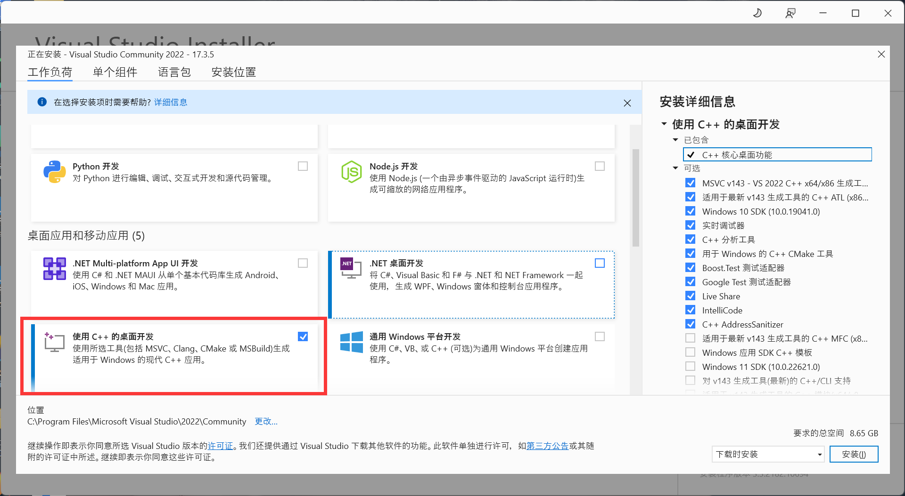
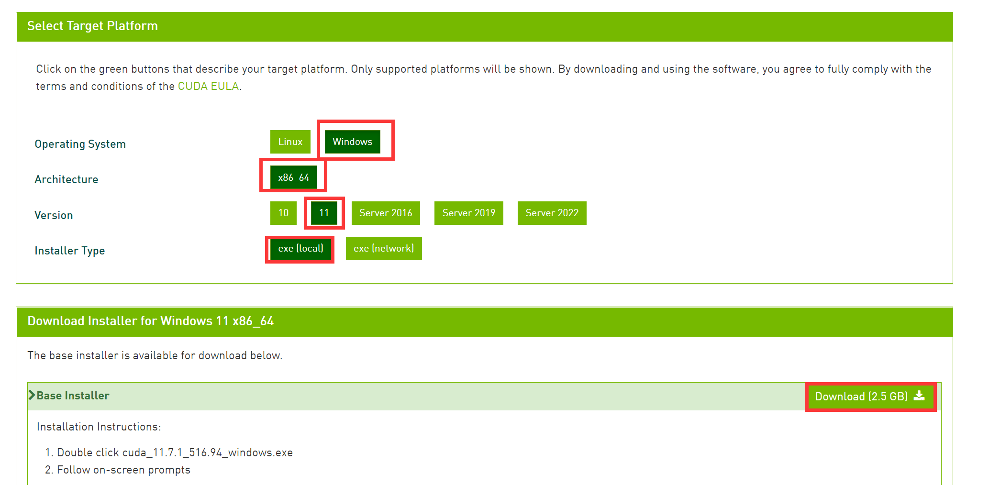
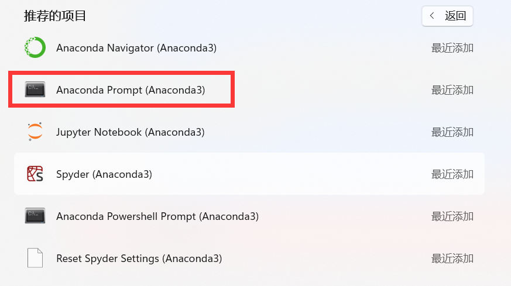
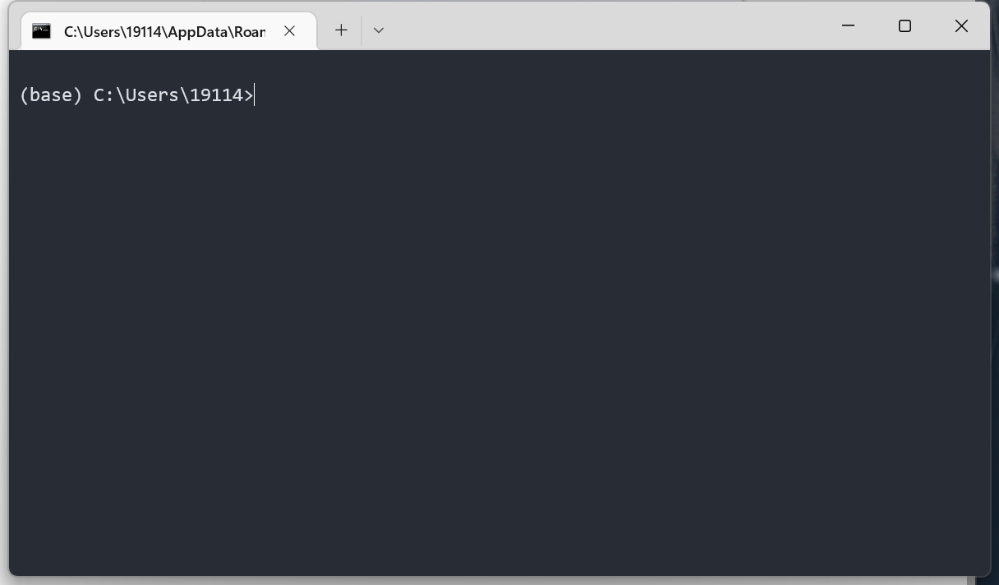
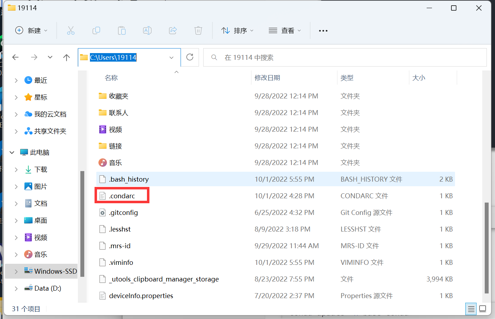
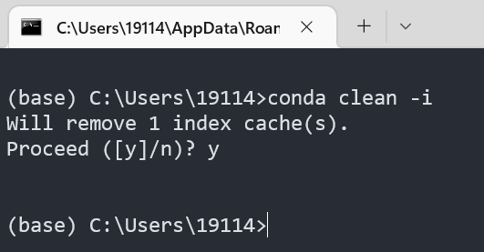

# Dive Into Object Detection

​																						---windows 版本，Author: rainbowseeker9  from DHU

## 一.前言

​	Windows 操作系统通常是大家最为熟悉的操作系统，但是在做深度学习时并不建议大使用择windows系统。可能出现的问题有深度学习框架的官方支持不够及时，复现他人模型时需修改源码才能直接运行（这往往是很困难的）等等。因此**为了能够使用大多数深度学习工程师开源的代码，我们建议使用 Ubuntu 作为运行代码的机器，参考方案见[linux版本](动手做目标检测-linux)及[云端版本](动手做目标检测-cloud)。**

### 前置软件

​	直接点击下方链接下载即可，安装时除安装位置可自行调整外其余默认。

- [Anaconda](https://repo.anaconda.com/archive/Anaconda3-2022.05-Windows-x86_64.exe)

- [Git](https://github.com/git-for-windows/git/releases/download/v2.37.3.windows.1/Git-2.37.3-64-bit.exe)

- [Visual Studio](https://visualstudio.microsoft.com/zh-hans/thank-you-downloading-visual-studio/?sku=Community&channel=Release&version=VS2022&source=VSLandingPage&cid=2030&passive=false): 勾选 C++ 安装即可

  

> ​	对于带 **Nvidia** 显卡的电脑用户，还可使用 `gpu` 加速训练过程，链接如下，按各自电脑系统版本进行下载
>
> - CUDA Toolkit 11.3： https://developer.nvidia.com/cuda-downloads
>
>   

## 二.环境创建

### 1.打开`Anaconda`控制台



打开之后如图：



#### 1.1 换源

在命令行中输入以下内容：

```
conda config --set show_channel_urls yes
```

接着进入 `C:\Users\{your_name}`，记事本打开 `.condarc`文件



修改内容为

```
channels:
  - defaults
show_channel_urls: true
default_channels:
  - https://mirrors.tuna.tsinghua.edu.cn/anaconda/pkgs/main
  - https://mirrors.tuna.tsinghua.edu.cn/anaconda/pkgs/r
  - https://mirrors.tuna.tsinghua.edu.cn/anaconda/pkgs/msys2
custom_channels:
  conda-forge: https://mirrors.tuna.tsinghua.edu.cn/anaconda/cloud
  msys2: https://mirrors.tuna.tsinghua.edu.cn/anaconda/cloud
  bioconda: https://mirrors.tuna.tsinghua.edu.cn/anaconda/cloud
  menpo: https://mirrors.tuna.tsinghua.edu.cn/anaconda/cloud
  pytorch: https://mirrors.tuna.tsinghua.edu.cn/anaconda/cloud
  pytorch-lts: https://mirrors.tuna.tsinghua.edu.cn/anaconda/cloud
  simpleitk: https://mirrors.tuna.tsinghua.edu.cn/anaconda/cloud
```

在命令行中输入以下内容，遇到选择就填 Y：

```
conda clean -i
```



### 2.开始安装

在命令行中依次输入以下内容：

```bash
conda update -n base conda
#创建名为 dl 的 python 环境
conda create -n dl python=3.7 		
#激活环境
conda activate dl
```

```bash
#安装 jypyter
conda install nb_conda jupyter		
conda install pytorch torchvision cudatoolkit=11.6 -c pytorch -c conda-forge	
```


webcam 测试

```
python detect.py --weight yolov5n.pt --img 224 --source 0
```

```
python train.py --img 224 --batch 16 --epochs 3 --data coco128.yaml --weights yolov5n.pt --cfg ./models/yolov5n.yaml --workers 1 --device 0
```

